## list
- gorm框架
  - [gorm官网](https://gorm.io/zh_CN/docs/)
- mysql底层原理
  - 索引原理p1-p4
  - 事务/锁机制p5-p7
  - InnoDB存储引擎

详细参考： https://www.mars13333.com/article/aac2ydmm/

## 索引

平常所说的索引，如果没有特别指明，都是指B+树结构组织的索引。

索引（index）是帮助MySQL高效获取数据的数据结构(有序)。在数据之外，数据库系统还维护着满足特定查找算法的数据结构，这些数据结构以某种方式引用（指向）数据， 这样就可以在这些数据结构上实现高级查找算法，这种数据结构就是索引。

### why

表结构及其数据如下：

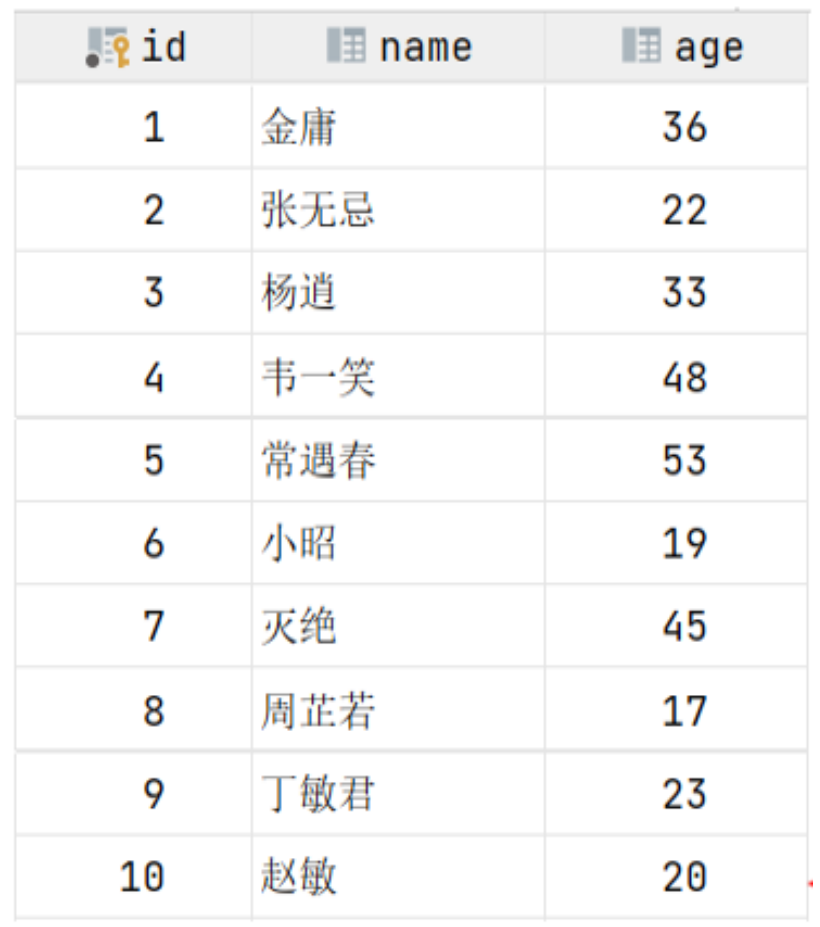

假如要执行的SQL语句为 ： `select * from user where age = 45;`

**无索引情况**

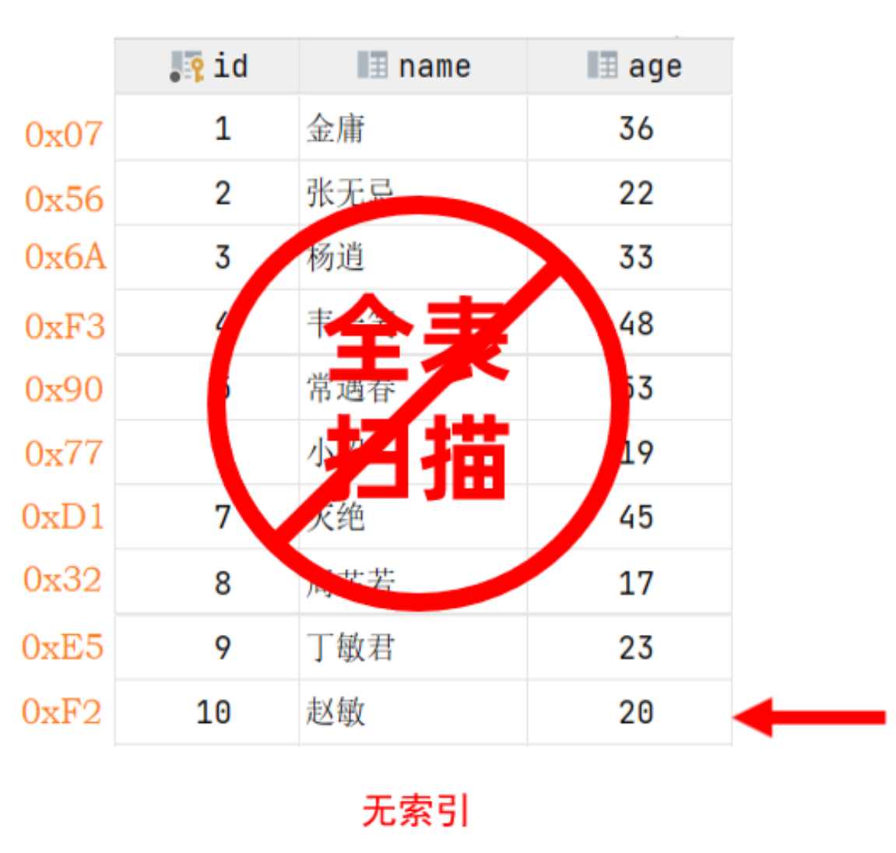

在无索引情况下，就需要从第一行开始扫描，一直扫描到最后一行，我们称之为 全表扫描，性能很低。

**有索引情况**

如果我们针对于这张表建立了索引，假设索引结构就是二叉树，那么也就意味着，会对age这个字段建立一个二叉树的索引结构。

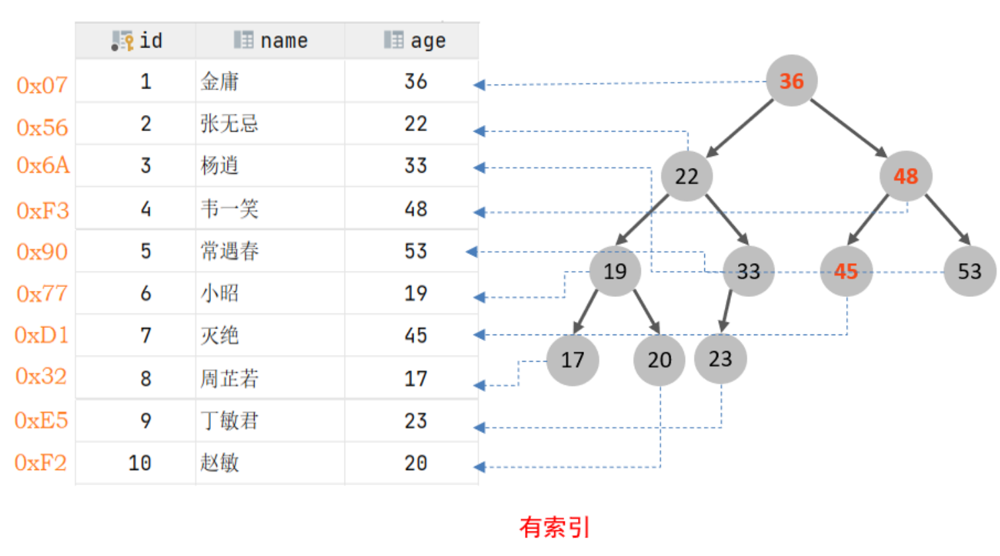

此时我们在进行查询时，只需要扫描三次就可以找到数据了，极大的提高的查询的效率。

### 索引结构

假如说MySQL的索引结构采用二叉树的数据结构，比较理想的结构如下：

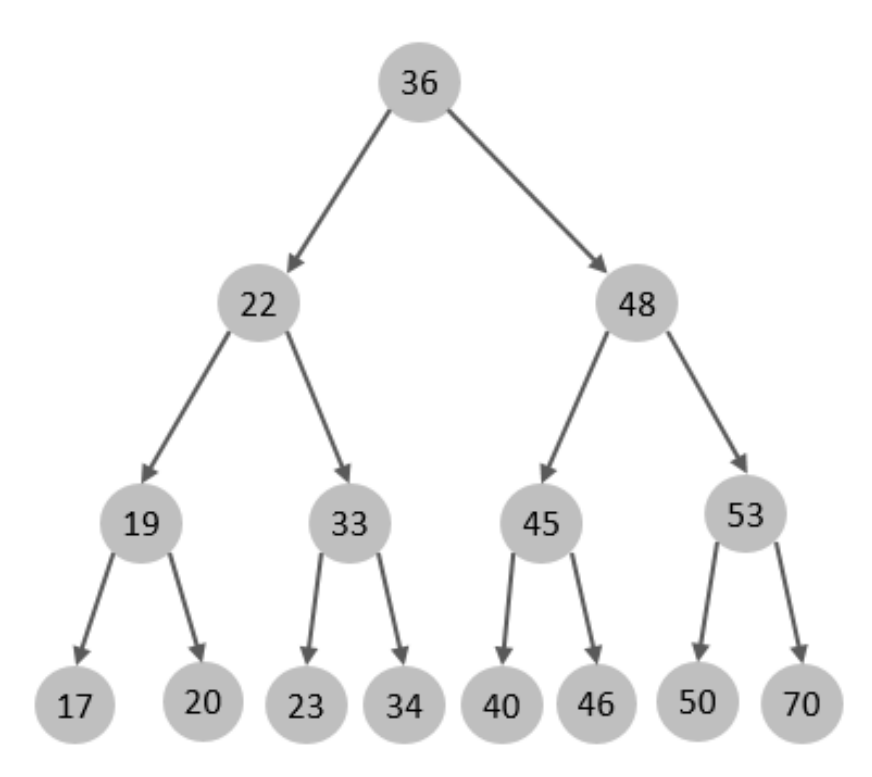

如果主键是顺序插入的，则会退化成一个单向链表，结构如下：

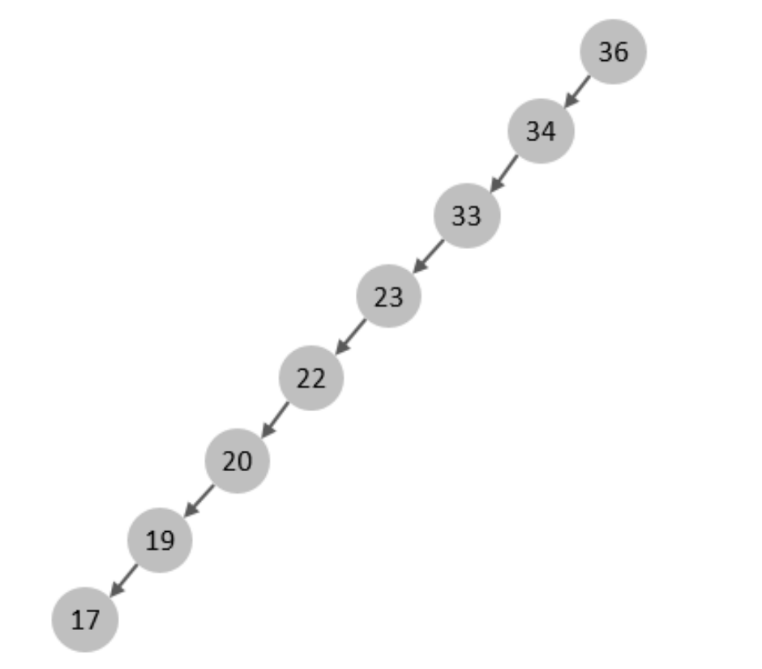

所以，如果选择二叉树作为索引结构，会存在以下缺点：

- 顺序插入时，会形成一个链表，查询性能大大降低。
- 大数据量情况下，层级较深，检索速度慢。

此时大家可能会想到，我们可以选择红黑树，红黑树是一颗自平衡二叉树，那这样即使是顺序插入数据，最终形成的数据结构也是一颗平衡的二叉树,结构如下:

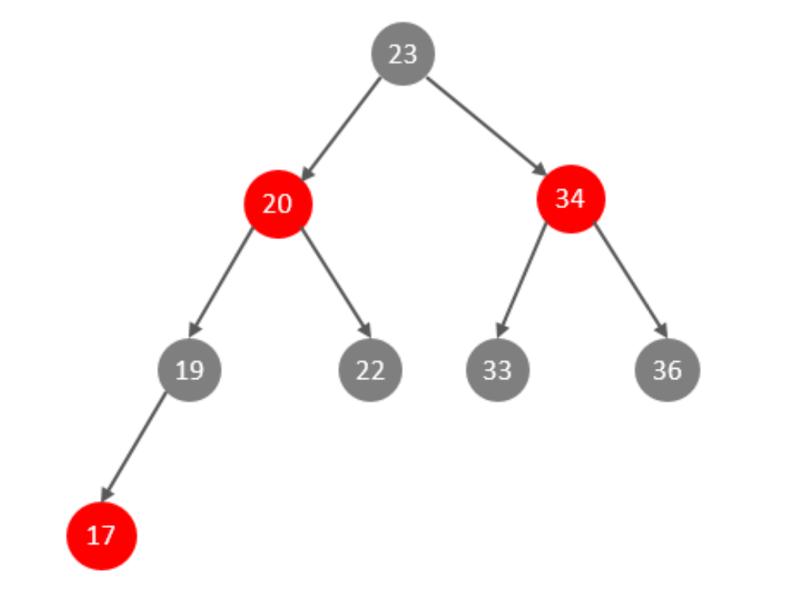

但是，即使如此，由于红黑树也是一颗二叉树，所以也会存在一个缺点：

- 大数据量情况下，层级较深，检索速度慢

所以，在MySQL的索引结构中，并没有选择二叉树或者红黑树，而选择的是B+Tree，那么什么是B+Tree呢？在详解B+Tree之前，先来介绍一个B-Tree。

B-Tree，B树是一种多叉路平衡查找树，相对于二叉树，B树每个节点可以有多个分支，即多叉。以一颗最大度数（max-degree）为5(5阶)的b-tree为例，那这个B树每个节点最多存储4个key，5个指针：

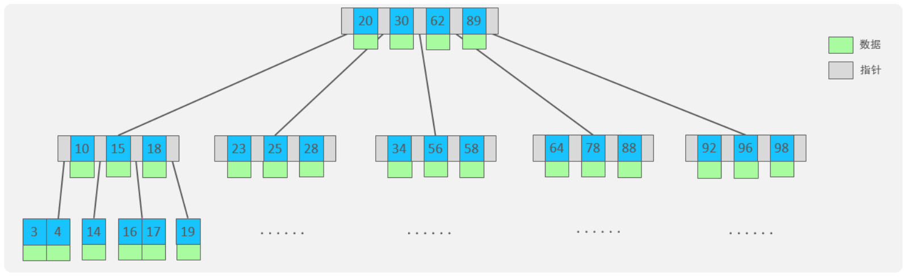

特点：

- 5阶的B树，每一个节点最多存储4个key，对应5个指针。
- 一旦节点存储的key数量到达5，就会裂变，中间元素向上分裂。
- 在B树中，非叶子节点和叶子节点都会存放数据。

B+Tree是B-Tree的变种。特点是：

- 所有数据都存在叶子节点上（内部节点只负责索引，不存实际数据）；
- 叶子节点之间有链表指针连接（支持区间查询与顺序遍历）；
- 非叶子节点仅用于导航（key 索引），不存 data，只存 key 和子指针。

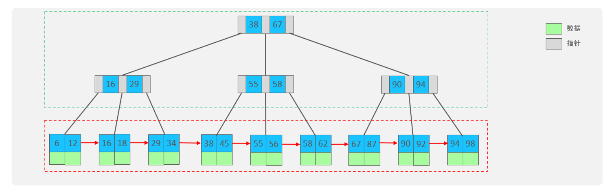

上述看到的结构是标准的B+Tree的数据结构，接下来，我们再来看看MySQL中优化之后的B+Tree。

MySQL索引数据结构对经典的B+Tree进行了优化。在原B+Tree的基础上，增加一个指向相邻叶子节点的链表指针，就形成了带有顺序指针的B+Tree，提高区间访问的性能，利于排序。

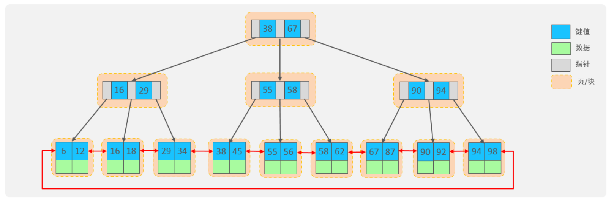

### 聚集索引&二级索引

在InnoDB存储引擎中，根据索引的存储形式，又可以分为以下两种：

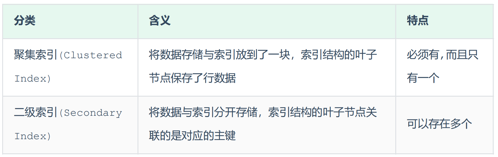

聚集索引选取规则:

- 如果存在主键，主键索引就是聚集索引。
- 如果不存在主键，将使用第一个唯一（UNIQUE）索引作为聚集索引。
- 如果表没有主键，或没有合适的唯一索引，则InnoDB会自动生成一个rowid作为隐藏的聚集索引。

聚集索引和二级索引的具体结构如下：

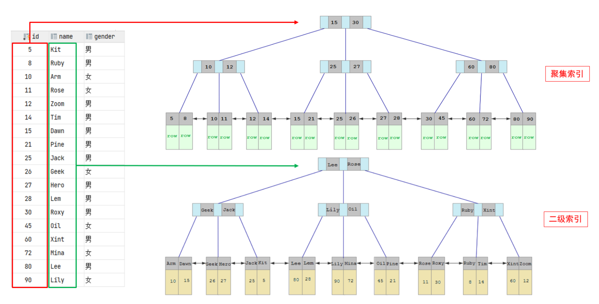

- 聚集索引的叶子节点下挂的是这一行的数据 。
- 二级索引的叶子节点下挂的是该字段值对应的主键值。

### 查找示例

接下来，我们来分析一下，当我们执行如下的SQL语句时，具体的查找过程是什么样子的。

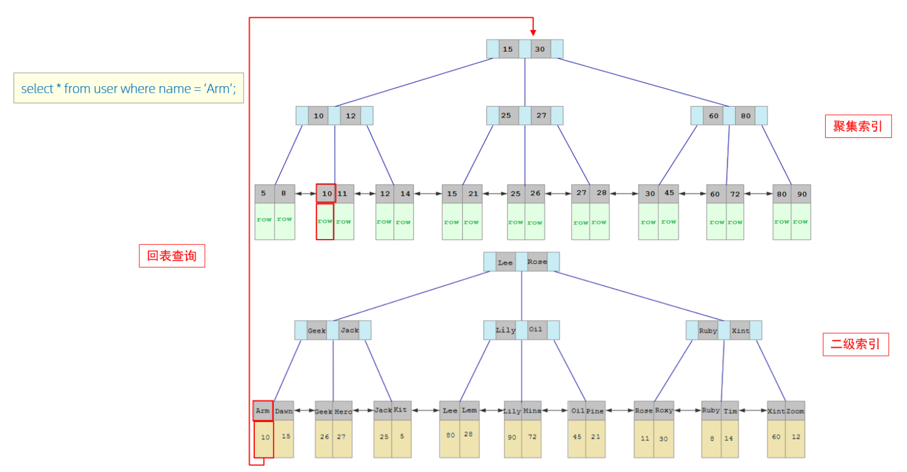

具体过程如下:

①. 由于是根据name字段进行查询，所以先根据name='Arm'到name字段的二级索引中进行匹配查 找。但是在二级索引中只能查找到 Arm 对应的主键值 10。

②. 由于查询返回的数据是*，所以此时，还需要根据主键值10，到聚集索引中查找10对应的记录，最终找到10对应的行row。

③. 最终拿到这一行的数据，直接返回即可。

**回表查询**： 这种先到二级索引中查找数据，找到主键值，然后再到聚集索引中根据主键值，获取数据的方式，就称之为回表查询。

以下两条SQL语句，那个执行效率高? 为什么? A. `select * from user where id = 10` ; B. `select * from user where name = 'Arm'` ; 备注: id为主键，name字段创建的有索引；

解答：A 语句的执行性能要高于B 语句。 因为A语句**直接走聚集索引**，直接返回数据。 而B语句需要先查询name字段的二级索引，然后再查询聚集索引，也就是需要进行回表查询。

InnoDB主键索引的B+tree高度为多高呢?

解答：如果树的高度为2，则可以存储 18000 多条记录。 如果树的高度为3，则可以存储 2200w 左右的记录。

### 索引语法

```sql
-- 创建索引
CREATE [ UNIQUE | FULLTEXT ] INDEX index_name ON table_name 
(index_col_name,... ) ;

-- 查看索引
SHOW INDEX FROM table_name ;

-- 删除索引
DROP INDEX index_name ON table_name ;

-- name字段为姓名字段，该字段的值可能会重复，为该字段创建索引。
CREATE INDEX idx_user_name ON tb_user(name);

-- phone手机号字段的值，是非空，且唯一的，为该字段创建唯一索引。
CREATE UNIQUE INDEX idx_user_phone ON tb_user(phone);

-- 为profession、age、status创建联合索引。
CREATE INDEX idx_user_pro_age_sta ON tb_user(profession,age,status);

-- 为email建立合适的索引来提升查询效率。
CREATE INDEX idx_email ON tb_user(email);
```

## SQL性能分析

### 慢查询日志

要开启慢查询日志，需要在MySQL的配置文件（/etc/my.cnf）中配置如下信息：
```properties
## 开启MySQL慢日志查询开关
slow_query_log=1
## 设置慢日志的时间为2秒，SQL语句执行时间超过2秒，就会视为慢查询，记录慢查询日志
long_query_time=2
```

配置完毕之后，通过以下指令重新启动MySQL服务器进行测试，查看慢日志文件中记录的信息/var/lib/mysql/localhost-slow.log。

```sh
systemctl restart mysqld
```

比如

```sql
select count(*) from tb_sku; -- 由于tb_sku表中, 预先存入了1000w的记录, count一次,耗时13.35sec
```

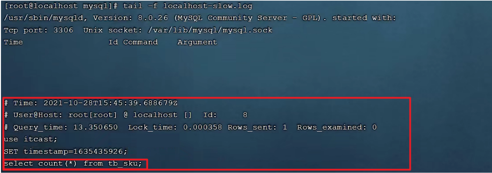

像这样，通过慢查询日志，就可以定位出执行效率比较低的SQL，从而有针对性的进行优化。

### explain

EXPLAIN 或者 DESC命令获取 MySQL 如何执行 SELECT 语句的信息，包括在 SELECT 语句执行过程中表如何连接和连接的顺序。

```sql
-- 直接在select语句之前加上关键字 explain / desc

EXPLAIN SELECT 字段列表 FROM 表名 WHERE 条件 ;
```

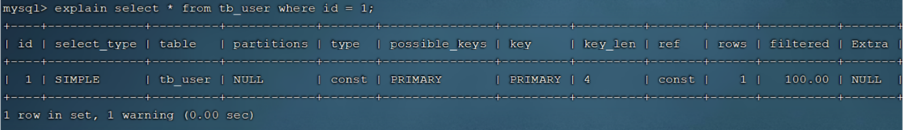

Explain 执行计划中各个字段的含义:

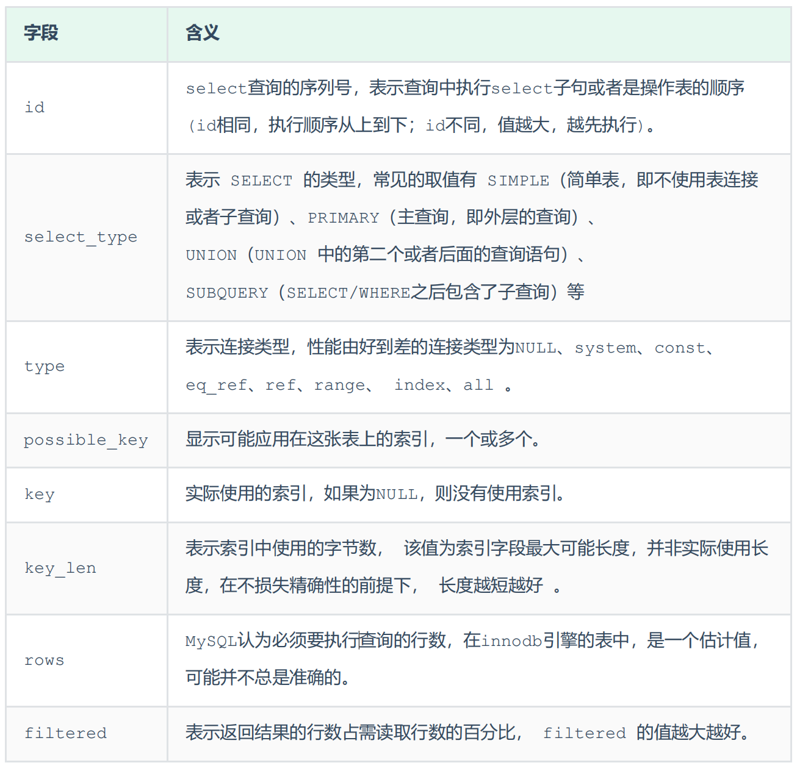

### 索引设计原则

索引设计原则
1). 针对于数据量较大，且查询比较频繁的表建立索引。

2). 针对于常作为查询条件（where）、排序（order by）、分组（group by）操作的字段建立索引。

3). 尽量选择区分度高的列作为索引，尽量建立唯一索引，区分度越高，使用索引的效率越高。

4). 如果是字符串类型的字段，字段的长度较长，可以针对于字段的特点，建立前缀索引。

5). 尽量使用联合索引，减少单列索引，查询时，联合索引很多时候可以覆盖索引，节省存储空间，避免回表，提高查询效率。

6). 要控制索引的数量，索引并不是多多益善，索引越多，维护索引结构的代价也就越大，会影响增删改的效率。

7). 如果索引列不能存储NULL值，请在创建表时使用NOT NULL约束它。当优化器知道每列是否包含NULL值时，它可以更好地确定哪个索引最有效地用于查询。


## 锁

锁是计算机协调多个进程或线程并发访问某一资源的机制。在数据库中，除传统的计算资源（CPU、RAM、I/O）的争用以外，数据也是一种供许多用户共享的资源。如何保证数据并发访问的一致性、有效性是所有数据库必须解决的一个问题，锁冲突也是影响数据库并发访问性能的一个重要因素。从这个角度来说，锁对数据库而言显得尤其重要，也更加复杂。

MySQL中的锁，按照锁的粒度分，分为以下三类：

- 全局锁：锁定数据库中的所有表。

- 表级锁：每次操作锁住整张表。

- 行级锁：每次操作锁住对应的行数据。

### 全局锁

全局锁就是对整个数据库实例加锁，加锁后整个实例就处于只读状态，后续的DML的写语句，DDL语句，以及更新操作的事务提交语句都将被阻塞。

其典型的使用场景是做全库的逻辑备份，对所有的表进行锁定，从而获取一致性视图，保证数据的完整性。

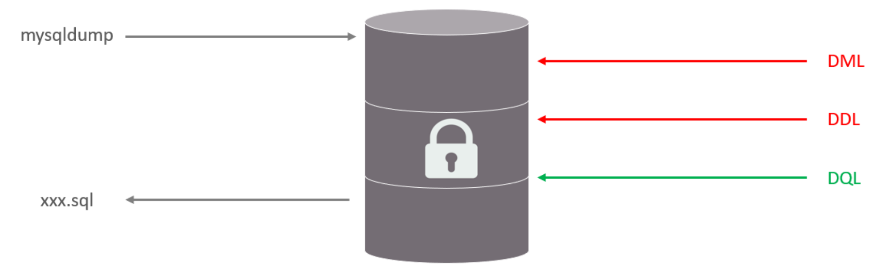

对数据库进行进行逻辑备份之前，先对整个数据库加上全局锁，一旦加了全局锁之后，其他的DDL、DML全部都处于阻塞状态，但是可以执行DQL语句，也就是处于只读状态，而数据备份就是查询操作。那么数据在进行逻辑备份的过程中，数据库中的数据就是不会发生变化的，这样就保证了数据的一致性和完整性。

```sql
-- 加全局锁
flush tables with read lock ;

-- 数据备份
mysqldump -uroot –p1234 itcast > itcast.sql

-- 释放锁
unlock tables ;
```

特点

数据库中加全局锁，是一个比较重的操作，存在以下问题：

- 如果在主库上备份，那么在备份期间都不能执行更新，业务基本上就得停摆。

- 如果在从库上备份，那么在备份期间从库不能执行主库同步过来的二进制日志（binlog），会导致主从延迟。


在InnoDB引擎中，我们可以在备份时加上参数 --single-transaction 参数来完成不加锁的一致性数据备份。一致性快照，不影响读写。但事务启动后的数据也不会备份，但不算错误。是正常现象。

```sql
mysqldump --single-transaction -uroot –p123456 itcast > itcast.sql
```

### 表级锁

表级锁，每次操作锁住整张表。锁定粒度大，发生锁冲突的概率最高，并发度最低。应用在MyISAM、InnoDB、BDB等存储引擎中。

对于表级锁，主要分为以下三类：

- 表锁

- 元数据锁（meta data lock，MDL）

- 意向锁


**表锁**

对于表锁，分为两类：

- 表共享读锁（read lock）

- 表独占写锁（write lock）

语法：

加锁：lock tables 表名... read/write。

释放锁：unlock tables / 客户端断开连接 。

读锁不会阻塞其他客户端的读，但是会阻塞写。写锁既会阻塞其他客户端的读，又会阻塞其他客户端的写。

**元数据锁**

meta data lock , 元数据锁，简写MDL。

MDL加锁过程是系统自动控制，无需显式使用，在访问一张表的时候会自动加上。MDL锁主要作用是维护表元数据的数据一致性，在表上有活动事务的时候，不可以对元数据进行写入操作。为了避免DML与DDL冲突，保证读写的正确性。

这里的元数据，大家可以简单理解为就是一张表的表结构。 也就是说，某一张表涉及到未提交的事务时，是不能够修改这张表的表结构的。

在MySQL5.5中引入了MDL，当对一张表进行增删改查的时候，加MDL读锁(共享)；当对表结构进行变更操作的时候，加MDL写锁(排他)。

常见的SQL操作时，所添加的元数据锁：

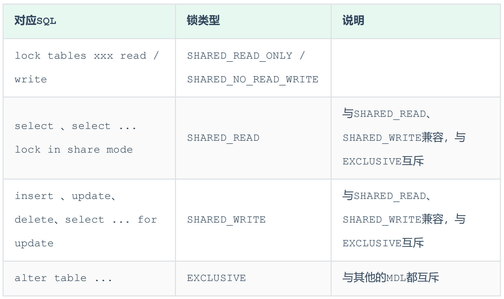

**意向锁**

为了避免DML在执行时，加的行锁与表锁的冲突，在InnoDB中引入了意向锁，使得表锁不用检查每行数据是否加锁，使用意向锁来减少表锁的检查。

假如没有意向锁，客户端一对表加了行锁后，客户端二如何给表加表锁呢，来通过示意图简单分析一下：

首先客户端一，开启一个事务，然后执行DML操作，在执行DML语句时，会对涉及到的行加行锁。

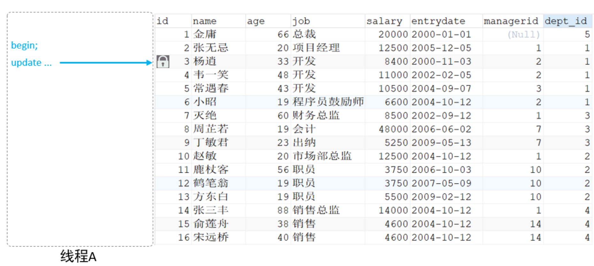

当客户端二，想对这张表加表锁时，会检查当前表是否有对应的行锁，如果没有，则添加表锁，此时就会从第一行数据，检查到最后一行数据，效率较低。

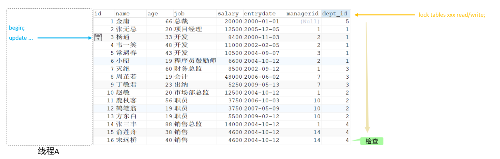

有了意向锁之后 :

客户端一，在执行DML操作时，会对涉及的行加行锁，同时也会对该表加上意向锁。

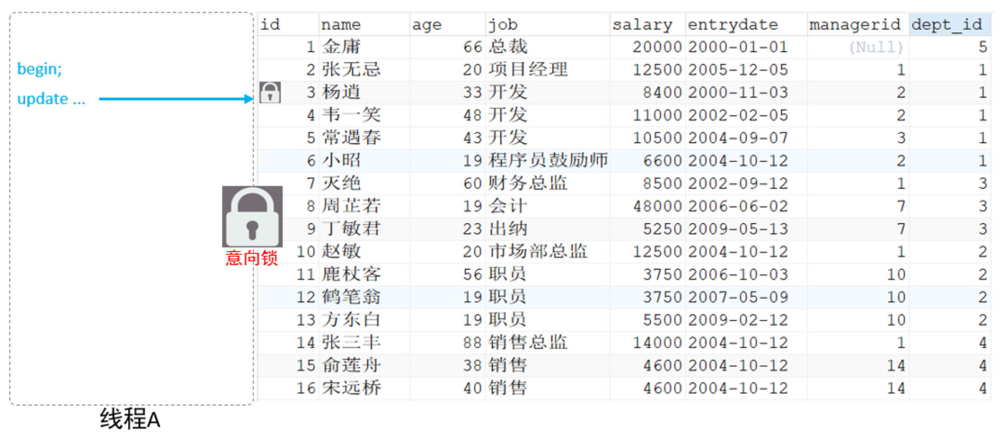

而其他客户端，在对这张表加表锁的时候，会根据该表上所加的意向锁来判定是否可以成功加表锁，而不用逐行判断行锁情况了。

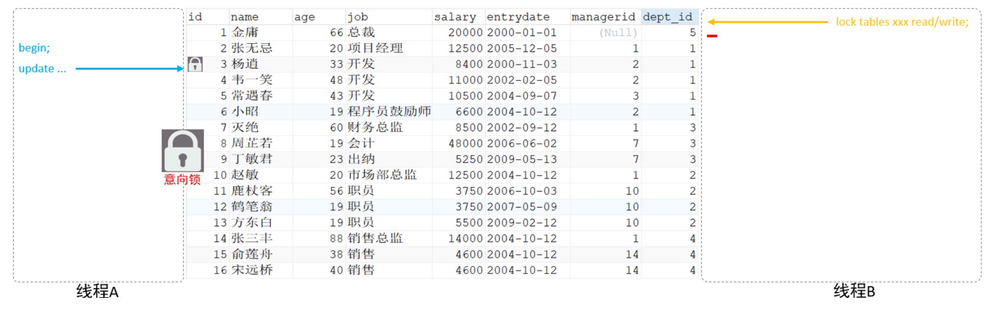

### 行级锁

行级锁，每次操作锁住对应的行数据。锁定粒度最小，发生锁冲突的概率最低，并发度最高。应用在InnoDB存储引擎中。

InnoDB的数据是基于索引组织的，行锁是通过对索引上的索引项加锁来实现的，而不是对记录加的锁。对于行级锁，主要分为以下三类：

行锁（Record Lock）：锁定单个行记录的锁，防止其他事务对此行进行update和delete。在RC、RR隔离级别下都支持。

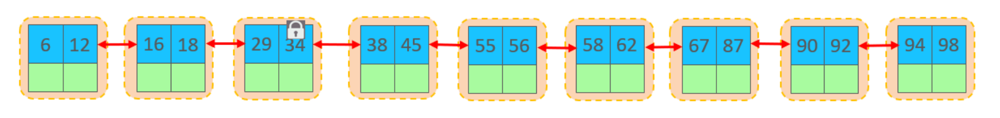

间隙锁（Gap Lock）：锁定索引记录间隙（不含该记录），确保索引记录间隙不变，防止其他事务在这个间隙进行insert，产生幻读。在RR隔离级别下都支持。

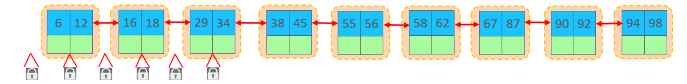

临键锁（Next-Key Lock）：行锁和间隙锁组合，同时锁住数据，并锁住数据前面的间隙Gap。在RR隔离级别下支持。

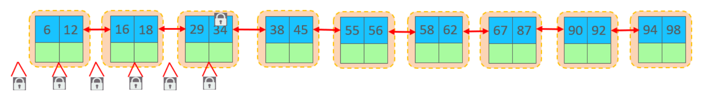

InnoDB实现了以下两种类型的行锁：

- 共享锁（S）：允许一个事务去读一行，阻止其他事务获得相同数据集的排它锁。

- 排他锁（X）：允许获取排他锁的事务更新数据，阻止其他事务获得相同数据集的共享锁和排他锁。


常见的SQL语句，在执行时，所加的行锁如下：

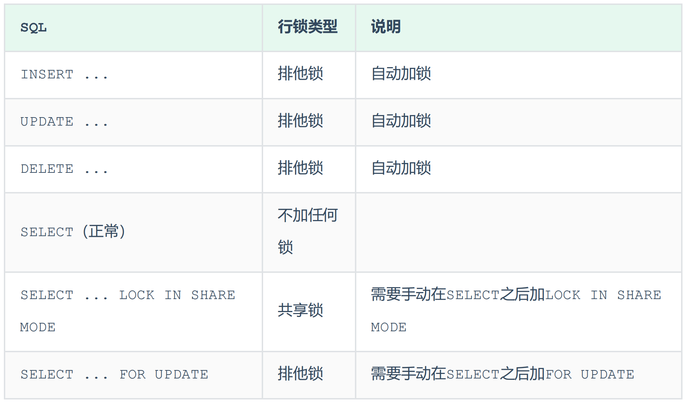


**间隙锁&临键锁**

默认情况下，InnoDB在 REPEATABLE READ事务隔离级别运行，InnoDB使用 next-key 锁进行搜索和索引扫描，以防止幻读。

- 索引上的等值查询(唯一索引)，给不存在的记录加锁时, 优化为间隙锁 。

- 索引上的等值查询(非唯一普通索引)，向右遍历时最后一个值不满足查询需求时，next-keylock 退化为间隙锁。

- 索引上的范围查询(唯一索引)--会访问到不满足条件的第一个值为止。

## InnoDB存储引擎（事务）

### 逻辑存储结构

InnoDB的逻辑存储结构如下图所示。

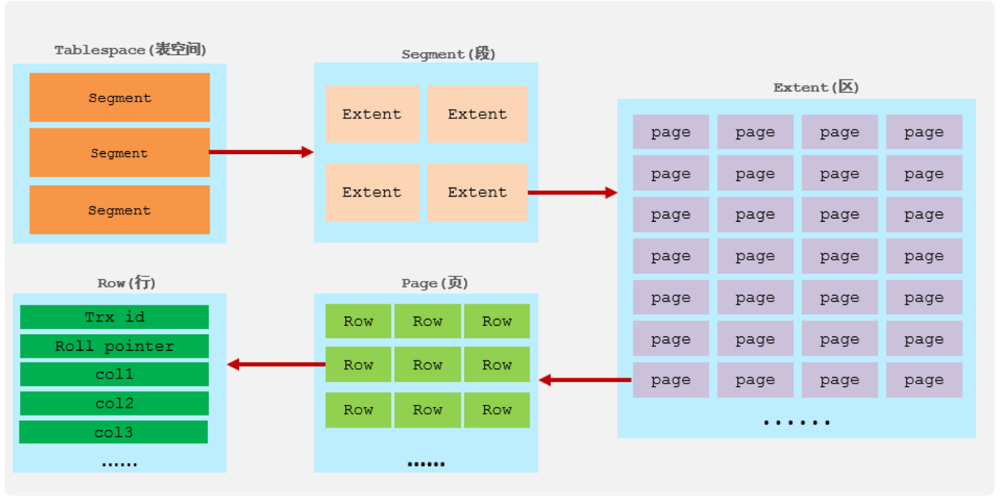

1). 表空间

表空间是InnoDB存储引擎逻辑结构的最高层， 如果用户启用了参数 innodb_file_per_table(在8.0版本中默认开启) ，则每张表都会有一个表空间（xxx.ibd），一个mysql实例可以对应多个表空间，用于存储记录、索引等数据。

2). 段

段，分为数据段（Leaf node segment）、索引段（Non-leaf node segment）、回滚段（Rollback segment），InnoDB是索引组织表，数据段就是B+树的叶子节点， 索引段即为B+树的非叶子节点。段用来管理多个Extent（区）。

3). 区

区，表空间的单元结构，每个区的大小为1M。 默认情况下， InnoDB存储引擎页大小为16K， 即一个区中一共有64个连续的页。

4). 页

页，是InnoDB 存储引擎磁盘管理的最小单元，每个页的大小默认为 16KB。为了保证页的连续性，InnoDB 存储引擎每次从磁盘申请 4-5 个区。

5). 行

行，InnoDB 存储引擎数据是按行进行存放的。


在行中，默认有两个隐藏字段：

`trx_id`：每次对某条记录进行改动时，都会把对应的事务id赋值给trx_id隐藏列。

`roll_pointer`：每次对某条引记录进行改动时，都会把旧的版本写入到undo日志中，然后这个隐藏列就相当于一个指针，可以通过它来找到该记录修改前的信息。

### 架构

MySQL5.5 版本开始，默认使用InnoDB存储引擎，它擅长事务处理，具有崩溃恢复特性，在日常开发中使用非常广泛。

### 事务原理

**事务基础**

1). 事务

事务 是一组操作的集合，它是一个不可分割的工作单位，事务会把所有的操作作为一个整体一起向系统提交或撤销操作请求，即这些操作要么同时成功，要么同时失败。

2). 特性

• 原子性（Atomicity）：事务是不可分割的最小操作单元，要么全部成功，要么全部失败。

• 一致性（Consistency）：事务完成时，必须使所有的数据都保持一致状态。

• 隔离性（Isolation）：数据库系统提供的隔离机制，保证事务在不受外部并发操作影响的独立环境下运行。

• 持久性（Durability）：事务一旦提交或回滚，它对数据库中的数据的改变就是永久的。


**并发事务问题**

1). 赃读：一个事务读到另外一个事务还没有提交的数据。

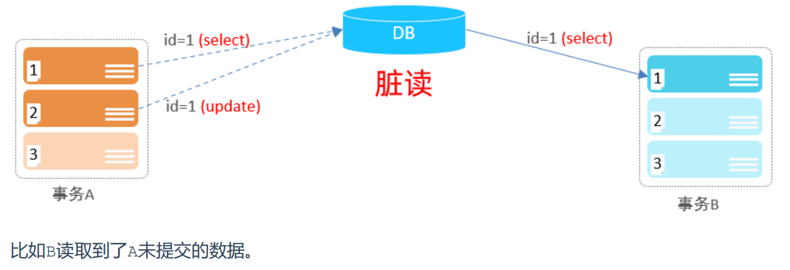

2). 不可重复读：一个事务先后读取同一条记录，但两次读取的数据不同，称之为不可重复读。

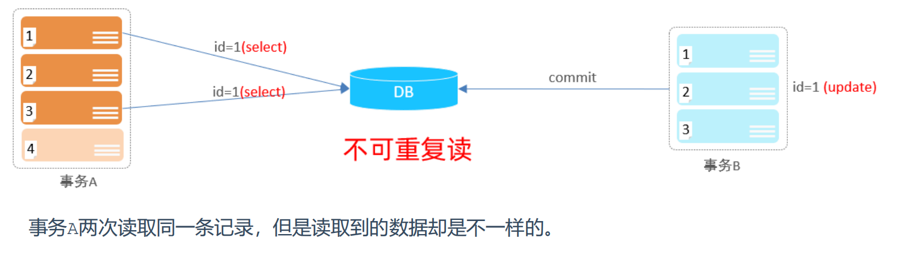

3). 幻读：一个事务按照条件查询数据时，没有对应的数据行，但是在插入数据时，又发现这行数据已经存在，好像出现了 "幻影"。

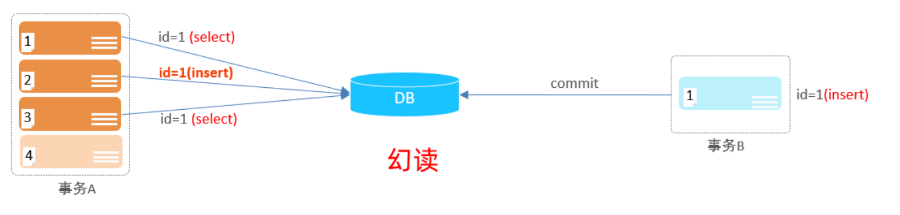


**事务隔离级别**

为了解决并发事务所引发的问题，在数据库中引入了事务隔离级别。主要有以下几种：

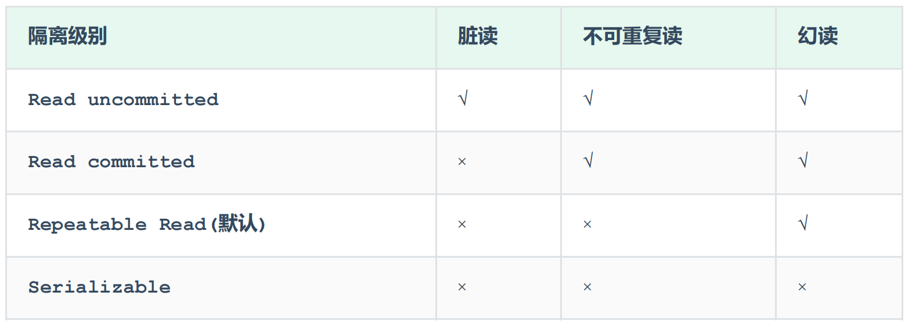


```sql
1). 查看事务隔离级别
SELECT @@TRANSACTION_ISOLATION;

2). 设置事务隔离级别
SET [ SESSION | GLOBAL ] TRANSACTION ISOLATION LEVEL { READ UNCOMMITTED | READ COMMITTED | REPEATABLE READ | SERIALIZABLE }

注意：事务隔离级别越高，数据越安全，但是性能越低。

```

**那实际上，我们研究事务的原理，就是研究MySQL的InnoDB引擎是如何保证事务的这四大特性的。**

而对于这四大特性，实际上分为两个部分。 其中的原子性、一致性、持久化，实际上是由InnoDB中的两份日志来保证的，一份是redo log日志，一份是undo log日志。 而持久性是通过数据库的锁，加上MVCC来保证的。


### redo log

重做日志，记录的是事务提交时数据页的物理修改，是用来实现事务的持久性。

该日志文件由两部分组成：重做日志缓冲（redo log buffer）以及重做日志文件（redo log file）,前者是在内存中，后者在磁盘中。当事务提交之后会把所有修改信息都存到该日志文件中, 用于在刷新脏页到磁盘,发生错误时, 进行数据恢复使用。

如果没有redolog，可能会存在什么问题的？ 我们一起来分析一下。

在InnoDB引擎中的内存结构中，主要的内存区域就是缓冲池，在缓冲池中缓存了很多的数据页。 当我们在一个事务中，执行多个增删改的操作时，InnoDB引擎会先操作缓冲池中的数据，如果缓冲区没有对应的数据，会通过后台线程将磁盘中的数据加载出来，存放在缓冲区中，然后将缓冲池中的数据修改，修改后的数据页我们称为脏页。 而脏页则会在一定的时机，通过后台线程刷新到磁盘 中，从而保证缓冲区与磁盘的数据一致。 而缓冲区的脏页数据并不是实时刷新的，而是一段时间之后将缓冲区的数据刷新到磁盘中，假如刷新到磁盘的过程出错了，而提示给用户事务提交成功，而数据却没有持久化下来，这就出现问题了，没有保证事务的持久性。

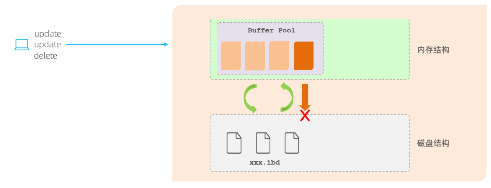

如何解决上述的问题呢？ 在InnoDB中提供了一份日志 redo log，接下来我们再来分析一下，通过redolog如何解决这个问题。

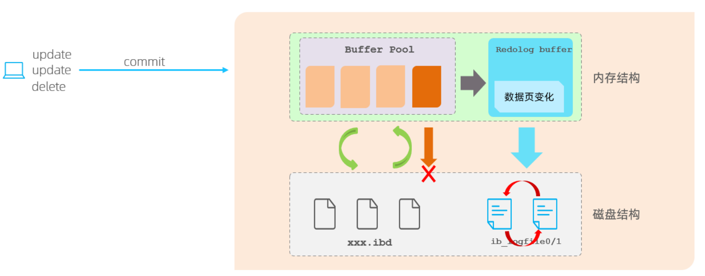

有了redolog之后，当对缓冲区的数据进行增删改之后，会首先将操作的数据页的变化，记录在redo log buffer中。在事务提交时，会将redo log buffer中的数据刷新到redo log磁盘文件中。过一段时间之后，如果刷新缓冲区的脏页到磁盘时，发生错误，此时就可以借助于redo log进行数据恢复，这样就保证了事务的持久性。 而如果脏页成功刷新到磁盘 或 或者涉及到的数据已经落盘，此时redolog就没有作用了，就可以删除了，所以存在的两个redolog文件是循环写的。

那为什么每一次提交事务，要刷新redo log 到磁盘中呢，而不是直接将buffer pool中的脏页刷新 到磁盘呢 ?因为在业务操作中，我们操作数据一般都是随机读写磁盘的，而不是顺序读写磁盘。 而redo log在往磁盘文件中写入数据，由于是日志文件，所以都是顺序写的。顺序写的效率，要远大于随机写。 这种**先写日志的方式，称之为 WAL（Write-Ahead Logging）**。


### undo log

回滚日志，用于记录数据被修改前的信息 , 作用包含两个 : 提供回滚(保证事务的原子性) 和MVCC(多版本并发控制) 。

undo log和redo log记录物理日志不一样，它是逻辑日志。可以认为当delete一条记录时，undo log中会记录一条对应的insert记录，反之亦然，当update一条记录时，它记录一条对应相反的update记录。当执行rollback时，就可以从undo log中的逻辑记录读取到相应的内容并进行回滚。

Undo log销毁：undo log在事务执行时产生，事务提交时，并不会立即删除undo log，因为这些日志可能还用于MVCC。

Undo log存储：undo log采用段的方式进行管理和记录，存放在前面介绍的 rollback segment回滚段中，内部包含1024个undo log segment。

### MVCC

基本概念
1). 当前读

读取的是记录的最新版本，读取时还要保证其他并发事务不能修改当前记录，会对读取的记录进行加锁。对于我们日常的操作，如：select ... lock in share mode(共享锁)，select ... for update、update、insert、delete(排他锁)都是一种当前读。

2). 快照读

简单的select（不加锁）就是快照读，快照读，读取的是记录数据的可见版本，有可能是历史数据，不加锁，是非阻塞读。

• Read Committed：每次select，都生成一个快照读。
• Repeatable Read：开启事务后第一个select语句才是快照读的地方。
• Serializable：快照读会退化为当前读。


全称 Multi-Version Concurrency Control，多版本并发控制。指维护一个数据的多个版本，使得读写操作没有冲突，快照读为MySQL实现MVCC提供了一个非阻塞读功能。MVCC的具体实现，还需要依赖于数据库记录中的`三个隐式字段`、`undo log日志`、`readView`。

接下来，介绍一下InnoDB引擎的表中涉及到的隐藏字段 、undolog 以及 readview，从而来介绍一下MVCC的原理。

**隐藏字段**

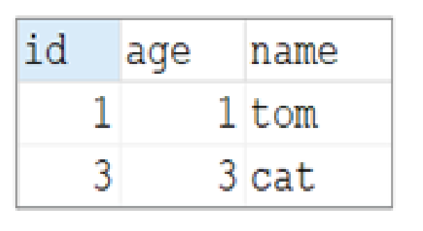

当创建了上面的这张表，我们在查看表结构的时候，就可以显式的看到这三个字段。 实际上除了这三个字段以外，InnoDB还会自动的给我们添加`三个隐藏字段`及其含义分别是：

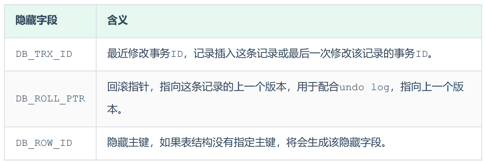

而上述的前两个字段是肯定会添加的， 是否添加最后一个字段DB_ROW_ID，得看当前表有没有主键，如果有主键，则不会添加该隐藏字段。

**undo log**

回滚日志，在insert、update、delete的时候产生的便于数据回滚的日志。当insert的时候，产生的undo log日志只在回滚时需要，在事务提交后，可被立即删除。而update、delete的时候，产生的undo log日志不仅在回滚时需要，在快照读时也需要，不会立即被删除。

**版本链**

有一张表原始数据为：

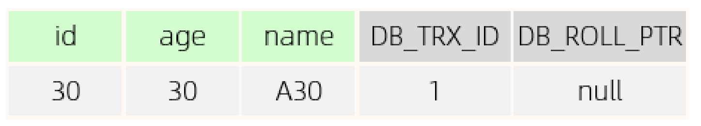

`DB_TRX_ID` : 代表最近修改事务ID，记录插入这条记录或最后一次修改该记录的事务ID，是自增的。
`DB_ROLL_PTR` ： 由于这条数据是才插入的，没有被更新过，所以该字段值为null。

然后，有四个并发事务同时在访问这张表。

A. 第一步

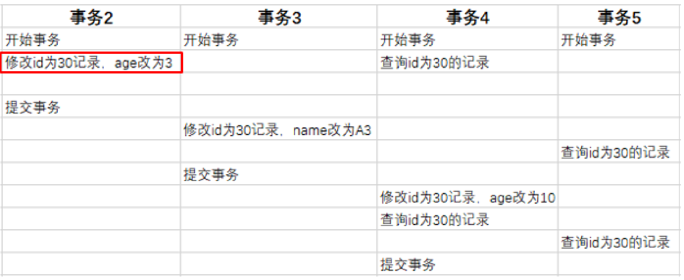

当事务2执行第一条修改语句时，会记录undo log日志，记录数据变更之前的样子; 然后更新记录，并且记录本次操作的事务ID，回滚指针，回滚指针用来指定如果发生回滚，回滚到哪一个版本。

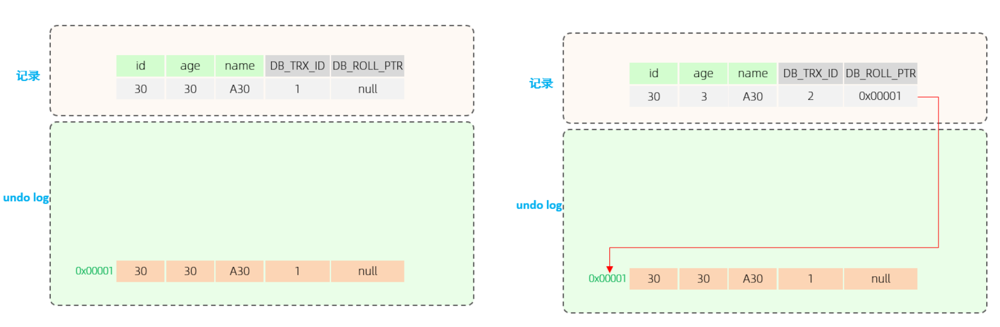

B.第二步

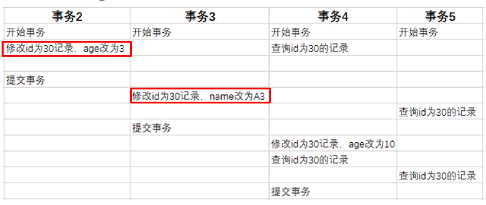

当事务3执行第一条修改语句时，也会记录undo log日志，记录数据变更之前的样子; 然后更新记录，并且记录本次操作的事务ID，回滚指针，回滚指针用来指定如果发生回滚，回滚到哪一个版本。

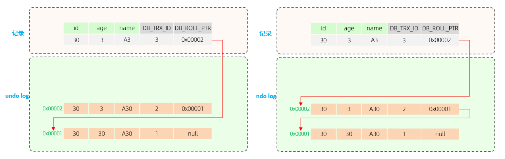


C. 第三步

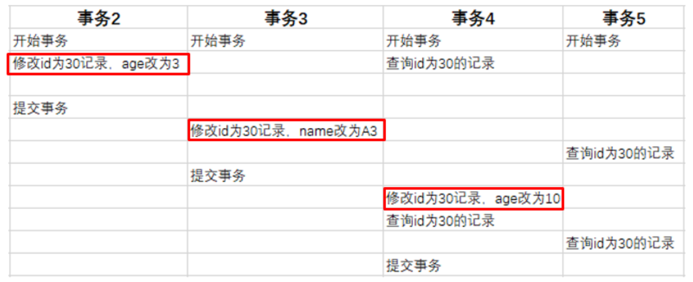

当事务4执行第一条修改语句时，也会记录undo log日志，记录数据变更之前的样子; 然后更新记 录，并且记录本次操作的事务ID，回滚指针，回滚指针用来指定如果发生回滚，回滚到哪一个版本。

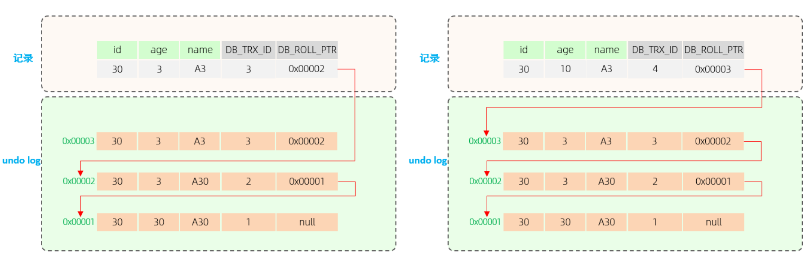

最终发现，不同事务或相同事务对同一条记录进行修改，会导致该记录的undolog生成一条记录版本链表，链表的头部是最新的旧记录，链表尾部是最早的旧记录。

**readview**

ReadView（读视图）是 快照读 SQL执行时MVCC提取数据的依据，记录并维护系统当前活跃的事务（未提交的）id。

ReadView中包含了四个核心字段：

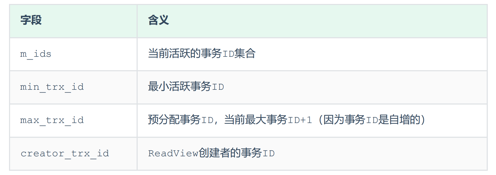


而在readview中就规定了版本链数据的访问规则：trx_id 代表当前undolog版本链对应事务ID。

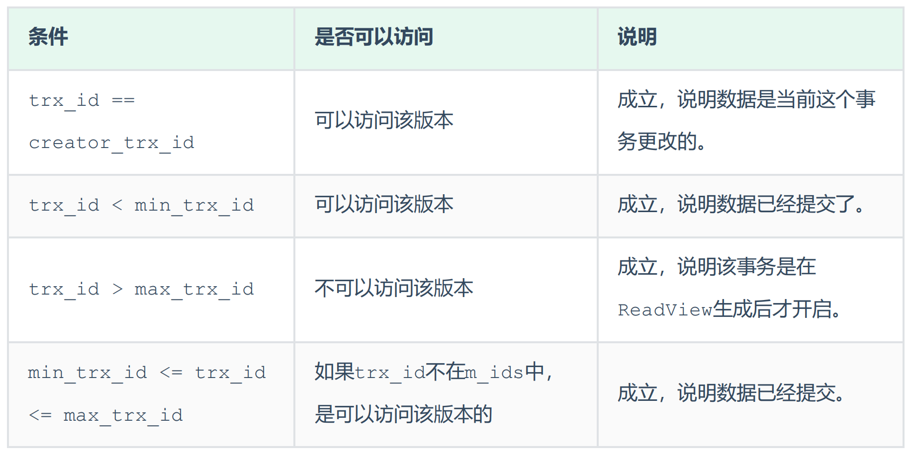

不同的隔离级别，生成ReadView的时机不同：

- READ COMMITTED ：在事务中每一次执行快照读时生成ReadView。

- REPEATABLE READ：仅在事务中第一次执行快照读时生成ReadView，后续复用该ReadView。

**原理分析**

**RC隔离级别**

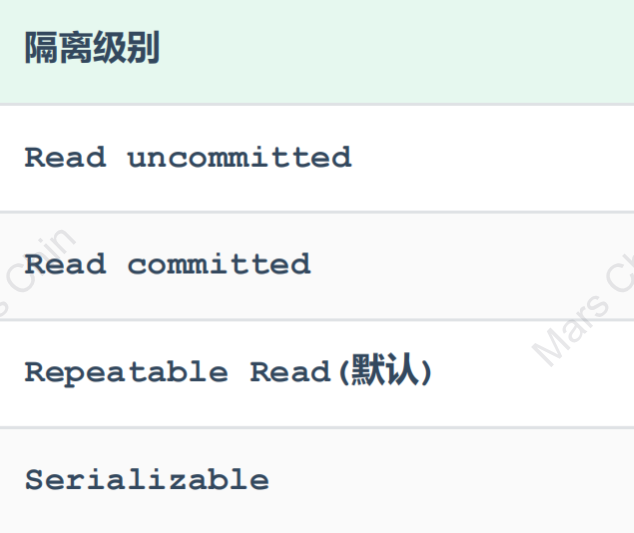

RC隔离级别下，在事务中每一次执行快照读时生成ReadView。

我们就来分析事务5中，两次快照读读取数据，是如何获取数据的?

在事务5中，查询了两次id为30的记录，由于隔离级别为Read Committed，所以每一次进行快照读都会生成一个ReadView，那么两次生成的ReadView如下。

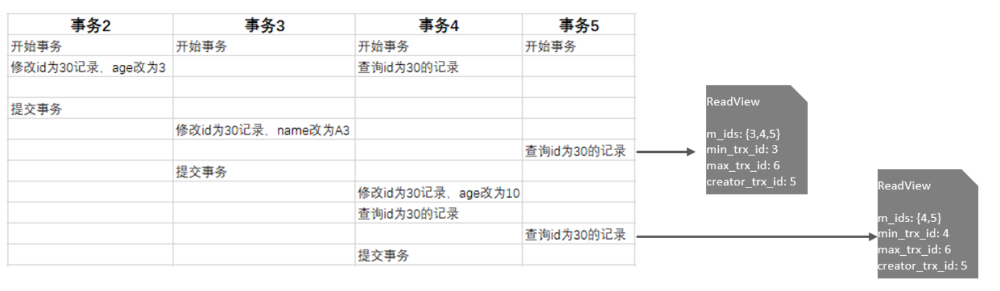

那么这两次快照读在获取数据时，就需要根据所生成的ReadView以及ReadView的版本链访问规则，到undolog版本链中匹配数据，最终决定此次快照读返回的数据。

A. 先来看第一次快照读具体的读取过程

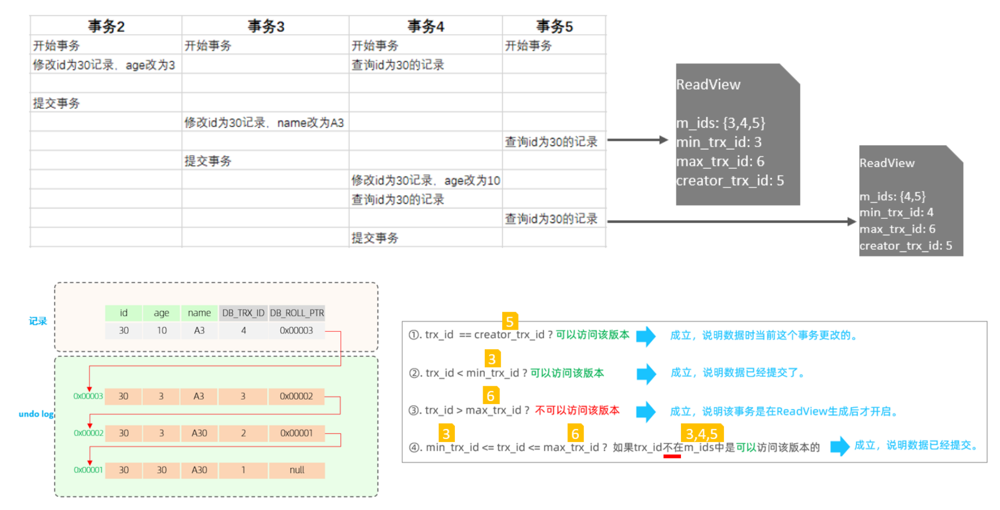

在进行匹配时，会从undo log的版本链，从上到下进行挨个匹配：

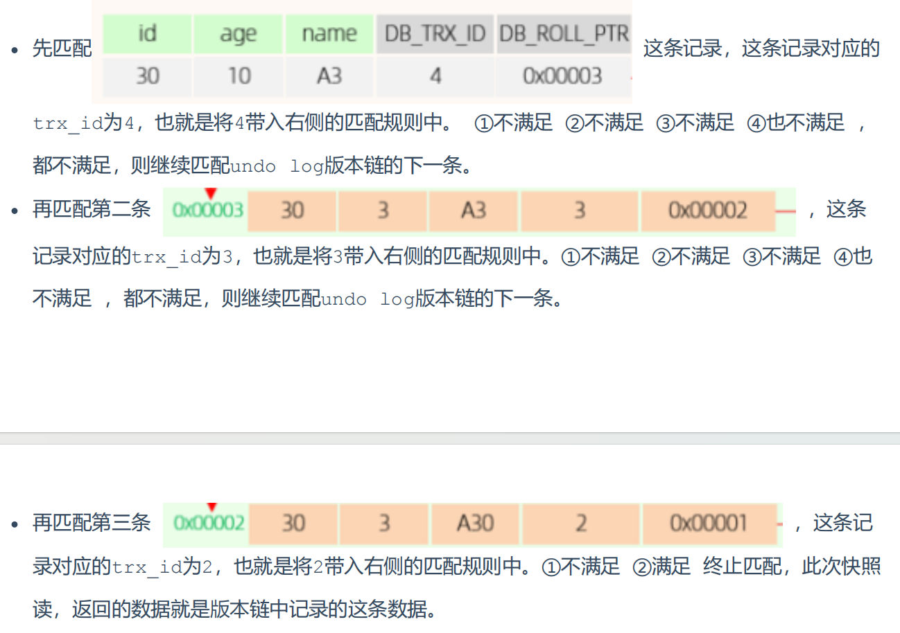

B. 再来看第二次快照读具体的读取过程:

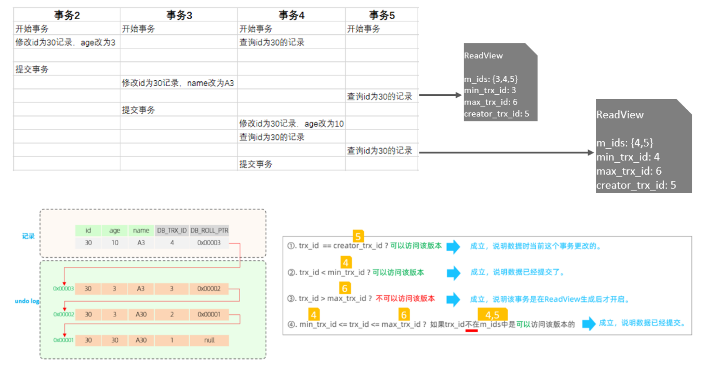

在进行匹配时，会从undo log的版本链，从上到下进行挨个匹配：

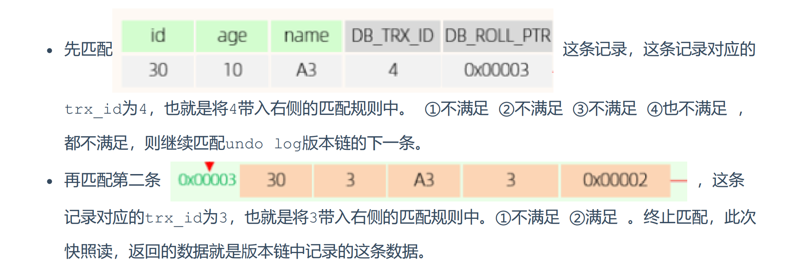


**RR隔离级别**

RR隔离级别下，仅在事务中第一次执行快照读时生成ReadView，后续复用该ReadView。 而RR 是可重复读，在一个事务中，执行两次相同的select语句，查询到的结果是一样的。那MySQL是如何做到可重复读的呢? 我们简单分析一下就知道了。

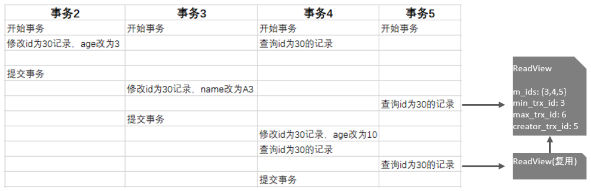

我们看到，在RR隔离级别下，只是在事务中第一次快照读时生成ReadView，后续都是复用该ReadView，那么既然ReadView都一样， ReadView的版本链匹配规则也一样， 那么最终快照读返回的结果也是一样的。

所以呢，MVCC的实现原理就是通过 InnoDB表的隐藏字段、UndoLog 版本链、ReadView来实现的。而MVCC + 锁，则实现了事务的隔离性。 而一致性则是由redolog 与 undolog保证。

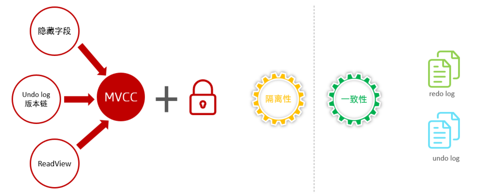