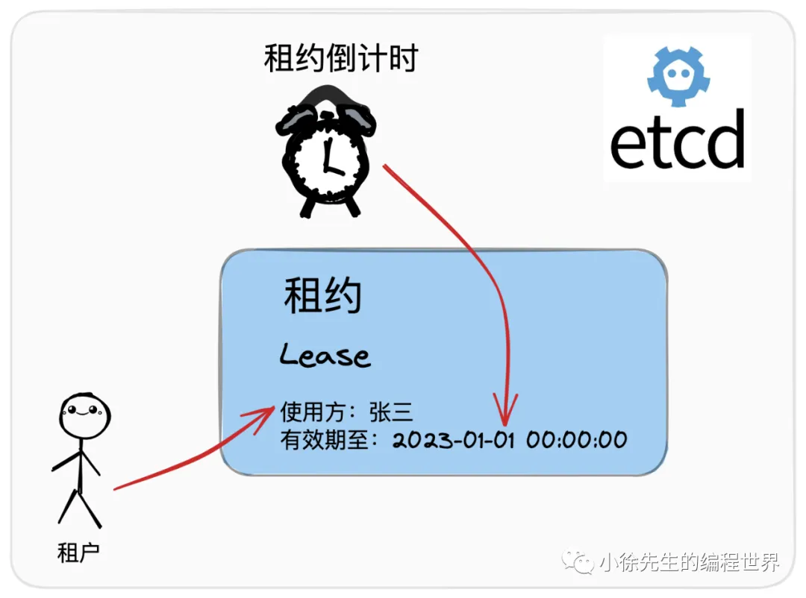
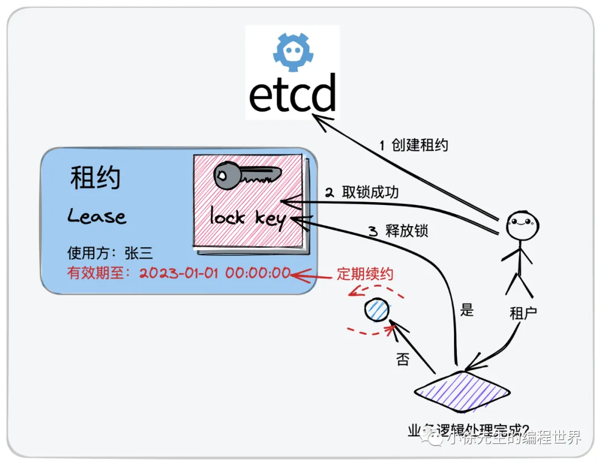

# 分布式锁

## 使用背景

在并发场景中，为了保证临界资源的数据一致性，我们会经常使用到“锁”这个工具对临界资源进行保护，让混乱的并发访问行为退化为秩序的串行访问行为.

在本地环境中，由于多线程之间能够共享进程的数据，因此可以比较简单地实现进程内的互斥锁；然而在分布式场景中，有时我们需要跨域多个物理节点执行加锁操作，因此我们就需要依赖到类似于 redis、mysql 这样的状态存储组件，在此基础之上实现所谓的“分布式锁”技术.

## 核心性质

分布式锁应当具备如下几项核心性质：

• 独占性：对于同一把锁，在同一时刻只能被一个取锁方占有，这是作为“锁”工具最基础的一项性质

• 健壮性：即不能产生死锁（dead lock）. 假如某个占有锁的使用方因为宕机而无法主动执行解锁动作，锁也应该能够被正常传承下去，被其他使用方所延续使用

• 对称性：加锁和解锁的使用方必须为同一身份. 不允许非法释放他人持有的分布式锁

• 高可用：当提供分布式锁服务的基础组件中存在少量节点发生故障时，不应该影响到分布式锁服务的稳定性

## 实现类型


分布式锁根据其实现模型，可以被划分为两大类：

• 主动轮询型：该模型类似于单机锁中的主动轮询 + cas 乐观锁模型，取锁方会持续对分布式锁发出尝试获取动作，如果锁已被占用则会不断发起重试，直到取锁成功为止

• watch 回调型：在取锁方发现锁已被他人占用时，会创建 watcher 监视器订阅锁的释放事件，随后不再发起主动取锁的尝试；当锁被释放后，取锁方能通过之前创建的 watcher 感知到这一变化，然后再重新发起取锁的尝试动作


## 个人理解

在单机环境中，主动轮询和 watch 回调两种锁模型各有优劣，所谓的”优“和”劣“也是相对而言，需要对 cpu 空转以及阻塞协程两种行为的损耗做出权衡. （大家对这部分概念如果不清晰，可以阅读一下我之前发表的文章——”Golang 单机锁实现原理“）.

然而，在分布式场景中，我个人觉得优势的天平在略微朝着 watch 回调型的实现策略倾斜. 这是因为分布式场景中”轮询“这一动作的成本相比于单机锁而言要高很多，背后存在的行为可能是一次甚至多次网络 IO 请求. 这种情况下，取锁方基于 watch 回调的方式，在确保锁被释放、自身有机会取锁的情况下，才会重新发出尝试取锁的请求，这样能在很大程度上避免无意义的轮询损耗.

当然，主动轮询型的分布式锁能够保证使用方始终占据流程的主动权，整个流程可以更加轻便灵活；此外，watch 机制在实现过程中需要建立长连接完成 watch 监听动作，也会存在一定的资源损耗. 因此这个问题没有标准答案，应该结合实际的需求背景采取不同的应对策略：在并发激烈程度较高时倾向于 watch 回调型分布式锁；反之，主动轮询型分布式锁可能会是更好的选择.

除此之外，基于 watch 回调模型实现的分布式锁背后可能还存在其他的问题，比如：当有多个尝试取锁的使用方 watch 监听同一把锁时，一次锁的释放事件可能会引发“惊群效应”. 这个问题以及对应的解决方案将会在本文第 4 章中进行探讨.

# 主动轮询型

## 实现思路


主动轮询型分布式锁的实现思路为：

• 针对于同一把分布式锁，使用同一条数据进行标识（以 redis 为例，则为同一个 key 对应的 kv 数据记录）

• 假如在存储介质成功插入了该条数据（要求之前该 key 对应的数据不存在），则被认定为加锁成功

• 把从存储介质中删除该条数据这一行为理解为释放锁操作

• 倘若在插入该条数据时，发现数据已经存在（锁已被他人持有），则持续轮询，直到数据被他人删除（他人释放锁），并由自身完成数据插入动作为止（取锁成功）

• 由于是并发场景，需要保证【 （1）检查数据是否已被插入（2）数据不存在则插入数据 】这两个步骤之间是原子化不可拆分的（在 redis 中是 set only if not exist —— SETNX 操作）


## 技术选型

实现主动轮询型分布式锁时，我们常用的组件包括 redis 和 mysql.

**redis**

在实现主动轮询型分布式锁时，redis 算得上是大家最常用的组件. 在第 3 章中，本文会以 redis 为例，进行主动轮询型分布式锁的实践介绍.

redis 官方文档：https://redis.io/

redis 基于内存实现数据的存储，因此足够高轻便高效. 此外，redis 基于单线程模型完成数据处理工作，支持 SETNX 原子指令（set only if not exist），能够很方便地支持分布式锁的加锁操作.

setnx 使用文档：https://redis.io/commands/setnx/ （事实上，在 redis 2.6.12 版本之后，setnx 操作已经被弃置，官方推荐大家使用 set 指令并附加 nx 参数来实现与 setnx 指令相同的效果）

此外，redis 还支持使用 lua 脚本自定义组装同一个 redis 节点下的多笔操作形成一个具备原子性的事务.


**mysql**

mysql 官方文档：https://www.mysql.com/

通过经典的关系型数据库 mysql 关也能实现和 redis 类似的效果.

• 建立一张用于存储分布式锁记录的数据表

• 以分布式锁的标识键作为表中的唯一键（类比于 redis 中的 key）

• 基于唯一键的特性，同一把锁只能被插入一条数据，因此也就只能由一个使用方持有锁

• 当锁被占有时，其他取锁方尝试插入数据时，会被 mysql 表的唯一键所拦截报错，进而感知到锁已被占用这一情报

• 在表中可以新增一个字段标识使用方的身份. 完整的解锁动作可以基于 mysql 事务（使用 innodb 引擎）保证原子性：【（1）检查释放锁动作执行者的身份；（2）身份合法时才进行解锁】. 基于此，分布式锁的对称性性质能够得到保证.

## 死锁问题

下一个问题是，我们在设计主动轮询型分布式锁时，如何避免出现死锁问题而导致分布式锁不可能用呢？

这项能力在 mysql 中显得捉襟见肘。

不过在使用 redis 时，我们可以通过过期时间 expire time 机制得以保证. 我们通常会在插入分布式锁对应的 kv 数据时设置一个过期时间 expire time，这样即便使用方因为异常原因导致无法正常解锁，锁对应的数据项也会在达到过期时间阈值后被自动删除，实现释放分布式锁的效果.

值得一提的是，这种过期机制的引入也带来了新的问题：因为锁的持有者并不能精确预判到自己持锁后处理业务逻辑的实际耗时，因此此处设置的过期时间只能是一个偏向于保守的经验值，假如因为一些异常情况导致占有锁的使用方在业务处理流程中的耗时超过了设置的过期时间阈值，就会导致锁被提前释放，其他取锁方可能取锁成功，最终引起数据不一致的并发问题.


## 弱一致性问题

回顾 redis 的设计思路，为避免单点故障问题，redis 会基于主从复制的方式实现数据备份. （以哨兵机制为例，哨兵会持续监听 master 节点的健康状况，倘若 master 节点发生故障，哨兵会负责扶持 slave 节点上位，以保证整个集群能够正常对外提供服务）. 此外，在 CAP 体系中，redis 走的是 AP 路线，为保证服务的吞吐性能，主从节点之间的数据同步是异步延迟进行的.

到这里问题就来了，试想一种场景：倘若 使用方 A 在 redis master 节点加锁成功，但是对应的 kv 记录在同步到 slave 之前，master 节点就宕机了. 此时未同步到这项数据的 slave 节点升为 master，这样分布式锁被 A 持有的“凭证” 就这样凭空消失了. 于是不知情的使用方 B C D 都可能加锁成功，于是就出现了一把锁被多方同时持有的问题，导致分布式锁最基本的独占性遭到破坏.

关于这个问题，一个比较经典的解决方案是：redis 红锁（redlock，全称 redis distribution lock）

# redis分布式锁

redigo

# watch回调型

## 实现思路


对于实现 watch 回调型分布式锁，一些基本要点和 2.1 小节中聊到的主动轮询型分布式锁类似：

• 针对于同一把分布式锁，使用一条相同的数据进行标识（唯一、明确的 key）

• 倘若在存储介质内成功插入该条数据（要求 key 对应的数据不存在），则这一行为被认定为加锁成功

• 把从存储介质中删除该条数据这行为理解为解锁操作

与主动轮询型分布式锁不同的是，在取锁失败时，watch 回调型分布式锁不会持续轮询，而是会 watch 监听锁的删除事件：

• 倘若在插入数据时，发现该条记录已经存在，说明锁已被他人持有，此时选择监听这条数据记录的删除事件，当对应事件发生时说明锁被释放了，此时才继续尝试取锁


## 技术选型

在实现上，我们需要依赖于提供了 watch 机制的状态存储组件，不仅能支持数据的存储和去重，还需要利用到其中的 watch 监听回调功能进行锁释放事件的订阅感知.

为满足上述诉求，我们常用的技术组件包括 etcd 和 zookeeper.

go工程更常用etcd.

**etcd**

etcd 官方文档：https://etcd.io/

etcd 是一款适合用于共享配置和服务发现的分布式 kv 存储组件，底层基于分布式共识算法 raft 协议保证了存储服务的强一致和高可用.

在 etcd 中提供了watch 监听器的功能，即针对于指定范围的数据，通过与 etcd 服务端节点创建 grpc 长连接的方式持续监听变更事件. 关于 watch 机制的详细介绍，可以参见我上一周发表的两篇文章—— etcd watch 机制源码解析——客户端篇/服务端篇.

此外，etcd 中写入数据时，还支持通过版本 revision 机制进行取锁秩序的统筹协调，是一款很适合用于实现分布式锁的组件.

etcd 是本文在介绍 watch 回调型分布式锁时选取的工程实践案例，在本文第 5 章会结合实现源码展开介绍.

**zookeeper**

zookeeper 官方文档：https://zookeeper.apache.org/

ZooKeeper是一款开源的分布式应用协调服务，底层基于分布式共识算法 zab 协议保证了数据的强一致性和高可用性.

zookeeper 中提供了临时顺序节点（EPHEMERAL_SEQUENTIAL）类型以及 watch 监听器机制，能够满足实现 watch 回调型分布式锁所需要具备的一切核心能力.

不过在本文中，zk 部分我们不多作展开，介绍内容以 etcd 为核心.

## 死锁问题





为避免死锁问题的产生，etcd 中提供了租约 lease 机制. 租约，顾名思义，是一份具有时效性的协议，一旦达到租约上规定的截止时间，租约就会失去效力. 同时，etcd 中还提供了续约机制（keepAlive），用户可以通过续约操作来延迟租约的过期时间.

那么，我们如何来利用租约 lease 机制解决分布式锁中可能存在的死锁问题呢？实现思路如下：

• 用户可以先申请一份租约，设定好租约的截止时间

• 异步启动一个续约协程，负责在业务逻辑处理完成前，按照一定的时间节奏持续进行续约操作

• 在执行取锁动作，将对应于锁的 kv 数据和租约进行关联绑定，使得锁数据和租约拥有相同的过期时间属性

在这样的设定之下，倘若分布式锁的持有者出现异常状况导致无法正常解锁，则可以通过租约的过期机制完成对分布式锁的释放，死锁问题因此得以规避. 

此外，锁的使用方可以将租约的初始过期时间设定为一个偏小的值，并通过续约机制来对租约的生效周期进行动态延长. 可以看到，此处 etcd 中的租约及续约机制，实现了与 redisson 中 watch dog 机制类似的效果.


## 惊群效应

惊群效应又称为羊群效应：羊群是一种纪律性很差的组织，平时就处在一种散漫无秩序地移动模式之下. 需要注意的是，在羊群中一旦有某只羊出现异动，其他的羊也会不假思索地一哄而上跑动起来，全然不估计附近可能有狼或者何处有更好的草源等客观问题.

在 watch 回调型分布式锁的实现过程中，可能也会存在类似于惊群效应的问题. 这里指的是：倘若一把分布式锁的竞争比较激烈，那么锁的释放事件可能同时被多个的取锁方所监听，一旦锁真的被释放了，所有的取锁方都会一拥而上尝试取锁，然而我们知道，一个轮次中真正能够取锁成功的只会有一名角色，因此这个过程中会存在大量无意义的性能损耗，且释放锁时刻瞬间激增的请求流量也可能会对系统稳定性产生负面效应.

为规避惊群效应，etcd 中提供了前缀 prefix 机制以及版本 revision 机制，和 zookeeper 的临时顺序节点功能有些类似：

• 对于同一把分布式锁，锁记录数据的 key 拥有共同的前缀 prefix，作为锁的标识

• 每个取锁方取锁时，会以锁前缀 prefix 拼接上自身的身份标识（租约 id），生成完整的 lock key. 因此各取锁方完整的 lock key 都是互不相同的（只是有着相同的前缀），理论上所有取锁方都能成功把锁记录数据插入到 etcd 中

• 每个取锁方插入锁记录数据时，会获得自身 lock key 处在锁前缀 prefix 范围下唯一且递增的版本号 revision

• 取锁方插入加锁记录数据不意味着加锁成功，而是需要在插入数据后查询一次锁前缀 prefix 下的记录列表，判定自身 lock key 对应的 revision 是不是其中最小的，如果是的话，才表示加锁成功

• 如果锁被他人占用，取锁方会 watch 监听 revision 小于自己但最接近自己的那个 lock key 的删除事件.


这样所有的取锁方就会在 revision 机制的协调下，根据取锁序号（revision）的先后顺序排成一条队列，每当锁被释放，只会惊动到下一顺位的取锁方，惊群问题得以避免.


# etcd分布式锁


etcd 开源地址：https://github.com/etcd-io/etcd

本文使用到的 etcd 源码版本为 v3.5.8.

etcd 作者在 etcd 的 concurrency 包下，基于 watch 机制结合 revision 机制实现了一款通用的 etcd 分布式锁。

## 实现源码

### 数据结构


#### session

session 指的是一次访问会话，背后对应的是一笔租约 lease. 用户调用 NewSession 方法构造 session 实例时，执行的步骤包括：

• 通过 client.Grant 方法申请到一个 lease id

• 调用 client.KeepAlive 方法持续对租约进行续期

• 构造一个会话 session 实例

• 异步开启一个守护协程，进行租约续期响应参数的处理（keepAlive）

```go
const defaultSessionTTL = 60

// Session represents a lease kept alive for the lifetime of a client.
// Fault-tolerant applications may use sessions to reason about liveness.
type Session struct {
    client *v3.Client
    opts   *sessionOptions
    id     v3.LeaseID

    cancel context.CancelFunc
    donec  <-chan struct{}
}

// NewSession gets the leased session for a client.
func NewSession(client *v3.Client, opts ...SessionOption) (*Session, error) {
    lg := client.GetLogger()
    ops := &sessionOptions{ttl: defaultSessionTTL, ctx: client.Ctx()}
    for _, opt := range opts {
        opt(ops, lg)
    }

    id := ops.leaseID
    if id == v3.NoLease {
        resp, err := client.Grant(ops.ctx, int64(ops.ttl))
        if err != nil {
            return nil, err
        }
        id = resp.ID
    }

    ctx, cancel := context.WithCancel(ops.ctx)
    keepAlive, err := client.KeepAlive(ctx, id)
    if err != nil || keepAlive == nil {
        cancel()
        return nil, err
    }

    donec := make(chan struct{})
    s := &Session{client: client, opts: ops, id: id, cancel: cancel, donec: donec}

    // keep the lease alive until client error or cancelled context
    go func() {
        defer close(donec)
        for range keepAlive {
            // eat messages until keep alive channel closes
        }
    }()

    return s,nil
}
```

假如用户处理完成业务逻辑之后，可以通过 session.Close 方法完成会话的关闭，在方法中会通过 context 的 cancel 动作，停止对租约的续期行为.

```go
// Close orphans the session and revokes the session lease.
func (s *Session) Close() error {
    s.Orphan()
    // if revoke takes longer than the ttl, lease is expired anyway
    ctx, cancel := context.WithTimeout(s.opts.ctx, time.Duration(s.opts.ttl)*time.Second)
    _, err := s.client.Revoke(ctx, s.id)
    cancel()
    return err
}

// Orphan ends the refresh for the session lease. This is useful
// in case the state of the client connection is indeterminate (revoke
// would fail) or when transferring lease ownership.
func (s *Session) Orphan() {
    s.cancel()
    <-s.donec
}
```

#### Mutex

Mutex 是 etcd 分布式锁的类型，其中核心字段包括：

• s：内置了一个会话 session

• pfx：分布式锁的公共前缀

• myKey：当前锁使用方完整的 lock key，由 pfx 和 lease id 两部分拼接而成

• myRev：当前锁使用方 lock key 在公共锁前缀 pfx 下对应的版本 revision

```go
// Mutex implements the sync Locker interface with etcd
type Mutex struct {
    s *Session
    
    pfx   string
    myKey string
    myRev int64
    hdr   *pb.ResponseHeader
}

func NewMutex(s *Session, pfx string) *Mutex {
    return &Mutex{s, pfx + "/", "", -1, nil}
}
```

### 方法链路

#### TryLock


Mutex.TryLock 方法会执行一次尝试加锁的动作，倘若锁已经被其他人占有，则会直接返回错误，不会阻塞：

• 调用 Mutex.tryAcquire 方法插入 my key（已存在则查询），获取到 my key 对应的 revision 以及当前锁的实际持有者

• 倘若锁 pfx 从未被占用过，或者锁 pfx 下存在的 revision 中，自身的 revision 是其中最小的一个，则说明自己加锁成功

• 倘若锁已经被其他人占用，则删除自己加锁时创建的 kv 对记录，然后返回锁已被他人占用的错误


```go
// TryLock locks the mutex if not already locked by another session.
// If lock is held by another session, return immediately after attempting necessary cleanup
// The ctx argument is used for the sending/receiving Txn RPC.
func (m *Mutex) TryLock(ctx context.Context) error {
    resp, err := m.tryAcquire(ctx)
    if err != nil {
        return err
    }
    // if no key on prefix / the minimum rev is key, already hold the lock
    ownerKey := resp.Responses[1].GetResponseRange().Kvs
    if len(ownerKey) == 0 || ownerKey[0].CreateRevision == m.myRev {
        m.hdr = resp.Header
        return nil
    }
    client := m.s.Client()
    // Cannot lock, so delete the key
    if _, err := client.Delete(ctx, m.myKey); err != nil {
        return err
    }
    m.myKey = "\x00"
    m.myRev = -1
    return ErrLocked
}
```

#### Lock


Mutex.Lock 方法采用的是阻塞加锁的处理模式，倘若分布式锁已经被其他人占用，则会持续阻塞等待时机，直到自己取锁成功：

• 调用 Mutex.tryAcquire 方法插入 my key（已存在则查询），获取到 my key 对应的 revision 以及当前锁的实际持有者

• 倘若锁 pfx 从未被占用过，或者锁 pfx 下存在的 revision 中，自身的 revision 是其中最小的一个，则说明自己加锁成功

• 倘若锁已被他人占用，调用 waitDeletes 方法，watch 监听 revision 小于自己且最接近于自己的锁记录数据的删除事件

• 当接收到解锁事件后，会再检查一下自身的租约有没有过期，如果没有，则说明加锁成功

```go
// Lock locks the mutex with a cancelable context. If the context is canceled
// while trying to acquire the lock, the mutex tries to clean its stale lock entry.
func (m *Mutex) Lock(ctx context.Context) error {
    resp, err := m.tryAcquire(ctx)
    if err != nil {
        return err
    }
    // if no key on prefix / the minimum rev is key, already hold the lock
    ownerKey := resp.Responses[1].GetResponseRange().Kvs
    if len(ownerKey) == 0 || ownerKey[0].CreateRevision == m.myRev {
        m.hdr = resp.Header
        return nil
    }
    client := m.s.Client()
    // wait for deletion revisions prior to myKey
    // TODO: early termination if the session key is deleted before other session keys with smaller revisions.
    _, werr := waitDeletes(ctx, client, m.pfx, m.myRev-1)
    // release lock key if wait failed
    if werr != nil {
        m.Unlock(client.Ctx())
        return werr
    }


    // make sure the session is not expired, and the owner key still exists.
    gresp, werr := client.Get(ctx, m.myKey)
    if werr != nil {
        m.Unlock(client.Ctx())
        return werr
    }


    if len(gresp.Kvs) == 0 { // is the session key lost?
        return ErrSessionExpired
    }
    m.hdr = gresp.Header


    return nil
}
```

#### tryAcquire


Mutex.tryAcquire 方法，使用方会完成锁数据的插入以及 revision 的获取：

• 基于 etcd 的事务操作，判定假如当前 my key 还没创建过锁的 kv 记录，则创建 kv 记录并执行 getOwner 操作获取当前锁的持有者；倘若已经创建过，则查询对应的 kv 记录，并调用 getOwner 获取当前锁的持有者

• 返回 my key 对应的 revision 和当前锁的 owner（锁 pfx 中最小 revision 的归属方），供上层的 Lock 或者 TryLock 方法使用

```go
func (m *Mutex) tryAcquire(ctx context.Context) (*v3.TxnResponse, error) {
    s := m.s
    client := m.s.Client()


    m.myKey = fmt.Sprintf("%s%x", m.pfx, s.Lease())
    cmp := v3.Compare(v3.CreateRevision(m.myKey), "=", 0)
    // put self in lock waiters via myKey; oldest waiter holds lock
    put := v3.OpPut(m.myKey, "", v3.WithLease(s.Lease()))
    // reuse key in case this session already holds the lock
    get := v3.OpGet(m.myKey)
    // fetch current holder to complete uncontended path with only one RPC
    getOwner := v3.OpGet(m.pfx, v3.WithFirstCreate()...)
    resp, err := client.Txn(ctx).If(cmp).Then(put, getOwner).Else(get, getOwner).Commit()
    if err != nil {
        return nil, err
    }
    m.myRev = resp.Header.Revision
    if !resp.Succeeded {
        m.myRev = resp.Responses[0].GetResponseRange().Kvs[0].CreateRevision
    }
    return resp, nil
}
```

#### waitDeletes

• 基于一个 for 循环实现自旋

• 每轮处理中，会获取 revision 小于自己且最接近于自己的取锁方的 key

• 倘若 key 不存在，则说明自己的 revision 已经是最小的，直接取锁成功

• 倘若 key 存在，则调用 waitDelete 方法阻塞监听这个 key 的删除事件


```go
// waitDeletes efficiently waits until all keys matching the prefix and no greater
// than the create revision are deleted.
func waitDeletes(ctx context.Context, client *v3.Client, pfx string, maxCreateRev int64) (*pb.ResponseHeader, error) {
    getOpts := append(v3.WithLastCreate(), v3.WithMaxCreateRev(maxCreateRev))
    for {
        resp, err := client.Get(ctx, pfx, getOpts...)
        if err != nil {
            return nil, err
        }
        if len(resp.Kvs) == 0 {
            return resp.Header, nil
        }
        lastKey := string(resp.Kvs[0].Key)
        if err = waitDelete(ctx, client, lastKey, resp.Header.Revision); err != nil {
            return nil, err
        }
    }
}
```

```go
func waitDelete(ctx context.Context, client *v3.Client, key string, rev int64) error {
    cctx, cancel := context.WithCancel(ctx)
    defer cancel()


    var wr v3.WatchResponse
    wch := client.Watch(cctx, key, v3.WithRev(rev))
    for wr = range wch {
        for _, ev := range wr.Events {
            if ev.Type == mvccpb.DELETE {
                return nil
            }
        }
    }
    if err := wr.Err(); err != nil {
        return err
    }
    if err := ctx.Err(); err != nil {
        return err
    }
    return errors.New("lost watcher waiting for delete")
}
```
#### unlock

解锁时直接删除自己的 kv 对记录即可，假如自己是持有锁的角色，那么删除 kv 对记录就是真正意义上的解锁动作；即便自己并无持有锁，删除 kv 对就代表自己退出了抢锁流程，也不会对流程产生负面影响.

这里大家可能会存在一个疑问，就是假如执行 unlock 操作的角色本身只是处在等锁队列中，并未真正持有锁，那么执行删除 kv 对记录时是否会误将队列中的下一个取锁方误唤醒，引起秩序混乱？

答案是不会的，大家可以回过头观察 waitDeletes 方法的实现逻辑，取锁方在从 waitDelete 方法中接收到前一笔 kv 记录的删除事件而被唤醒后，它会接着查询一轮比它小且最接近的 revision 对应的 kv 对记录，如果存在则继续进行监听，直到这样的 kv 数据不存在时才会取锁成功（my revision 已经是锁 pfx 下最小的 revision）.

```go
func (m *Mutex) Unlock(ctx context.Context) error {
    if m.myKey == "" || m.myRev <= 0 || m.myKey == "\x00" {
        return ErrLockReleased
    }


    if !strings.HasPrefix(m.myKey, m.pfx) {
        return fmt.Errorf("invalid key %q, it should have prefix %q", m.myKey, m.pfx)
    }


    client := m.s.Client()
    if _, err := client.Delete(ctx, m.myKey); err != nil {
        return err
    }
    m.myKey = "\x00"
    m.myRev = -1
    return nil
```