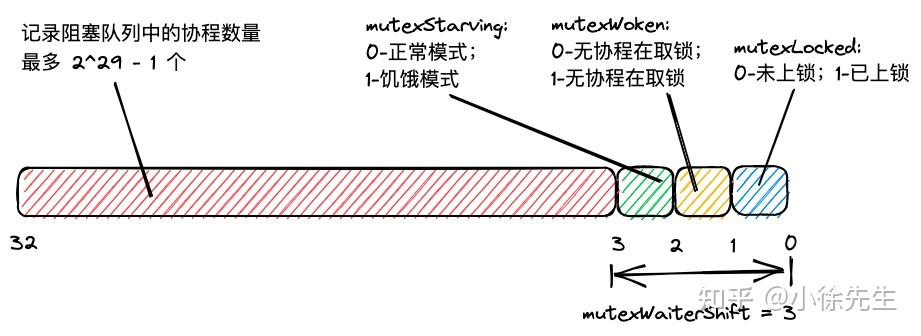
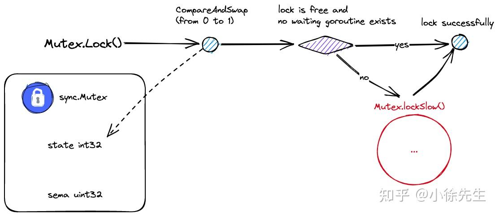
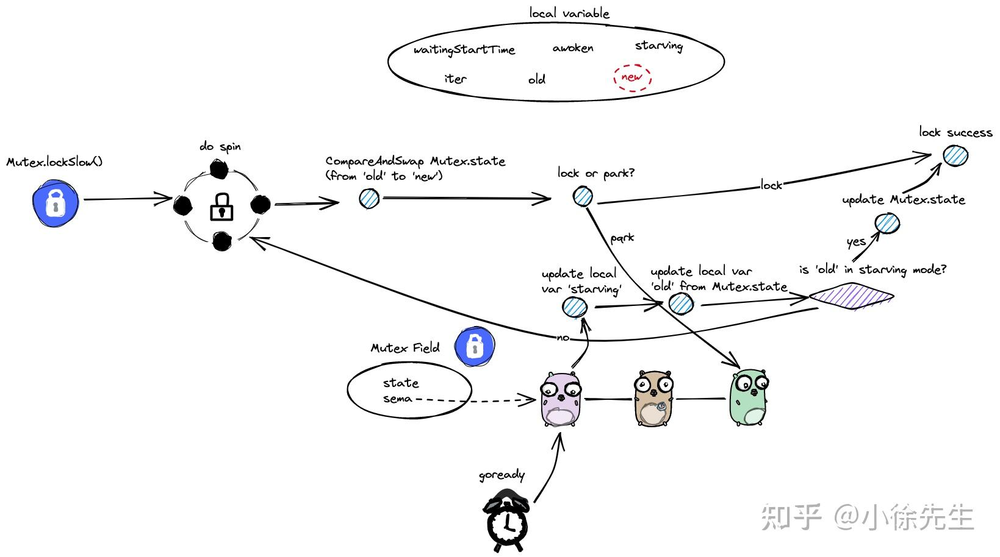
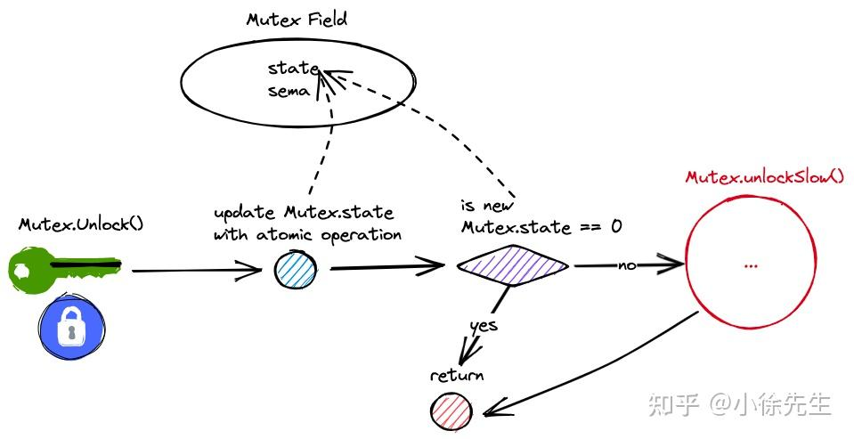
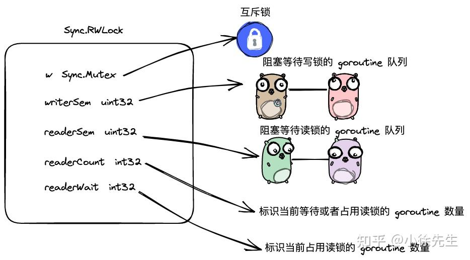

> 主要聊聊两部分内容
> 1.go中常用的互斥锁sync.Mutex
> 2.以Mutex为基础，研究sync.RWMutex


# sync.Mutex

## 核心机制

### 上锁/解锁

遵循由简入繁的思路，我们首先忽略大量的实现细节以及基于并发安全角度的逻辑考量，思考实现一把锁最简单纯粹的主干流程：

（1）通过 Mutex 内一个状态值标识锁的状态，例如，取 0 表示未加锁，1 表示已加锁；

（2）上锁：把 0 改为 1；

（3）解锁：把 1 置为 0.

（4）上锁时，假若已经是 1，则上锁失败，需要等他人解锁，将状态改为 0.

Mutex 整体流程的骨架便是如此，接下来，我们就不断填充血肉、丰富细节.

### 由自旋到阻塞的升级过程

> CAS: 比较一个变量当前的值是否是我期望的旧值，如果是，就改成新值，否则什么都不做。
> 自旋：当没拿到锁时，不立刻放弃或睡眠，而是“在原地循环”不断重试，看看锁是不是释放了。

针对 goroutine 加锁时发现锁已被抢占的这种情形，此时摆在面前的策略有如下两种：

（1）阻塞/唤醒：将当前 goroutine 阻塞挂起，直到锁被释放后，以回调的方式将阻塞 goroutine 重新唤醒，进行锁争夺；

（2）自旋 + CAS（轻量锁）：基于自旋结合 CAS 的方式，重复校验锁的状态并尝试获取锁，始终把主动权握在手中.

> 一般系统会用混合策略: 先自旋几次 + CAS 尝试，如果还拿不到，再阻塞挂起。

上述方案各有优劣，且有其适用的场景：


`sync.Mutex` 结合两种方案的使用场景，制定了一个锁升级的过程，反映了面对并发环境通过持续试探逐渐由`乐观`逐渐转为`悲观`的态度，具体方案如下：

（1）首先保持乐观，goroutine 采用自旋 + CAS 的策略争夺锁；

（2）尝试持续受挫达到一定条件后，判定当前过于激烈，则由自旋转为 阻塞/挂起模式.

上面谈及到的由自旋模式转为阻塞模式的具体条件拆解如下：

（1）自旋累计达到 4 次仍未取得战果；

（2）CPU 单核或仅有单个 P 调度器；（此时自旋，其他 goroutine 根本没机会释放锁，自旋纯属空转）；

（3）当前 P 的执行队列中仍有待执行的 G. （避免因自旋影响到 GMP 调度效率）.

### 饥饿模式

升级策略主要面向性能问题.饥饿模式的概念则是展开对【公平性】的问题探讨.

（1）饥饿：顾名思义，是因为非公平机制的原因，导致 Mutex 阻塞队列中存在 goroutine 长时间取不到锁，从而陷入饥荒状态；

（2）饥饿模式：当 Mutex 阻塞队列中存在处于饥饿态的 goroutine 时，会进入模式，将抢锁流程由非公平机制转为公平机制.

在 `sync.Mutex` 运行过程中存在两种模式：

（1）正常模式/非饥饿模式：这是 sync.Mutex 默认采用的模式. 当有 goroutine 从阻塞队列被唤醒时，会和此时先进入抢锁流程的 goroutine 进行锁资源的争夺，假如抢锁失败，会重新回到阻塞队列头部.

值得一提的是，此时被唤醒的老 goroutine 相比新 goroutine 是处于劣势地位，因为新 goroutine 已经在占用 CPU 时间片，且新 goroutine 可能存在多个，从而形成多对一的人数优势，因此形势对老 goroutine 不利.

（2）饥饿模式：这是 sync.Mutex 为拯救陷入饥荒的老 goroutine 而启用的特殊机制，饥饿模式下，锁的所有权按照阻塞队列的顺序进行依次传递. 新 goroutine 进行流程时不得抢锁，而是进入队列尾部排队.

`两种模式的转换条件`：

（1）默认为正常模式；

（2）正常模式 -> 饥饿模式：当阻塞队列存在 goroutine 等锁超过 1ms 而不得，则进入饥饿模式；

（3）饥饿模式 -> 正常模式：当阻塞队列已清空，或取得锁的 goroutine 等锁时间已低于 1ms 时，则回到正常模式

小结：正常模式灵活机动，性能较好；饥饿模式严格死板，但能捍卫公平的底线. 因此，两种模式的切换体现了 sync.Mutex 为适应环境变化，在公平与性能之间做出的调整与权衡. 回头观望，这一项因地制宜、随机应变的能力正是许多优秀工具所共有的特质.

### goroutine唤醒标识

为尽可能缓解竞争压力和性能损耗，sync.Mutex 会不遗余力在可控范围内减少一些无意义的并发竞争和操作损耗.

在实现上，sync.Mutex 通过一个 mutexWoken 标识位，标志出当前是否已有 goroutine 在自旋抢锁或存在 goroutine 从阻塞队列中被唤醒；倘若 `mutexWoken` 为 true，且此时有解锁动作发生时，就没必要再额外唤醒阻塞的 goroutine 从而引起竞争内耗.

## 数据结构

```go
type Mutex struct {
    state int32
    sema  uint32
}
```

（1）state：锁中最核心的状态字段，不同 bit 位分别存储了 `mutexLocked(是否上锁)`、`mutexWoken（是否有 goroutine 从阻塞队列中被唤醒）`、`mutexStarving（是否处于饥饿模式）`的信息；

（2）sema：用于阻塞和唤醒 goroutine 的信号量.

### 几个全局常量

```go
const (
    mutexLocked = 1 << iota // mutex is locked
    mutexWoken
    mutexStarving
    mutexWaiterShift = iota


    starvationThresholdNs = 1e6
)
```
（1）mutexLocked = 1：state 最右侧的一个 bit 位标志是否上锁，0-未上锁，1-已上锁；

（2）mutexWoken = 2：state 右数第二个 bit 位标志是否有 goroutine 从阻塞中被唤醒，0-没有，1-有；

（3）mutexStarving = 4：state 右数第三个 bit 位标志 Mutex 是否处于饥饿模式，0-非饥饿，1-饥饿；

（4）mutexWaiterShift = 3：右侧存在 3 个 bit 位标识特殊信息，分别为上述的 mutexLocked、mutexWoken、mutexStarving；

（5）starvationThresholdNs = 1 ms：sync.Mutex 进入饥饿模式的等待时间阈值.

### state字段描述

`Mutex.state` 字段为 `int32` 类型，不同 bit 位具有不同的标识含义：



低 3 位分别标识 mutexLocked（是否上锁）、mutexWoken（是否有协程在抢锁）、mutexStarving（是否处于饥饿模式），高 29 位的值聚合为一个范围为 0~2^29-1 的整数，表示在阻塞队列中等待的协程个数.

后续在加锁/解锁处理流程中，会频繁借助位运算从 Mutex.state 字段中快速获取到以上信息，大家可以先对以下几个式子混个眼熟：

（1）state & mutexLocked：判断是否上锁；

（2）state | mutexLocked：加锁；

（3）state & mutexWoken：判断是否存在抢锁的协程；

（4）state | mutexWoken：更新状态，标识存在抢锁的协程；

（5）state &^ mutexWoken：更新状态，标识不存在抢锁的协程；

> &^ (AND NOT):按位清零

（6）state & mutexStarving：判断是否处于饥饿模式；

（7）state | mutexStarving：置为饥饿模式；

（8）state >> mutexWaiterShif：获取阻塞等待的协程数；

（9）state += 1 << mutexWaiterShif：阻塞等待的协程数 + 1.

## Mutex.Lock()


### Lock方法主干



```go
func (m *Mutex) Lock() {
    if atomic.CompareAndSwapInt32(&m.state, 0, mutexLocked) {
        return
    }
    // Slow path (outlined so that the fast path can be inlined)
    m.lockSlow()
}
```
（1）首先进行一轮 `CAS` 操作，假如当前未上锁且锁内不存在阻塞协程，则直接 CAS 抢锁成功返回；

（2）第一轮初探失败，则进入 `lockSlow` 流程，下面细谈.


### Mutex.lockSlow()

#### 几个局部变量

```go
func (m *Mutex) lockSlow() {
    var waitStartTime int64
    starving := false
    awoke := false
    iter := 0
    old := m.state
    // ...
}
```

（1）waitStartTime：标识当前 goroutine 在抢锁过程中的等待时长，单位：ns；

（2）starving：标识当前是否处于饥饿模式；

（3）awoke：标识当前是否已有协程在等锁；

（4）iter：标识当前 goroutine 参与自旋的次数；

（5）old：临时存储锁的 state 值

#### 自旋空转

```go
func (m *Mutex) lockSlow() {
    // ...
    for {
        // 进入该 if 分支，说明抢锁失败，处于饥饿模式，但仍满足自旋条件
        if old&(mutexLocked|mutexStarving) == mutexLocked && runtime_canSpin(iter) {
            // 进入该 if 分支，说明当前锁阻塞队列有协程，但还未被唤醒，因此需要将      
            // mutexWoken 标识置为 1，避免再有其他协程被唤醒和自己抢锁
            if !awoke && old&mutexWoken == 0 && old>>mutexWaiterShift != 0 &&
                atomic.CompareAndSwapInt32(&m.state, old, old|mutexWoken) {
                awoke = true
            }
            runtime_doSpin()
            iter++
            old = m.state
            continue
        }
        
        // ...
    }
}
```
（1）走进 for 循环；

（2）假如满足三个条件：I 锁已被占用、 II 锁为正常模式、III 满足自旋条件（runtime_canSpin 方法），则进入自旋后处理环节；

（3）在自旋后处理中，假如当前锁有尚未唤醒的阻塞协程，则通过 CAS 操作将 state 的 mutexWoken 标识置为 1，将局部变量 awoke 置为 true；

（4）调用 runtime_doSpin 告知调度器 P 当前处于自旋模式；

（5）更新自旋次数 iter 和锁状态值 old；

（6）通过 continue 语句进入下一轮尝试.

#### state新值构造

```go
func (m *Mutex) lockSlow() {
    // ...

    for {
        // 自旋抢锁失败后处理 ...
        
        new := old
        if old&mutexStarving == 0 {
            new |= mutexLocked
        }
        if old&(mutexLocked|mutexStarving) != 0 {
            new += 1 << mutexWaiterShift
        }
        if starving && old&mutexLocked != 0 {
            new |= mutexStarving
        }
        if awoke {
            new &^= mutexWoken
        }
        
        // ...
    }
}
```

（1）从自旋中走出来后，会存在两种分支，要么加锁成功，要么陷入自锁，不论是何种情形，都会先对 sync.Mutex 的状态新值 new 进行更新；

（2）倘若当前是非饥饿模式，则在新值 new 中置为已加锁，即尝试抢锁；

（3）倘若旧值为已加锁或者处于饥饿模式，则当前 goroutine 在这一轮注定无法抢锁成功，可以直接令新值的阻塞协程数加1；

（4）倘若当前进入饥饿模式且旧值已加锁，则将新值置为饥饿模式；

（5）倘若局部变量标识是已有唤醒协程抢锁，说明 Mutex.state 中的 mutexWoken 是被当前 gouroutine 置为 1 的，但由于当前 goroutine 接下来要么抢锁成功，要么被阻塞挂起，因此需要在新值中将该 mutexWoken 标识更新置 0.

#### state新旧值替换


```go
func (m *Mutex) lockSlow() {
    // ...
    for {
        // 自旋抢锁失败后处理 ...
        
        // new old 状态值更新 ...
        
        if atomic.CompareAndSwapInt32(&m.state, old, new) {
            // case1 加锁成功
            // case2 将当前协程挂起
            
            // ...
        }else {
            old = m.state
        }
        // ...
    }
}
```

（1）通过 CAS 操作，用构造的新值替换旧值；

（2）倘若失败（即旧值被其他协程介入提前修改导致不符合预期），则将旧值更新为此刻的 Mutex.State，并开启一轮新的循环；

（3）倘若 CAS 替换成功，则进入最后一轮的二择一局面：I 倘若当前 goroutine 加锁成功，则返回；II 倘若失败，则将 goroutine 挂起添加到阻塞队列.

#### 上锁成功分支


```go
    // ...
    for {
        // 自旋抢锁失败后处理 ...
        
        // new old 状态值更新 ...
        
        if atomic.CompareAndSwapInt32(&m.state, old, new) {
            if old&(mutexLocked|mutexStarving) == 0 {
                break 
            }
            
            // ...
        } 
        // ...
    }
}
```

（1）延续 1.2.2.4 的思路，此时已经成功将 Mutex.state 由旧值替换为新值；

（2）接下来进行判断，倘若旧值是未加锁状态且为正常模式，则意味着加锁标识位正是由当前 goroutine 完成的更新，说明加锁成功，返回即可；

（3）倘若旧值中锁未释放或者处于饥饿模式，则当前 goroutine 需要进入阻塞队列挂起.

#### 阻塞挂起


```go
func (m *Mutex) lockSlow() {
    // ...
    for {
        // 自旋抢锁失败后处理 ...
        
        // new old 状态值更新 ...
        
        if atomic.CompareAndSwapInt32(&m.state, old, new) {
            // 加锁成功后返回的逻辑分支 ...
             
            queueLifo := waitStartTime != 0
            if waitStartTime == 0 {
                waitStartTime = runtime_nanotime()
            }
            runtime_SemacquireMutex(&m.sema, queueLifo, 1)
            // ...
        } 
        // ...
    }
}
```

承接上节，走到此处的情形有两种：要么是抢锁失败，要么是锁已处于饥饿模式，而当前 goroutine 不是从阻塞队列被唤起的协程. 不论处于哪种情形，当前 goroutine 都面临被阻塞挂起的命运.

（1）基于 queueLifo 标识当前 goroutine 是从阻塞队列被唤起的老客还是新进流程的新客；

（2）倘若等待的起始时间为零，则为新客；倘若非零，则为老客；

（3）倘若是新客，则对等待的起始时间进行更新，置为当前时刻的 ns 时间戳；

（4）将当前协程添加到阻塞队列中，倘若是老客则挂入队头；倘若是新客，则挂入队尾；

（5）挂起当前协程.

#### 从阻塞态被唤醒



```go
func (m *Mutex) lockSlow() {
    // ...
    for {
        // 自旋抢锁失败后处理...
        
        // new old 状态值更新 ...
        
        if atomic.CompareAndSwapInt32(&m.state, old, new) {
            // 加锁成功后返回的逻辑分支 ...
             
            // 挂起前处理 ...
            runtime_SemacquireMutex(&m.sema, queueLifo, 1)
            // 从阻塞队列被唤醒了
            starving = starving || runtime_nanotime()-waitStartTime > starvationThresholdNs
            old = m.state
            if old&mutexStarving != 0 {
                delta := int32(mutexLocked - 1<<mutexWaiterShift)
                if !starving || old>>mutexWaiterShift == 1 {
                    delta -= mutexStarving
                }
                atomic.AddInt32(&m.state, delta)
                break
            }
            awoke = true
            iter = 0
        } 
        // ...
    }
}
```

（1）走入此处，说明当前 goroutine 是从 Mutex 的阻塞队列中被唤起的；

（2）判断一下，此刻需要进入阻塞态，倘若当前 goroutine 进入阻塞队列时间长达 1 ms，则说明需要；此时会更新 starving 局部变量，并在下一轮循环中完成对 Mutex.state 中 starving 标识位的更新；

（3）获取此时锁的状态，通过 old 存储；

（4）倘若此时锁是饥饿模式，则当前 goroutine 无需竞争可以直接获得锁；

（5）饥饿模式下，goroutine 获取锁前需要更新锁的状态，包含 mutexLocked、锁阻塞队列等待协程数以及 mutexStarving 三个信息；均通过 delta 变量记录差值，最终通过原子操作添加到 Mutex.state 中；

（6）mutexStarving 的更新要作前置判断，倘若当前局部变量 starving 为 false，或者当前 goroutine 就是 Mutex 阻塞队列的最后一个 goroutine，则将 Mutex.state 置为正常模式.


## Unlock

### Unlock方法主干



```go
func (m *Mutex) Unlock() {
    new := atomic.AddInt32(&m.state, -mutexLocked)
    if new != 0 {
        m.unlockSlow(new)
    }
}
```

（1）通过原子操作解锁；

（2）倘若解锁时发现，目前参与竞争的仅有自身一个 goroutine，则直接返回即可；

（3）倘若发现锁中还有阻塞协程，则走入 unlockSlow 分支.

### unlockSlow


#### 未加锁的异常情形

```go
func (m *Mutex) unlockSlow(new int32) {
    if (new+mutexLocked)&mutexLocked == 0 {
        fatal("sync: unlock of unlocked mutex")
    }
    // ...
}
```

解锁时倘若发现 Mutex 此前未加锁，直接抛出 fatal.


#### 正常模式

```go
func (m *Mutex) unlockSlow(new int32) {   
    // ...
    if new&mutexStarving == 0 {
        old := new
        for {
            
            if old>>mutexWaiterShift == 0 || old&(mutexLocked|mutexWoken|mutexStarving) != 0 {
                return
            }
            
            new = (old - 1<<mutexWaiterShift) | mutexWoken
            if atomic.CompareAndSwapInt32(&m.state, old, new) {
                runtime_Semrelease(&m.sema, false, 1)
                return
            }
            old = m.state
        }
    } 
    // ...
}
```

（1）倘若阻塞队列内无 goroutine 或者 mutexLocked、mutexStarving、mutexWoken 标识位任一不为零，三者均说明此时有其他活跃协程已介入，自身无需关心后续流程；

（2）基于 CAS 操作将 Mutex.state 中的阻塞协程数减 1，倘若成功，则唤起阻塞队列头部的 goroutine，并退出；

（3）倘若减少阻塞协程数的 CAS 操作失败，则更新此时的 Mutex.state 为新的 old 值，开启下一轮循环.

#### 饥饿模式

```go
func (m *Mutex) unlockSlow(new int32) {
    // ...
    if new&mutexStarving == 0 {
        // ...
    } else {
        runtime_Semrelease(&m.sema, true, 1)
    }
}
```

饥饿模式下，直接唤醒阻塞队列**头部**的 goroutine 即可.


# sync.RWMutex

## 核心机制

（1）从逻辑上，可以把 RWMutex 理解为一把读锁加一把写锁；

（2）写锁具有严格的排他性，当其被占用，其他试图取写锁或者读锁的 goroutine 均阻塞；

（3）读锁具有有限的共享性，当其被占用，试图取写锁的 goroutine 会阻塞，试图取读锁的 goroutine 可与当前 goroutine 共享读锁；

（4）综上可见，RWMutex 适用于读多写少的场景，最理想化的情况，当所有操作均使用读锁，则可实现去锁化；最悲观的情况，倘若所有操作均使用写锁，则 RWMutex 退化为普通的 Mutex.

## 数据结构



```go
const rwmutexMaxReaders = 1 << 30


type RWMutex struct {
    w           Mutex  // held if there are pending writers
    writerSem   uint32 // semaphore for writers to wait for completing readers
    readerSem   uint32 // semaphore for readers to wait for completing writers
    readerCount int32  // number of pending readers
    readerWait  int32  // number of departing readers
}
```

（1）rwmutexMaxReaders：共享读锁的 goroutine 数量上限，值为 2^29；

（2）w：RWMutex 内置的一把普通互斥锁 sync.Mutex；

（3）writerSem：关联写锁阻塞队列的信号量；

（4）readerSem：关联读锁阻塞队列的信号量；

（5）readerCount：正常情况下等于介入读锁流程的 goroutine 数量；当 goroutine 接入写锁流程时，该值为实际介入读锁流程的 goroutine 数量减 rwmutexMaxReaders.

（6）readerWait：记录在当前 goroutine 获取写锁前，还需要等待多少个 goroutine 释放读锁.

## 读锁流程

### RLock

```go
func (rw *RWMutex) RLock() {
    if atomic.AddInt32(&rw.readerCount, 1) < 0 {
        runtime_SemacquireMutex(&rw.readerSem, false, 0)
    }
}
```

（1）基于原子操作，将 RWMutex 的 readCount 变量加一，表示占用或等待读锁的 goroutine 数加一；

（2）倘若 RWMutex.readCount 的新值仍小于 0，说明有 goroutine 未释放写锁，因此将当前 goroutine 添加到读锁的阻塞队列中并阻塞挂起.

### RUnlock

#### RUnlock方法主干

```go
func (rw *RWMutex) RUnlock() {
    if r := atomic.AddInt32(&rw.readerCount, -1); r < 0 {
        rw.rUnlockSlow(r)
    }
}
```

（1）基于原子操作，将 RWMutex 的 readCount 变量减一，表示占用或等待读锁的 goroutine 数减一；

（2）倘若 RWMutex.readCount 的新值小于 0，说明有 goroutine 在等待获取写锁，则走入 RWMutex.rUnlockSlow 的流程中.

#### rUnlockSlow

```go
func (rw *RWMutex) rUnlockSlow(r int32) {
    if r+1 == 0 || r+1 == -rwmutexMaxReaders {
        fatal("sync: RUnlock of unlocked RWMutex")
    }
    if atomic.AddInt32(&rw.readerWait, -1) == 0 {
        runtime_Semrelease(&rw.writerSem, false, 1)
    }
}
```

（1）对 RWMutex.readerCount 进行校验，倘若发现当前协程此前未抢占过读锁，或者介入读锁流程的 goroutine 数量达到上限，则抛出 fatal；

倘若 r+1 == -rwmutexMaxReaders，说明此时有 goroutine 介入写锁流程，但当前此前未加过读锁，具体原因见 2.3 小节；倘若 r+1==0，则要么此前未加过读锁，要么介入读锁流程的 goroutine 数量达到上限，具体原因见 2.3 小节.

（2）基于原子操作，对 RWMutex.readerWait 进行减一操作，倘若其新值为 0，说明当前 goroutine 是最后一个介入读锁流程的协程，因此需要唤醒一个等待写锁的阻塞队列的 goroutine.（综合 RWMutex.readerCount 为负值，可以确定存在等待写锁的 goroutine，具体原因见 2.3 小节.）

## 写锁流程

### Lock

```go
func (rw *RWMutex) Lock() {
    rw.w.Lock()
    r := atomic.AddInt32(&rw.readerCount, -rwmutexMaxReaders) + rwmutexMaxReaders
    if r != 0 && atomic.AddInt32(&rw.readerWait, r) != 0 {
        runtime_SemacquireMutex(&rw.writerSem, false, 0)
    }
}
```

（1）对 RWMutex 内置的互斥锁进行加锁操作；

（2）基于原子操作，对 RWMutex.readerCount 进行减少 -rwmutexMaxReaders 的操作；

（3）倘若此时存在未释放读锁的 gouroutine，则基于原子操作在 RWMutex.readerWait 的基础上加上介入读锁流程的 goroutine 数量，并将当前 goroutine 添加到写锁的阻塞队列中挂起.

### Unlock

```go
func (rw *RWMutex) Unlock() {
    r := atomic.AddInt32(&rw.readerCount, rwmutexMaxReaders)
    if r >= rwmutexMaxReaders {
        fatal("sync: Unlock of unlocked RWMutex")
    }
    for i := 0; i < int(r); i++ {
        runtime_Semrelease(&rw.readerSem, false, 0)
    }
    rw.w.Unlock()
}
```

（1）基于原子操作，将 RWMutex.readerCount 的值加上 rwmutexMaxReaders；

（2）倘若发现 RWMutex.readerCount 的新值大于 rwmutexMaxReaders，则说明要么当前 RWMutex 未上过写锁，要么介入读锁流程的 goroutine 数量已经超限，因此直接抛出 fatal；

（3）因此唤醒读锁阻塞队列中的所有 goroutine；(可见，竞争读锁的 goroutine 更具备优势)

（4）解开 RWMutex 内置的互斥锁.