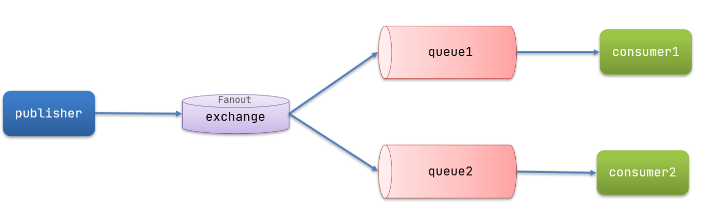

- 基于redis实现mq
- kafka/rocketmq/rabbitmq
  - kafka
  - rabbitmq
- nsq: 基于go实现的mq

# 概述

MQ，中文是消息队列（MessageQueue），字面来看就是存放消息的队列。也就是事件驱动架构中的Broker。

比较常见的MQ实现：

- ActiveMQ
- RabbitMQ
- RocketMQ
- Kafka
几种常见MQ的对比

## quick start

### 消息模型

RabbitMQ中的一些角色：

- publisher：生产者
- consumer：消费者
- exchange：交换机，负责消息路由
- queue：队列，存储消息
- virtualHost：虚拟主机，隔离不同租户的exchange、queue、消息的隔离

RabbitMQ官方提供了5个不同的Demo示例，对应了不同的消息模型：

- 基本消息队列BasicQueue
- 工作消息队列WorkQueue
- 发布订阅，根据交换机类型不同分三种
  - FanoutExchange广播
  - DirectExchange路由
  - TopicExchange主题

### BasicQueue

～

### WorkQueue

Work queues，也被称为（Task queues），任务模型。简单来说就是让多个消费者绑定到一个队列，共同消费队列中的消息。

当消息处理比较耗时的时候，可能生产消息的速度会远远大于消息的消费速度。长此以往，消息就会堆积越来越多，无法及时处理。

此时就可以使用work 模型，多个消费者共同处理消息处理，速度就能大大提高了。

Work模型的使用：

多个消费者绑定到一个队列，同一条消息只会被一个消费者处理
通过设置prefetch来控制消费者预取的消息数量

### 发布/订阅

可以看到，在订阅模型中，多了一个exchange角色，而且过程略有变化：

- Publisher：生产者，也就是要发送消息的程序，但是不再发送到队列中，而是发给交换机
- Exchange：交换机。一方面，接收生产者发送的消息。另一方面，知道如何处理消息，例如递交给某个特别队列、递交给所有队列、或是将消息丢弃。到底如何操作，取决于Exchange的类型。Exchange有以下3种类型：
  - Fanout：广播，将消息交给所有绑定到交换机的队列
  - Direct：定向，把消息交给符合指定routing key 的队列
  - Topic：通配符，把消息交给符合routing pattern（路由模式） 的队列
- Consumer：消费者，与以前一样，订阅队列，没有变化
- Queue：消息队列也与以前一样，接收消息、缓存消息。

Exchange（交换机）只负责转发消息，不具备存储消息的能力，因此如果没有任何队列与Exchange绑定，或者没有符合路由规则的队列，那么消息会丢失！

### Fanout

Fanout，是扇出。

在广播模式下，消息发送流程是这样的：

1） 可以有多个队列
2） 每个队列都要绑定到Exchange（交换机）
3） 生产者发送的消息，只能发送到交换机，交换机来决定要发给哪个队列，生产者无法决定
4） 交换机把消息发送给绑定过的所有队列
5） 订阅队列的消费者都能拿到消息

### Direct

在Fanout模式中，一条消息，会被所有订阅的队列都消费。但是，在某些场景下，我们希望不同的消息被不同的队列消费。这时就要用到Direct类型的Exchange。

在Direct模型下：

队列与交换机的绑定，不能是任意绑定了，而是要指定一个RoutingKey（路由key）
消息的发送方在 向 Exchange发送消息时，也必须指定消息的 RoutingKey。
Exchange不再把消息交给每一个绑定的队列，而是根据消息的Routing Key进行判断，只有队列的Routingkey与消息的 Routing key完全一致，才会接收到消息

### Topic

Topic类型的Exchange与Direct相比，都是可以根据RoutingKey把消息路由到不同的队列。只不过Topic类型Exchange可以让队列在绑定Routing key 的时候使用通配符！

Routingkey 一般都是有一个或多个单词组成，多个单词之间以”.”分割，例如： item.insert

通配符规则：

#：匹配一个或多个词

*：匹配不多不少恰好1个词

举例：

item.#：能够匹配item.spu.insert 或者 item.spu

item.*：只能匹配item.spu

