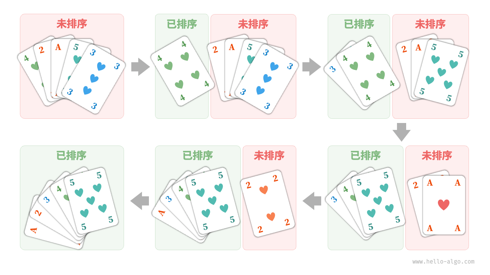
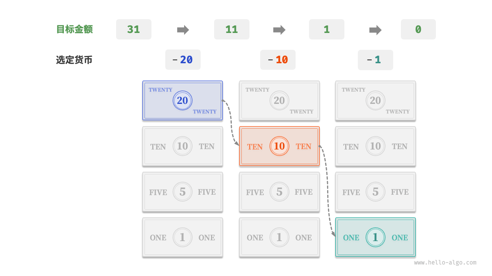

## 算法无处不在

当我们听到“算法”这个词时，很自然地会想到数学。然而实际上，许多算法并不涉及复杂数学，而是更多地依赖基本逻辑，这些逻辑在我们的日常生活中处处可见。

在正式探讨算法之前，有一个有趣的事实值得分享：你已经在不知不觉中学会了许多算法，并习惯将它们应用到日常生活中了。下面我将举几个具体的例子来证实这一点。

### 例一：查字典

在字典里，每个汉字都对应一个拼音，而字典是按照拼音字母顺序排列的。假设我们需要查找一个拼音首字母为r的字。通常会按照如下方式实现。

- 1.翻开字典约一半的页数，查看该页的首字母是什么，假设首字母为m
- 2.由于在拼音字母表中r位于m之后，所以排除字典前半部分，查找范围缩小到后半部分。
- 3.不断重复步骤 1. 和步骤 2. ，直至找到拼音首字母为r的页码为止。

查字典这个小学生必备技能，实际上就是著名的`“二分查找”算法`。从数据结构的角度，我们可以把字典视为一个已排序的“数组”；从算法的角度，我们可以将上述查字典的一系列操作看作“二分查找”。

### 例二：整理扑克

在打牌时，每局都需要整理手中的扑克牌，使其从小到大排列，实现流程如图所示。

- 1.将扑克牌划分为“有序”和“无序”两部分，并假设初始状态下最左 1 张扑克牌已经有序。
- 2.在无序部分抽出一张扑克牌，插入至有序部分的正确位置；完成后最左 2 张扑克已经有序。
- 3.不断循环步骤 2. ，每一轮将一张扑克牌从无序部分插入至有序部分，直至所有扑克牌都有序。

上述整理扑克牌的方法本质上是`“插入排序”算法`，它在处理小型数据集时非常高效。许多编程语言的排序库函数中都有插入排序的身影。

### 例三：货币找零

假设我们在超市购买了69元的商品，给了收银员100元，则收银员需要找我们31元。他会很自然地完成如图所示的思考。

- 1.可选项是比31元面值更小的货币，包括1元，5元，10元，20元。
- 2.从可选项中拿出最大的20元，剩余31-20=11元。
- 3.从剩余可选项中拿出最大的10元，剩余11-10=1元。
- 4.从剩余可选项中拿出最大的1元，剩余1-1=0元。
- 5.完成找零，方案是20+10+1=31元。

在以上步骤中，我们`每一步都采取当前看来最好的选择（尽可能用大面额的货币）`，最终得到了可行的找零方案。从数据结构与算法的角度看，这种方法本质上是`“贪心”算法`。

## 算法是什么

小到烹饪一道菜，大到星际航行，几乎所有问题的解决都离不开算法。计算机的出现使得我们能够通过编程将数据结构存储在内存中，同时编写代码调用 CPU 和 GPU 执行算法。这样一来，我们就能把生活中的问题转移到计算机上，以更高效的方式解决各种复杂问题。

### 算法定义

算法（algorithm）是在有限时间内解决特定问题的一组指令或操作步骤，它具有以下特性。

- 问题是明确的，包含清晰的输入和输出定义。
- 具有可行性，能够在有限步骤、时间和内存空间下完成。
- 各步骤都有确定的含义，在相同的输入和运行条件下，输出始终相同。

### 数据结构定义

数据结构（data structure）是组织和存储数据的方式，涵盖数据内容、数据之间关系和数据操作方法，它具有以下设计目标。

- 空间占用尽量少，以节省计算机内存。
- 数据操作尽可能快速，涵盖数据访问、添加、删除、更新等。
- 提供简洁的数据表示和逻辑信息，以便算法高效运行。

数据结构设计是一个充满权衡的过程。如果想在某方面取得提升，往往需要在另一方面作出妥协。下面举两个例子。

- 链表相较于数组，在数据添加和删除操作上更加便捷，但牺牲了数据访问速度。
- 图相较于链表，提供了更丰富的逻辑信息，但需要占用更大的内存空间。

### 数据结构与算法的关系

数据结构与算法高度相关、紧密结合，具体表现在以下三个方面。

- 数据结构是算法的基石。数据结构为算法提供了结构化存储的数据，以及操作数据的方法。
- 算法为数据结构注入生命力。数据结构本身仅存储数据信息，结合算法才能解决特定问题。
- 算法通常可以基于不同的数据结构实现，但执行效率可能相差很大，选择合适的数据结构是关键。

## 小结

- 算法在日常生活中无处不在，并不是遥不可及的高深知识。实际上，我们已经在不知不觉中学会了许多算法，用以解决生活中的大小问题。
- 查字典的原理与二分查找算法相一致。二分查找算法体现了分而治之的重要算法思想。
- 整理扑克的过程与插入排序算法非常类似。插入排序算法适合排序小型数据集。
- 货币找零的步骤本质上是贪心算法，每一步都采取当前看来最好的选择。
- 算法是在有限时间内解决特定问题的一组指令或操作步骤，而数据结构是计算机中组织和存储数据的方式。
- 数据结构与算法紧密相连。数据结构是算法的基石，而算法为数据结构注入生命力。

## Q & A

算法（以及其他基础科目）的意义不是在于在工作中从零实现它，而是基于学到的知识，在解决问题时能够作出专业的反应和判断，从而提升工作的整体质量。

在工程领域中，大量问题是难以达到最优解的，许多问题只是被“差不多”地解决了。问题的难易程度一方面取决于问题本身的性质，另一方面也取决于观测问题的人的知识储备。人的知识越完备、经验越多，分析问题就会越深入，问题就能被解决得更优雅。