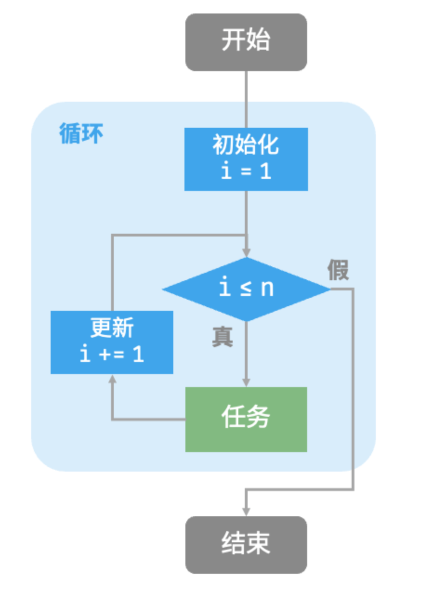
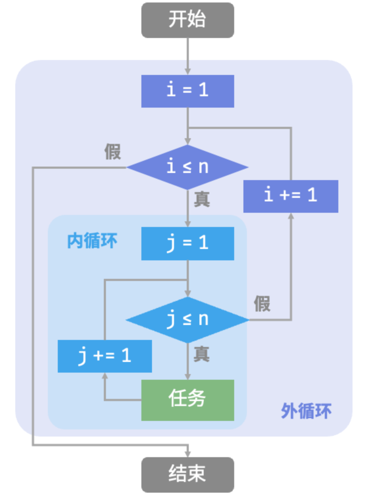
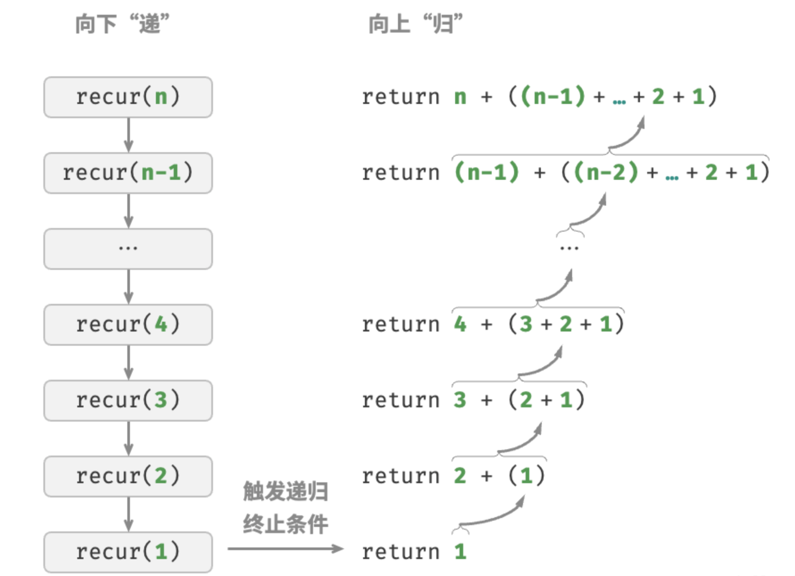
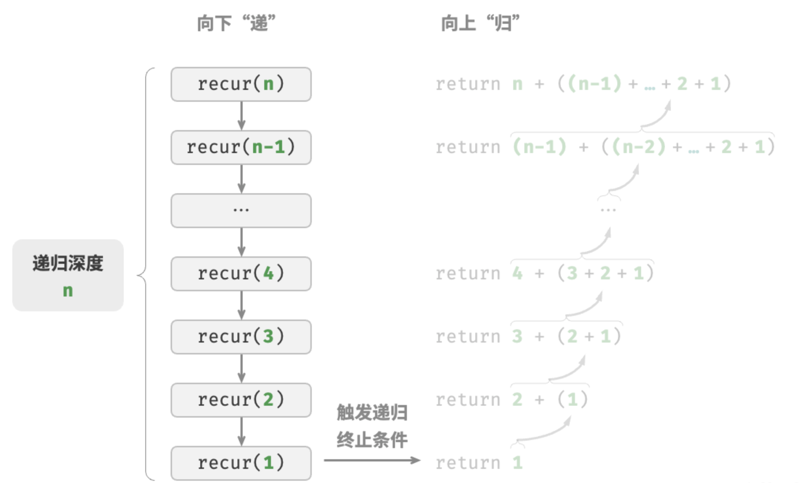
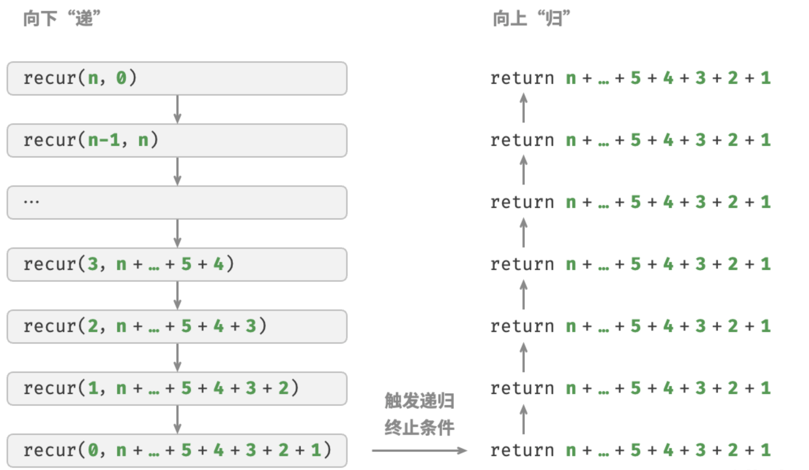
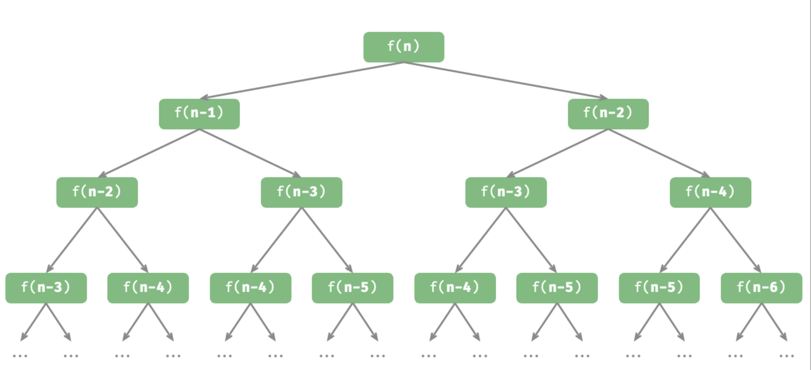

> 在算法中，重复执行某个任务是很常见的，它与复杂度分析息息相关。因此，在介绍时间复杂度和空间复杂度之前，我们先来了解如何在程序中实现重复执行任务，即两种基本的程序控制结构：迭代、递归。

## 迭代

迭代（iteration）是一种重复执行某个任务的控制结构。在迭代中，程序会在满足一定的条件下重复执行某段代码，直到这个条件不再满足。

### for循环

for 循环是最常见的迭代形式之一，适合在预先知道迭代次数时使用。

以下函数基于 for 循环实现了求和$1+2+...+n$，求和结果使用变量 res 记录。

```go
func forLoop(n int) int{
  res:=0
  for i:=1;i<=n;i++{
    res+=i
  }
  return res
}
```

下图是该求和函数的流程框图。



此求和函数的操作数量与输入数据大小$n$成正比，或者说成“线性关系”。实际上，时间复杂度描述的就是这个“线性关系”。

### 嵌套循环

可以在一个循环结构内嵌套另一个循环结构，下面以 for 循环为例：

```go
func nestedForLoop(n int) string{
  res:=""
  // 循环i= 1,2,...n-1,n
  for i:=1;i<=n;i++{
    for j:=1;j<=n;j++{
      // 循环j=1,2,...,n-1,n
      res+=fmt.Sprintf("(%d, %d), ",i,j)
    }
  }
  return res
}
```



在这种情况下，函数的操作数量与$n2$成正比，或者说算法运行时间和输入数据大小$n$成“平方关系”。

我们可以继续添加嵌套循环，每一次嵌套都是一次“升维”，将会使时间复杂度提高至“立方关系”“四次方关系”，以此类推。

## 递归

递归（recursion）是一种算法策略，通过函数调用自身来解决问题。它主要包含两个阶段。

- 递：程序不断深入地调用自身，通常传入更小或更简化的参数，直到达到“终止条件”。
- 归：触发“终止条件”后，程序从最深层的递归函数开始逐层返回，汇聚每一层的结果。

而从实现的角度看，递归代码主要包含三个要素。

- 1.终止条件：用于决定什么时候由“递”转“归”。
- 2.递归调用：对应“递”，函数调用自身，通常输入更小或更简化的参数。
- 3.返回结果：对应“归”，将当前递归层级的结果返回至上一层。

观察以下代码，我们只需调用函数 `recur(n)` ，就可以完成$1+2+...+n$的计算：

```go
// 递归
func recur(n int) int{
  // 终止条件
  if n==1{
    return 1
  }
  // 递: 递归调用
  res:= recur(n-1)
  // 归: 返回结果
  return n+res
}
```

下图展示了该函数的递归过程。



虽然从计算角度看，迭代与递归可以得到相同的结果，`但它们代表了两种完全不同的思考和解决问题的范式`。

- **迭代**：“自下而上”地解决问题。从最基础的步骤开始，然后不断重复或累加这些步骤，直到任务完成。
- **递归**：“自上而下”地解决问题。将原问题分解为更小的子问题，这些子问题和原问题具有相同的形式。接下来将子问题继续分解为更小的子问题，直到基本情况时停止（基本情况的解是已知的）。

以上述求和函数为例，设问题 $f(n)=1+2+...+n$ 。

- 迭代：在循环中模拟求和过程，从 $1$ 遍历到 $n$，每轮执行求和操作，即可求得 $f(n)$。
- 递归：将问题分解为子问题 $f(n)=n+f(n-1)$，不断（递归地）分解下去，直至基本情况 $f(1)=1$ 时终止。

### 调用栈

递归函数每次调用自身时，系统都会为新开启的函数分配内存，以存储局部变量、调用地址和其他信息等。这将导致两方面的结果。

- 函数的上下文数据都存储在称为“栈帧空间”的内存区域中，直至函数返回后才会被释放。因此，`递归通常比迭代更加耗费内存空间`。
- 递归调用函数会产生额外的开销。`因此递归通常比循环的时间效率更低`。

如图所示，在触发终止条件前，同时存在 $n$ 个未返回的递归函数，$递归深度为n$ 。



在实际中，编程语言允许的递归深度通常是有限的，过深的递归可能导致栈溢出错误。

### 尾递归

有趣的是，`如果函数在返回前的最后一步才进行递归调用`，则该函数可以被编译器或解释器优化，使其在空间效率上与迭代相当。这种情况被称为尾递归（tail recursion）。

- **普通递归**：当函数返回到上一层级的函数后，需要继续执行代码，因此系统需要保存上一层调用的上下文。
- **尾递归**：递归调用是函数返回前的最后一个操作，这意味着函数返回到上一层级后，无须继续执行其他操作，因此系统无须保存上一层函数的上下文。

以计算$1+2+...+n$为例，可以将结果变量 `res` 设为函数参数，从而实现尾递归：

```go
// 尾递归
func tailRecur(n int,res int) int{
  // 终止条件
  if n==0{
    return res
  }
  // 尾递归调用
  return tailRecur(n-1, res+n)
}
```
尾递归的执行过程如图所示。对比普通递归和尾递归，两者的求和操作的执行点是不同的。

- 普通递归：求和操作是在“归”的过程中执行的，每层返回后都要再执行一次求和操作。
- 尾递归：求和操作是在“递”的过程中执行的，“归”的过程只需层层返回。



### 递归树

当处理与“分治”相关的算法问题时，递归往往比迭代的思路更加直观、代码更加易读。以“斐波那契数列”为例。

给定一个斐波那契数列 $0,1,1,2,3,5,8,13,...$，求该数列的第 $n$ 个数字。

设斐波那契数列的第$n$个数字为$f(n)$，易得两个结论。

- 数列的前两个数字为$f(1)=0$和$f(2)=1$。
- 数列中的每个数字是前两个数字的和，即$f(n)=f(n-1)+f(n-2)$。

按照递推关系进行递归调用，将前两个数字作为终止条件，便可写出递归代码。调用 `fib(n)` 即可得到斐波那契数列的第$n$个数字：

```go
func fib(n int) int{
  // 终止条件 f(1)=0,f(2)=1
  if n==1||n==2{
    return n-1
  }
  // 递归调用f(n)=f(n-1)+f(n-2)
  res:=fib(n-1)+fib(n-2)
  return res
}
```

观察以上代码，我们在函数内递归调用了两个函数，**这意味着从一个调用产生了两个调用分支**。如图所示，这样不断递归调用下去，最终将产生一棵层数为$n$的`递归树（recursion tree）`。



从本质上看，递归体现了“将问题分解为更小子问题”的思维范式，这种分治策略至关重要。

- 从算法角度看，搜索、排序、回溯、分治、动态规划等许多重要算法策略直接或间接地应用了这种思维方式。
- 从数据结构角度看，递归天然适合处理链表、树和图的相关问题，因为它们非常适合用分治思想进行分析。
