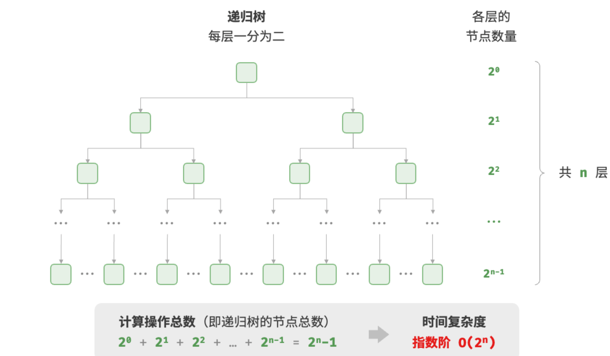

## 时间复杂度

### 推算方法

#### 第一步：统计操作数量

针对代码，逐行从上到下计算即可。然而，由于上述$c*f(n)$中的常数项$c$可以取任意大小，因此操作数量$T(n)$中的各种系数、常数项都可以忽略。根据此原则，可以总结出以下计数简化技巧。

- 1.忽略$T(n)$中的常数项。因为它们都与$n$无关，所以对时间复杂度不产生影响。
- 2.省略所有系数。例如，循环$2n$次、$5n+1$次等，都可以简化记为$n$次，因为$n$前面的系数对时间复杂度没有影响。
- 3.循环嵌套时使用乘法。总操作数量等于外层循环和内层循环操作数量之积，每一层循环依然可以分别套用第 1. 点和第 2. 点的技巧。

给定一个函数，我们可以用上述技巧来统计操作数量：

```go
func algorithm(n int) {
    a := 1     // +0（技巧 1）
    a = a + n  // +0（技巧 1）
    // +n（技巧 2）
    for i := 0; i < 5 * n + 1; i++ {
        fmt.Println(0)
    }
    // +n*n（技巧 3）
    for i := 0; i < 2 * n; i++ {
        for j := 0; j < n + 1; j++ {
            fmt.Println(0)
        }
    }
}
```

以下公式展示了使用上述技巧前后的统计结果，两者推算出的时间复杂度都为$O(n^2)$。


#### 第二步：判断渐近上界

时间复杂度由$T(n)$中最高阶的项来决定。这是因为在$n$趋于无穷大时，最高阶的项将发挥主导作用，其他项的影响都可以忽略。

展示了一些例子，其中一些夸张的值是为了强调“系数无法撼动阶数”这一结论。当$n$趋于无穷大时，这些常数变得无足轻重。


### 常见类型

设输入数据大小为$n$，常见的时间复杂度类型如图所示（按照从低到高的顺序排列）。


#### 常数阶$O(1)$

常数阶的操作数量与输入数据大小$n$无关，即不随着$n$的变化而变化。

在以下函数中，尽管操作数量 `size` 可能很大，但由于其与输入数据大小$n$无关，因此时间复杂度仍为$O(1)$：

```go
// 常数阶
func constant(n int) int{
  count:=0
  size:=10000
  for i:=0;i<size;i++{
    count++
  }
  return count
}
```

#### 线性阶$O(n)$

线性阶的操作数量相对于输入数据大小$n$以线性级别增长。线性阶通常出现在单层循环中：

```go
// 线性阶
func linear(n int) int{
  count := 0
  for i:=0;i<n;i++{
    count++
  }
  return count
}
```

遍历数组和遍历链表等操作的时间复杂度均为$O(n)$，其中$n$为数组或链表的长度：

```go
// 线性阶 遍历数组
func arrayTraversal(nums []int) int{
  count:=0
  // 循环次数与数组长度成正比
  for range nums{
    count++
  }
  return count
}
```

#### 平方阶O($n^2$)

平方阶的操作数量相对于输入数据大小$n$以平方级别增长。平方阶通常出现在嵌套循环中，外层循环和内层循环的时间复杂度都为$O(n)$，因此总体的时间复杂度为$O(n^2)$：

```go
// 平方阶
func quadratic(n int) int{
  count:=0
  // 循环次数与数据大小n成平方关系
  for i:=0;i<n;i++{
    for j:=0;j<n;j++{
      count++
    }
  }
  return count
}
```

下图对比了常数阶、线性阶和平方阶三种时间复杂度。


以冒泡排序为例，外层循环执行$n-1$次，内层循环执行$n-1,n-2,n-3,...2,1$次，平均$n/2$次，因此复杂度为$O(n-1)n/2=O(n^2)$：

```go
// 平方阶 冒泡排序
func bubbleSort(nums []int) int{
  count := 0 // 计数器
  // 外循环: 未排序区间为[0, i]
  for i:=len(nums)-1; i>0;i--{
    // 内循环：将未排序区间[0, i]中最大的元素交换至该区间最右端
    for j:=0;j<i;j++{
      if nums[j]>nums[j+1]{
        // 交换nums[j]与nums[j+1]
        tmp:=nums[j]
        nums[j]=nums[j+1]
        nums[j+1]=tmp
        count+=3 // 元素交换包含3个单元操作
      }
    }
  }
  return count
}
```

#### 指数阶O($2^n$)

生物学的“细胞分裂”是指数阶增长的典型例子：初始状态为$1$个细胞，分裂一轮后变为$2$个，分裂两轮后变为$4$个，以此类推，分裂$n$轮后有 
$2^n$个细胞。

```go
// 指数阶 循环实现
func exponential(n int)int{
  count,base:=0,1
  // 细胞每轮一分为2,形成数列 1,2,4,8,...,2^(n-1)
  for i:=0;i<n;i++{
    for j:=0;j<base;j++{
      count++
    }
    base *=2
  }
  return count
}
```



在实际算法中，指数阶常出现于递归函数中。例如在以下代码中，其递归地一分为二，经过$n$次分裂后停止：

```go
// 指数阶 递归实现
func expRecur(n int) int{
  if n==1{
    return 1
  }
  return expRecur(n-1) + expRecur(n-1)+1
}
```

指数阶增长非常迅速，在穷举法（暴力搜索、回溯等）中比较常见。对于数据规模较大的问题，指数阶是不可接受的，通常需要使用动态规划或贪心算法等来解决。

#### 对数阶O($logn$)

与指数阶相反，对数阶反映了“每轮缩减到一半”的情况。设输入数据大小为$n$，由于每轮缩减到一半，因此循环次数是$log_2n$，即$2^n$的反函数。

以下代码模拟了“每轮缩减到一半”的过程，时间复杂度为$O(log_2n)$，简记为$O(logn)$：

```go
// 对数阶 循环实现
func logarithmic(n int) int{
  count:=0
  for n>1{
    n=n/2
    count++
  }
  return count
}
```


与指数阶类似，对数阶也常出现于递归函数中。以下代码形成了一棵高度为$log_2n$的递归树：

```go
func logRecur(n int) int{
  if n<=1{
    return 0
  }
  return logRecur(n/2)+1
}
```
对数阶常出现于基于分治策略的算法中，体现了“一分为多”和“化繁为简”的算法思想。它增长缓慢，是仅次于常数阶的理想的时间复杂度。

#### 线性对数阶O($nlogn$)

线性对数阶常出现于嵌套循环中，两层循环的时间复杂度分别为$O(logn)$和 
$O(n)$。相关代码如下：

```go
// 线性对数阶
func linearLogRecur(n int) int{
  if n<=1{
    return 1
  }
  count:= linearLogRecur(n/2)+linearLogRecur(n/2)
  for i:=0;i<n;i++{
    count++
  }
  return count
}
```

下图展示了线性对数阶的生成方式。二叉树的每一层的操作总数都为$n$，树共有 
$log_2n+1$层，因此时间复杂度为$O(nlogn)$。


主流排序算法的时间复杂度通常为$O(nlogn)$，例如快速排序、归并排序、堆排序等。

#### 阶乘阶O($n!$)

阶乘阶对应数学上的“全排列”问题。给定$n$个互不重复的元素，求其所有可能的排列方案，方案数量为：


阶乘通常使用递归实现。如图 2-14 和以下代码所示，第一层分裂出$n$个，第二层分裂出$n-1$个，以此类推，直至第$n$层时停止分裂：

```go
// 阶乘阶 递归实现
func factorialRecur(n int) int{
  if n==0{
    return 1
  }
  count:=0
  // 从1分裂出n个
  for i:=0;i<n;i++{
    count+=factorialRecur(n-1)
  }
  return count
}
```


### 最差，最佳，平均时间复杂度

**算法的时间效率往往不是固定的，而是与输入数据的分布有关**。

值得说明的是，我们在实际中很少使用最佳时间复杂度，因为通常只有在很小概率下才能达到，可能会带来一定的误导性。**而最差时间复杂度更为实用，因为它给出了一个效率安全值**，让我们可以放心地使用算法。