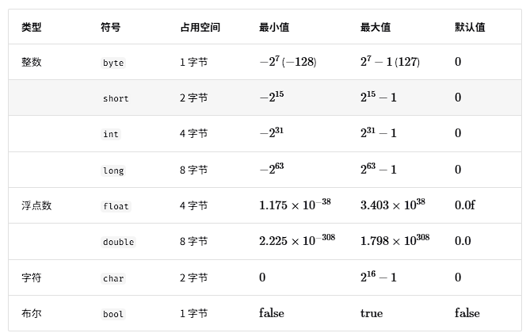

当谈及计算机中的数据时，我们会想到文本、图片、视频、语音、3D 模型等各种形式。尽管这些数据的组织形式各异，但它们都由各种基本数据类型构成。

基本数据类型是 CPU 可以直接进行运算的类型，在算法中直接被使用，主要包括以下几种。

- 整数类型 byte、short、int、long 。
- 浮点数类型 float、double ，用于表示小数。
- 字符类型 char ，用于表示各种语言的字母、标点符号甚至表情符号等。
- 布尔类型 bool ，用于表示“是”与“否”判断。

基本数据类型以二进制的形式存储在计算机中。一个二进制位即为$1$比特。在绝大多数现代操作系统中，$1$字节（byte）由$8$比特（bit）组成。

基本数据类型的取值范围取决于其占用的空间大小。下面以 Java 为例。

整数类型 `byte` 占用$1$字节 = $8$比特 ，可以表示$2^8$个数字。
整数类型 `int` 占用$1$字节 = $32$比特 ，可以表示$2^32$个数字。

下表列举了 Java 中各种基本数据类型的占用空间、取值范围和默认值。此表格无须死记硬背，大致理解即可，需要时可以通过查表来回忆。



请注意，表中针对的是 Java 的基本数据类型的情况。每种编程语言都有各自的数据类型定义，它们的占用空间、取值范围和默认值可能会有所不同。

那么，基本数据类型与数据结构之间有什么联系呢？我们知道，数据结构是在计算机中组织与存储数据的方式。这句话的主语是“结构”而非“数据”。

如果想表示“一排数字”，我们自然会想到使用数组。这是因为数组的线性结构可以表示数字的相邻关系和顺序关系，但至于存储的内容是整数 int、小数 float 还是字符 char ，则与“数据结构”无关。

换句话说，**基本数据类型提供了数据的“内容类型”，而数据结构提供了数据的“组织方式”**。例如以下代码，我们用相同的数据结构（数组）来存储与表示不同的基本数据类型，包括 int、float、char、bool 等。

```go
// 使用多种基本数据类型来初始化数组
var numbers = [5]int{}
var decimals = [5]float64{}
var chars = [5]byte{}
var bools = [5]bool{}
```