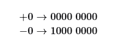

## 原码|反码|补码

在上一节的表格中我们发现，所有整数类型能够表示的负数都比正数多一个，例如 byte 的取值范围是$[-128, 127]$。这个现象比较反直觉，它的内在原因涉及原码、反码、补码的相关知识。

首先需要指出，**数字是以“补码”的形式存储在计算机中的**。在分析这样做的原因之前，首先给出三者的定义。

- 原码：我们将数字的二进制表示的最高位视为符号位，其中$0$表示正数，$1$表示负数，其余位表示数字的值。
- 反码：正数的反码与其原码相同，负数的反码是对其原码除符号位外的所有位取反。
- 补码：正数的补码与其原码相同，负数的补码是在其反码的基础上加$1$。

下图展示了原码、反码和补码之间的转换方法。

`原码（sign-magnitude）`虽然最直观，但存在一些局限性。一方面，负数的原码不能直接用于运算。例如在原码下计算 $1+(-2)$，得到的结果是$-3$ ，这显然是不对的。

为了解决此问题，计算机引入了`反码（1's complement）`。如果我们先将原码转换为反码并在反码下计算 $1+(-2)$，最后将结果从反码转换回原码，则可得到正确结果$-1$。

另一方面，数字零的原码有$+0$和$-0$两种表示方式。这意味着数字零对应两个不同的二进制编码，这可能会带来歧义。比如在条件判断中，如果没有区分正零和负零，则可能会导致判断结果出错。而如果我们想处理正零和负零歧义，则需要引入额外的判断操作，这可能会降低计算机的运算效率。

与原码一样，反码也存在正负零歧义问题，因此计算机进一步引入了`补码（2's complement）`。我们先来观察一下负零的原码、反码、补码的转换过程：

在负零的反码基础上加$1$会产生进位，但 byte 类型的长度只有 8 位，因此溢出到第 9 位的$1$会被舍弃。也就是说，负零的补码为$0000\;0000$，与正零的补码相同。这意味着在补码表示中只存在一个零，正负零歧义从而得到解决。

还剩最后一个疑惑：`byte` 类型的取值范围是 $[-128, 127]$，多出来的一个负数 $-128$是如何得到的呢？我们注意到，区间 $[-127, 127]$ 内的所有整数都有对应的原码、反码和补码，并且原码和补码之间可以互相转换。

然而，补码 $1000\;0000$ 是一个例外，它并没有对应的原码。根据转换方法，我们得到该补码的原码为 
 $0000\;0000$。这显然是矛盾的，因为该原码表示数字 $0$ ，它的补码应该是自身。计算机规定这个殊的补码 $1000\;0000$ 代表 $-128$ 
 。实际上，$(-1)+(-127)$ 在补码下的计算结果就是 $-128$。

你可能已经发现了，上述所有计算都是加法运算。这暗示着一个重要事实：**计算机内部的硬件电路主要是基于加法运算设计的**。这是因为加法运算相对于其他运算（比如乘法、除法和减法）来说，硬件实现起来更简单，更容易进行并行化处理，运算速度更快。

请注意，这并不意味着计算机只能做加法。通过将加法与一些基本逻辑运算结合，计算机能够实现各种其他的数学运算。例如，计算减法 $a-b$ 可以转换为计算加法 $a+(-b)$ ；计算乘法和除法可以转换为计算多次加法或减法。

现在我们可以总结出计算机使用补码的原因：基于补码表示，计算机可以用同样的电路和操作来处理正数和负数的加法，不需要设计特殊的硬件电路来处理减法，并且无须特别处理正负零的歧义问题。这大大简化了硬件设计，提高了运算效率。

## 浮点数编码

细心的你可能会发现：int 和 float 长度相同，都是 4 字节 ，但为什么 float 的取值范围远大于 int ？这非常反直觉，因为按理说 float 需要表示小数，取值范围应该变小才对。

实际上，这是因为浮点数 float 采用了不同的表示方式。记一个 32 比特长度的二进制数为：

根据 IEEE 754 标准，32-bit 长度的 float 由以下三个部分构成。

- 符号位 $S$：占 1 位 ，对应 $b_{31}$。
- 指数位 $E$：占 8 位 ，对应 $b_{30}b_{29}...b_{23}$。
- 分数位 $N$：占 23 位 ，对应 $b_{22}b_{21}...b_0$。

二进制数 float 对应值的计算方法为：

转化到十进制下的计算公式为：

其中各项的取值范围为：

现在我们可以回答最初的问题：float 的表示方式包含指数位，导致其取值范围远大于 int 。根据以上计算，float 可表示的最大正数为 $2^{254-127} * (2-2^{-23}) = 3.4 * 10^{28}$ ，切换符号位便可得到最小负数。

双精度 double 也采用类似于 float 的表示方法，在此不做赘述。