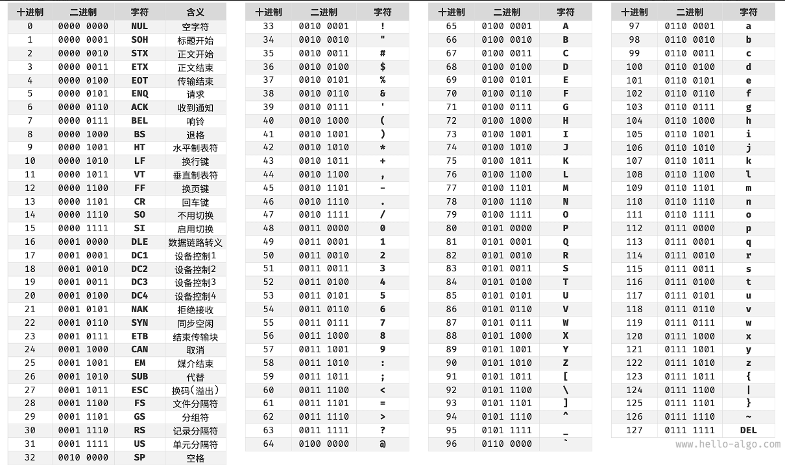
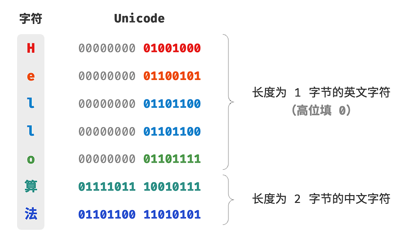

> 在计算机中，所有数据都是以二进制数的形式存储的，字符 char 也不例外。为了表示字符，我们需要建立一套“字符集”，规定每个字符和二进制数之间的一一对应关系。有了字符集之后，计算机就可以通过查表完成二进制数到字符的转换。

## ASCII字符集

ASCII 码是最早出现的字符集，其全称为 American Standard Code for Information Interchange（美国标准信息交换代码）。它使用 7 位二进制数（一个字节的低 7 位）表示一个字符，最多能够表示 128 个不同的字符。如图 3-6 所示，ASCII 码包括英文字母的大小写、数字 0 ~ 9、一些标点符号，以及一些控制字符（如换行符和制表符）。

然而，ASCII 码仅能够表示英文。随着计算机的全球化，诞生了一种能够表示更多语言的 EASCII 字符集。它在 ASCII 的 7 位基础上扩展到 8 位，能够表示 256 个不同的字符。

在世界范围内，陆续出现了一批适用于不同地区的 EASCII 字符集。这些字符集的前 128 个字符统一为 ASCII 码，后 128 个字符定义不同，以适应不同语言的需求。

## GBK字符集

后来人们发现，EASCII 码仍然无法满足许多语言的字符数量要求。比如汉字有近十万个，光日常使用的就有几千个。中国国家标准总局于 1980 年发布了 GB2312 字符集，其收录了 6763 个汉字，基本满足了汉字的计算机处理需要。

然而，GB2312 无法处理部分罕见字和繁体字。GBK 字符集是在 GB2312 的基础上扩展得到的，它共收录了 21886 个汉字。在 GBK 的编码方案中，ASCII 字符使用一个字节表示，汉字使用两个字节表示。

## Unicode字符集

随着计算机技术的蓬勃发展，字符集与编码标准百花齐放，而这带来了许多问题。一方面，这些字符集一般只定义了特定语言的字符，无法在多语言环境下正常工作。另一方面，同一种语言存在多种字符集标准，如果两台计算机使用的是不同的编码标准，则在信息传递时就会出现乱码。

那个时代的研究人员就在想：如果推出一个足够完整的字符集，将世界范围内的所有语言和符号都收录其中，不就可以解决跨语言环境和乱码问题了吗？在这种想法的驱动下，一个大而全的字符集 Unicode 应运而生。

Unicode 的中文名称为“统一码”，理论上能容纳 100 多万个字符。它致力于将全球范围内的字符纳入统一的字符集之中，提供一种通用的字符集来处理和显示各种语言文字，减少因为编码标准不同而产生的乱码问题。

**Unicode 是一种通用字符集，本质上是给每个字符分配一个编号（称为“码点”），但它并没有规定在计算机中如何存储这些字符码点。** 我们不禁会问：当多种长度的 Unicode 码点同时出现在一个文本中时，系统如何解析字符？例如给定一个长度为 2 字节的编码，系统如何确认它是一个 2 字节的字符还是两个 1 字节的字符？

对于以上问题，一种直接的解决方案是将所有字符存储为等长的编码。如图 3-7 所示，“Hello”中的每个字符占用 1 字节，“算法”中的每个字符占用 2 字节。我们可以通过高位填 0 将“Hello 算法”中的所有字符都编码为 2 字节长度。这样系统就可以每隔 2 字节解析一个字符，恢复这个短语的内容了。

然而 ASCII 码已经向我们证明，编码英文只需 1 字节。若采用上述方案，英文文本占用空间的大小将会是 ASCII 编码下的两倍，非常浪费内存空间。因此，我们需要一种更加高效的 Unicode 编码方法。

## UTF-8编码

目前，UTF-8 已成为国际上使用最广泛的 Unicode 编码方法。**它是一种可变长度的编码**，使用 1 到 4 字节来表示一个字符，根据字符的复杂性而变。ASCII 字符只需 1 字节，拉丁字母和希腊字母需要 2 字节，常用的中文字符需要 3 字节，其他的一些生僻字符需要 4 字节。

另外还诞生了UTF-16和UTF-32编码。

- UTF-16 编码：使用 2 或 4 字节来表示一个字符。所有的 ASCII 字符和常用的非英文字符，都用 2 字节表示；少数字符需要用到 4 字节表示。对于 2 字节的字符，UTF-16 编码与 Unicode 码点相等。
- UTF-32 编码：每个字符都使用 4 字节。这意味着 UTF-32 比 UTF-8 和 UTF-16 更占用空间，特别是对于 ASCII 字符占比较高的文本。

从兼容性的角度看，UTF-8 的通用性最佳，许多工具和库优先支持 UTF-8 。

## 编程语言的字符编码

对于以往的大多数编程语言，程序运行中的字符串都采用 UTF-16 或 UTF-32 这类等长编码。在等长编码下，我们可以将字符串看作数组来处理，这种做法具有以下优点。

Go 语言的 string 类型在内部使用 UTF-8 编码。Go 语言还提供了 rune 类型，它用于表示单个 Unicode 码点。

需要注意的是，以上讨论的都是字符串在编程语言中的存储方式，这和字符串如何在文件中存储或在网络中传输是不同的问题。在文件存储或网络传输中，我们通常会将字符串编码为 UTF-8 格式，以达到最优的兼容性和空间效率。

