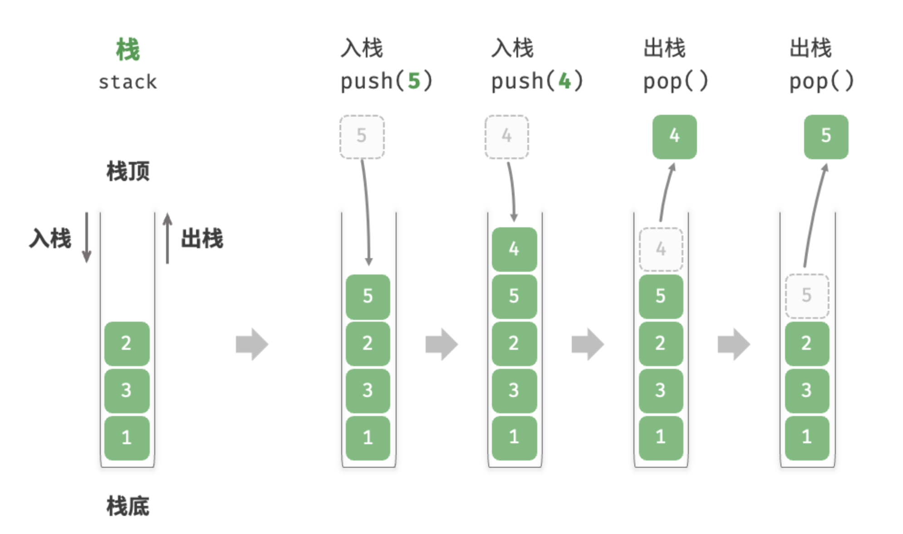
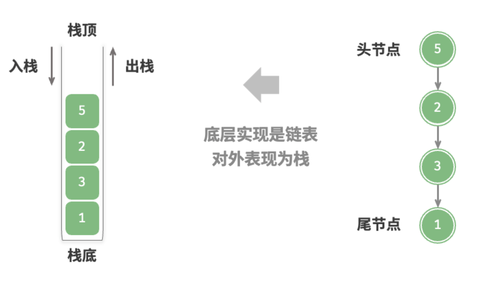
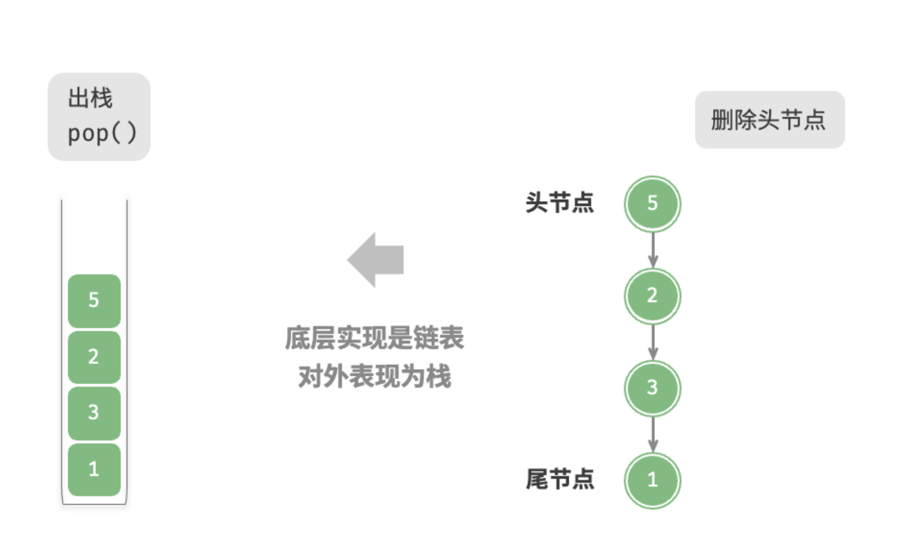
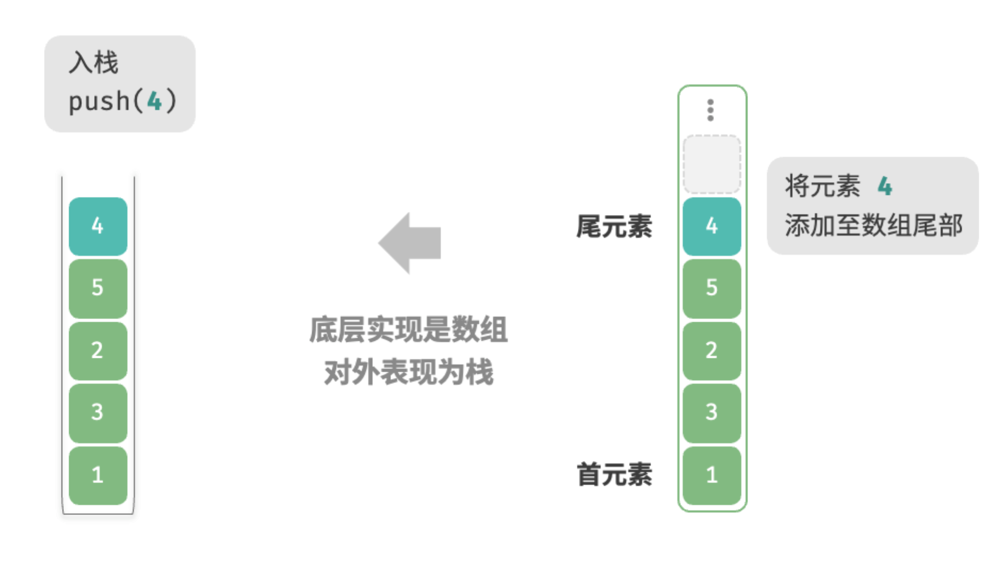
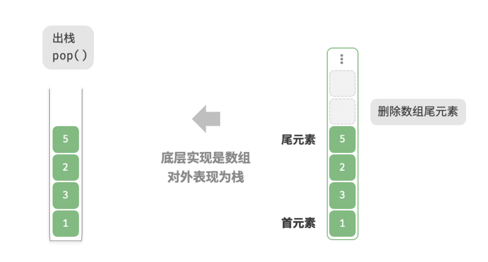

栈（stack）是一种遵循先入后出逻辑的线性数据结构。

可以将栈类比为桌面上的一摞盘子，如果想取出底部的盘子，则需要先将上面的盘子依次移走。我们将盘子替换为各种类型的元素（如整数、字符、对象等），就得到了栈这种数据结构。

把堆叠元素的顶部称为“栈顶”，底部称为“栈底”。将把元素添加到栈顶的操作叫作“入栈”，删除栈顶元素的操作叫作“出栈”。



## 栈的常用操作

栈的常用操作如表 5-1 所示，具体的方法名需要根据所使用的编程语言来确定。在此，我们以常见的 `push()`、`pop()`、`peek()` 命名为例。


通常情况下，我们可以直接使用编程语言内置的栈类。然而，某些语言可能没有专门提供栈类，这时我们可以将该语言的“数组”或“链表”当作栈来使用，并在程序逻辑上忽略与栈无关的操作。

```go
// 在Go中，推荐使用Slice当作栈来使用
var stack []int

// 元素入栈
stack = append(stack, 1)
stack = append(stack, 3)
stack = append(stack, 2)
stack = append(stack, 5)
stack = append(stack, 4)

// 访问栈顶元素
peek := stack[len(stack)-1]

// 元素出栈
pop := stack[len(stack)-1]
stack = stack[:len(stack)-1]

// 获取长度
size := len(stack)

// 判断是否为空
isEmpty := len(stack)==0
```


## 栈的实现

为了深入了解栈的运行机制，我们来尝试自己实现一个栈类。

栈遵循先入后出的原则，因此我们只能在栈顶添加或删除元素。然而，数组和链表都可以在任意位置添加和删除元素，因此**栈可以视为一种受限制的数组或链表**。换句话说，我们可以“屏蔽”数组或链表的部分无关操作，使其对外表现的逻辑符合栈的特性。

### 基于链表的实现


使用链表实现栈时，我们可以将链表的头节点视为栈顶，尾节点视为栈底。

对于入栈操作，我们只需将元素插入链表头部，这种节点插入方法被称为“头插法”。而对于出栈操作，只需将头节点从链表中删除即可。






以下是基于链表实现栈的示例代码：

```go
// 基于链表实现的栈
type linkedListStack struct{
  // 使用内置包 list来实现
  data *list.List
}

// 初始化栈
func newLinkedListStack() *linkedListStack{
  return &lindedListStack{
    data: list.New(),
  }
}

// 入栈
func (s *linkedListStack) push(value int){
  s.data.PushBack(value)
}

// 出栈
func (s *linkedListStack) pop() any{
  if s.isEmpty(){
    return nil
  }
  e := s.data.Back()
  s.data.Remove(e)
  return e.Value
}

// 访问栈顶元素
func (s *linkedListStack) peek() any{
  if s.isEmpty(){
    return nil
  }
  e := s.data.Back()
  return e.Value
}

// 获取栈的长度
func (s *linkedListStack) size() int{
  return s.data.Len()
}

// 判断栈是否为空
func (s *linkedListStack) isEmpty() bool {
    return s.data.Len() == 0
}

/* 获取 List 用于打印 */
func (s *linkedListStack) toList() *list.List {
    return s.data
}
```


### 基于数组的实现

使用数组实现栈时，我们可以将数组的尾部作为栈顶。如图 5-3 所示，入栈与出栈操作分别对应在数组尾部添加元素与删除元素，时间复杂度都为$O(1)$。






由于入栈的元素可能会源源不断地增加，因此我们可以使用动态数组，这样就无须自行处理数组扩容问题。以下为示例代码：

```go
// 基于数组实现栈
type arrayStack struct{
  data []int // 数据，Go中用切片
}

// 初始化栈
func newArrayStack() *arrayStack{
  return &arrayStack{
    // 设置栈的长度为0, 容量为16
    data: make([]int, 0, 16),
  }
}

// 栈的长度
func (s *arrayStack) size() int{
  return len(s.data)
}

// 栈是否为空
func (s *arrayStack) isEmpty() bool{
  return s.size==0
}

// 入栈
func (s *arrayStack) push(v int){
  // 切片会自动扩容
  s.data = append(s.data, v)
}

// 出栈
func (s *arrayStack) pop() any{
  val := s.peek()
  s.data = s.data[:len(s.data)-1]
}

// 获取栈顶元素
func (s *arrayStack) peek() any{
  if s.isEmpty(){
    return nil
  }
  val := s.data[len(s.data)-1]
  return val
}

// 获取slice用于打印
func (s *arrayStack) toSlice() []int{
  return s.data
}
```

## 两种实现对比

两种实现都支持栈定义中的各项操作。数组实现额外支持随机访问，但这已超出了栈的定义范畴，因此一般不会用到。

### 时间效率

在基于数组的实现中，入栈和出栈操作都在预先分配好的连续内存中进行，具有很好的缓存本地性，因此效率较高。然而，如果入栈时超出数组容量，会触发扩容机制，导致该次入栈操作的时间复杂度变为$O(n)$。

在基于链表的实现中，链表的扩容非常灵活，不存在上述数组扩容时效率降低的问题。但是，入栈操作需要初始化节点对象并修改指针，因此效率相对较低。不过，如果入栈元素本身就是节点对象，那么可以省去初始化步骤，从而提高效率。

综上所述，当入栈与出栈操作的元素是基本数据类型时，例如 int 或 double ，我们可以得出以下结论。

- 基于数组实现的栈在触发扩容时效率会降低，但由于扩容是低频操作，因此平均效率更高。
- 基于链表实现的栈可以提供更加稳定的效率表现。

### 空间效率

在初始化列表时，系统会为列表分配“初始容量”，该容量可能超出实际需求；并且，扩容机制通常是按照特定倍率（例如 2 倍）进行扩容的，扩容后的容量也可能超出实际需求。因此，基于数组实现的栈可能造成一定的空间浪费。

然而，由于链表节点需要额外存储指针，因此链表节点占用的空间相对较大。

综上，我们不能简单地确定哪种实现更加节省内存，需要针对具体情况进行分析。

## 栈的典型应用

- **浏览器中的后退与前进、软件中的撤销与反撤销**。每当我们打开新的网页，浏览器就会对上一个网页执行入栈，这样我们就可以通过后退操作回到上一个网页。后退操作实际上是在执行出栈。如果要同时支持后退和前进，那么需要两个栈来配合实现。

- 程序内存管理。每次调用函数时，系统都会在栈顶添加一个栈帧，用于记录函数的上下文信息。在递归函数中，向下递推阶段会不断执行入栈操作，而向上回溯阶段则会不断执行出栈操作。

