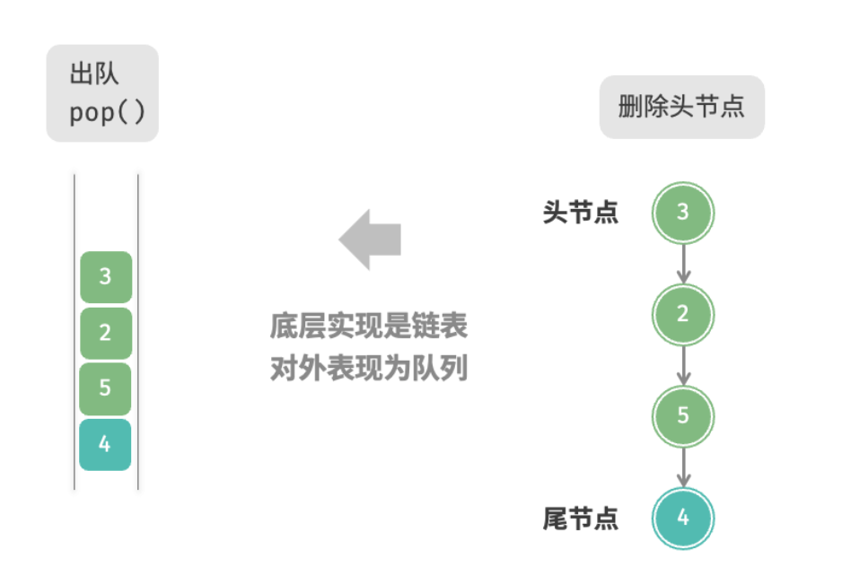

队列（queue）是一种遵循先入先出规则的线性数据结构。顾名思义，队列模拟了排队现象，即新来的人不断加入队列尾部，而位于队列头部的人逐个离开。

如图 5-4 所示，我们将队列头部称为“队首”，尾部称为“队尾”，将把元素加入队尾的操作称为“入队”，删除队首元素的操作称为“出队”。


## 队列常用操作

队列的常见操作如表 5-2 所示。需要注意的是，不同编程语言的方法名称可能会有所不同。我们在此采用与栈相同的方法命名。


可以直接使用编程语言中现成的队列类：

```go
// 初始化队列
// 在Go中，将list作为队列来使用
queue := list.New()

// 元素入队
queue.PushBack(1)
queue.PushBack(3)
queue.PushBack(2)
queue.PushBack(5)
queue.PushBack(4)

// 访问队首元素
peek := queue.Front()

// 元素出队
pop := queue.Front()
queue.Remove(pop)

// 获取队列的长度
size := queue.Len()

// 判断队列是否为空
isEmpty := queue.Len() == 0
```

## 队列实现

为了实现队列，我们需要一种数据结构，可以在一端添加元素，并在另一端删除元素，链表和数组都符合要求。


### 基于链表的实现

如图 5-5 所示，我们可以将链表的“头节点”和“尾节点”分别视为“队首”和“队尾”，规定队尾仅可添加节点，队首仅可删除节点。




以下是用链表实现队列的代码：

```go
// 基于链表实现的队列
type linkedListQueue struct{
  // 使用内置包list实现队列
  data *list.List
}

// 初始化队列
func newLinkedListQueue() *linkedListQueue{
  return &linkedListQueue{
    data: list.New(),
  }
}

// 入队
func (s *linkedListQueue) push(value any){
  s.data.PushBack(value)
}

// 出队
func (s *linkedListQueue) pop() any{
  if s.isEmpty(){
    return nil
  }
  e := s.dataFront()
  s.data.Remove(e)
  return e.Value
}

// 访问队首
func (s *linkedListQueue) peek() any{
  if s.isEmpty(){
    return nil
  }
  e := s.data.Front()
  return e.Value
}

// 获取队列长度
func (s *linkedListQueue) size() int{
  return s.data.Len()
}

// 判断队列是否为空
func (s *linkedListQueue) isEmpty() bool{
  return s.data.Len() == 0
}

// 获取list用于打印
func (s *linkedListQueue) toList *list.List{
  return s.data
}
```

### 基于数组的实现

在数组中删除首元素的时间复杂度为$O(n)$，这会导致出队操作效率较低。然而，我们可以采用以下巧妙方法来避免这个问题。

可以使用一个变量 `front` 指向队首元素的索引，并维护一个变量 `size` 用于记录队列长度。定义 r`ear = front + size` ，这个公式计算出的 `rear` **指向队尾元素之后的下一个位置**。

基于此设计，数组中包含元素的有效区间为 `[front, rear - 1]`，各种操作的实现方法如图 5-6 所示。

- 入队操作：将输入元素赋值给 `rear` 索引处，并将 `size` 增加 1 。
- 出队操作：只需将 `front` 增加 1 ，并将 `size` 减少 1 。


你可能会发现一个问题：在不断进行入队和出队的过程中，`front` 和 `rear` 都在向右移动，当它们到达数组尾部时就无法继续移动了。为了解决此问题，我们可以将数组视为首尾相接的“环形数组”

对于环形数组，我们需要让 `front` 或 `rear` 在越过数组尾部时，直接回到数组头部继续遍历。这种周期性规律可以通过“**取余**操作”来实现，代码如下所示：

```go
// 基于环形数组实现队列
type arrayQueue struct{
  nums []int      // 用于存储队列元素的数组
  front int       // 队首指针，指向队首元素
  queSize int     // 队列长度
  queCapacity int // 队列容量（即最大容纳元素数量）
}

// 初始化队列
func newArrayQueue(queCapacity int) *arrayQueue{
  return &arrayQueue{
    nums: make([]int, queCapacity),
    queCapacity: queCapacity,
    front: 0,
    queSize: 0
  }
}


// 队列长度
func (q *arrayQueue) size() int{
  return q.queSize
}

// 队列是否为空
func (q *arrayQueue) isEmpty() bool{
  return q.queSize == 0
}

// 入队
func (q *arrayQueue) push(num int){
  // 队列已满
  if q.queSize == q.queCapacity{
    // 这里可以补充扩容实现～～～
    return
  }
  // 计算队尾指针，指向队尾索引+1
  // 通过取余操作实现rear越过数组尾部后回到头部
  rear := (q.front+q.queSize) % q.queCapacity
  // 将num添加到队尾
  q.nums[rear]=num
  // 长度+1
  q.queSize++
}

// 出队
func (q *arrayQueue) pop() any{
  num := q.peek()
  if num == nil{
    return nil
  }
  // 队首指针向后移动一位，若越过队尾，则返回数组头部
  q.front = (q.front+1) % q.queCapacity
  q.queSize--
  // 这里可以实现缩容～～～
  return num
}

// 访问队首元素
func (q *arrayQueue) peek() any{
  if q.isEmpty{
    return nil
  }
  return q.nums[q.front]
}

// 获取Slice用于打印
func (q *arrayQueue) toSlice() []int{
  rear := q.front+q.queSize
  if rear >= q.queCapacity{
    rear %= q.queCapacity
    return append(q.nums[q.front:], q.nums[:rear]...)
  }
  return q.nums[q.front:rear]
}

// 自动扩容为原来的 2 倍
func (q *arrayQueue) expandCapacity() {
	newCap := q.queCapacity * 2
	newNums := make([]int, newCap)

	// 按入队顺序复制旧数据
	for i := 0; i < q.queSize; i++ {
		newNums[i] = q.nums[(q.front+i)%q.queCapacity]
	}

	q.nums = newNums
	q.front = 0
	q.queCapacity = newCap
}


```

以上实现的队列仍然具有局限性：其长度不可变。然而，这个问题不难解决，我们可以将数组替换为动态数组，从而引入扩容机制。有兴趣的读者可以尝试自行实现。

两种实现的对比结论与栈一致，在此不再赘述。


## 队列典型应用


- 淘宝订单。购物者下单后，订单将加入队列中，系统随后会根据顺序处理队列中的订单。在双十一期间，短时间内会产生海量订单，高并发成为工程师们需要重点攻克的问题。
- 各类待办事项。任何需要实现“先来后到”功能的场景，例如打印机的任务队列、餐厅的出餐队列等，队列在这些场景中可以有效地维护处理顺序。
