在队列中，我们仅能删除头部元素或在尾部添加元素。如图 5-7 所示，双向队列（double-ended queue）提供了更高的灵活性，允许在头部和尾部执行元素的添加或删除操作。

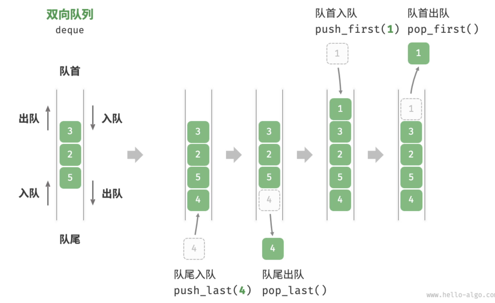

## 双向队列常用操作

双向队列的常用操作如表 5-3 所示，具体的方法名称需要根据所使用的编程语言来确定。

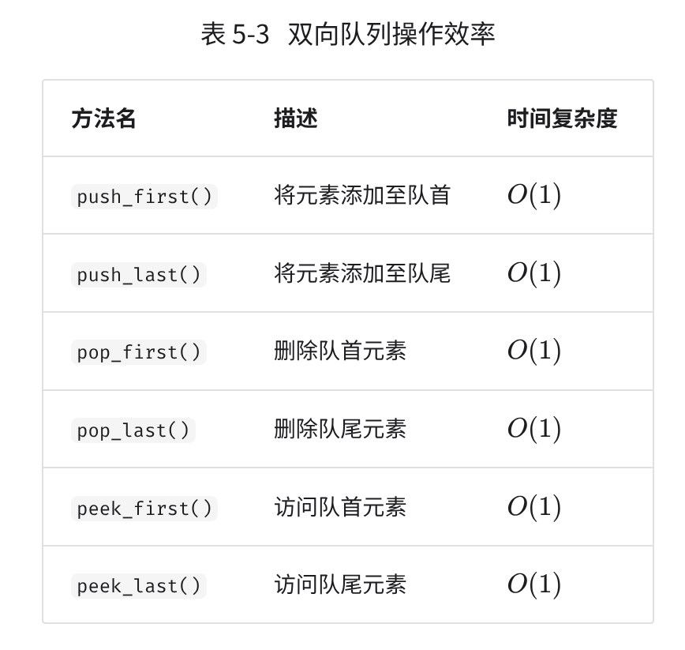

同样地，我们可以直接使用编程语言中已实现的双向队列类：

```go
/* 初始化双向队列 */
// 在 Go 中，将 list 作为双向队列使用
deque := list.New()

/* 元素入队 */
deque.PushBack(2)      // 添加至队尾
deque.PushBack(5)
deque.PushBack(4)
deque.PushFront(3)     // 添加至队首
deque.PushFront(1)

/* 访问元素 */
front := deque.Front() // 队首元素
rear := deque.Back()   // 队尾元素

/* 元素出队 */
deque.Remove(front)    // 队首元素出队
deque.Remove(rear)     // 队尾元素出队

/* 获取双向队列的长度 */
size := deque.Len()

/* 判断双向队列是否为空 */
isEmpty := deque.Len() == 0
```

## 双向队列实现 *

双向队列的实现与队列类似，可以选择链表或数组作为底层数据结构。

### 基于双向链表的实现

对于双向队列而言，头部和尾部都可以执行入队和出队操作。换句话说，双向队列需要实现另一个对称方向的操作。为此，我们采用“双向链表”作为双向队列的底层数据结构。

如图 5-8 所示，我们将双向链表的头节点和尾节点视为双向队列的队首和队尾，同时实现在两端添加和删除节点的功能。

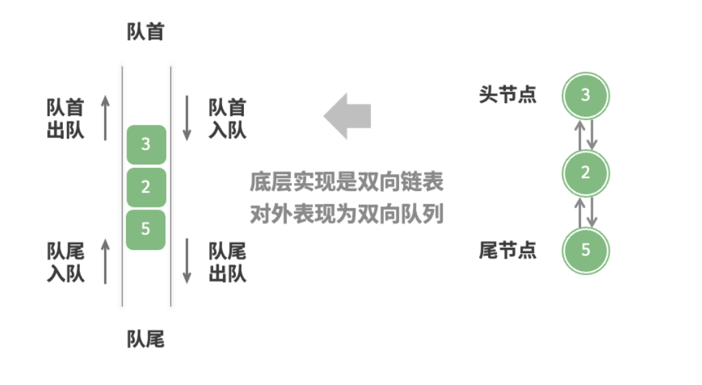

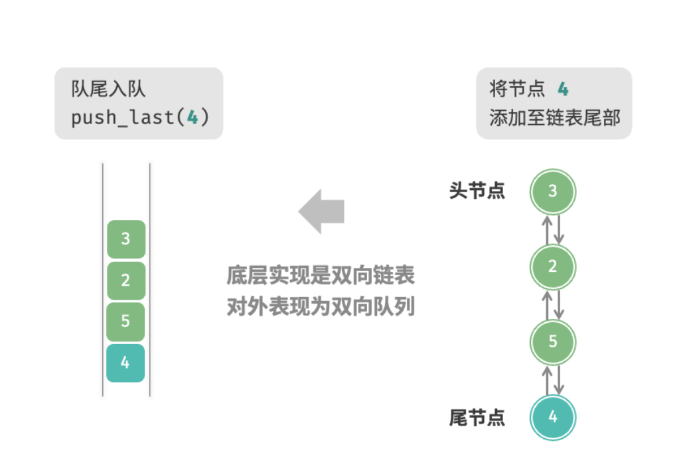

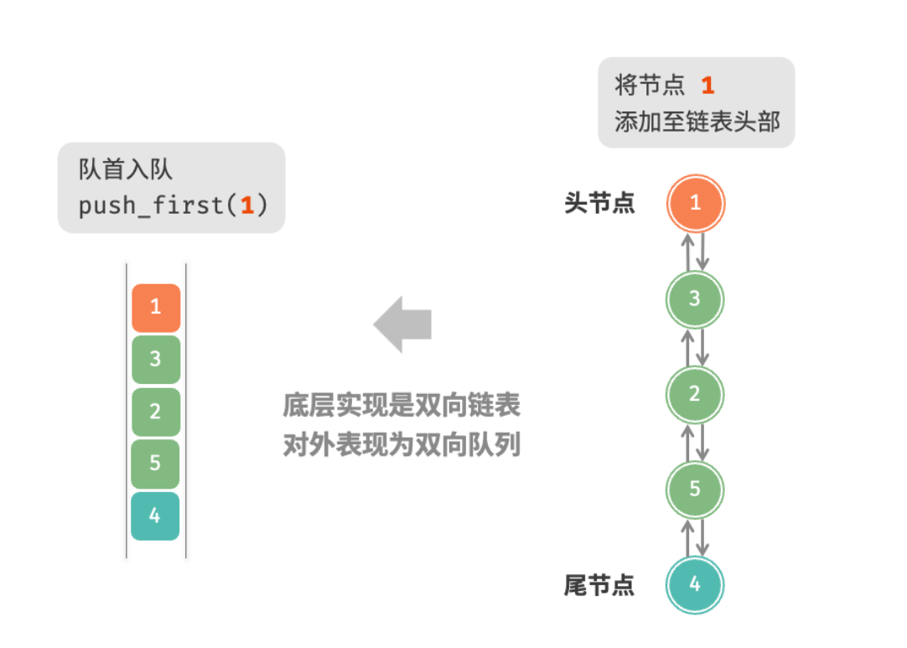

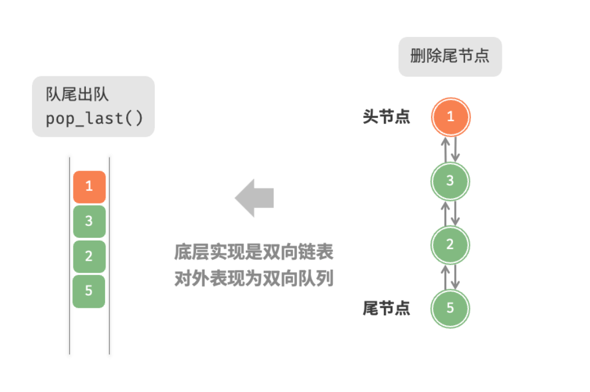

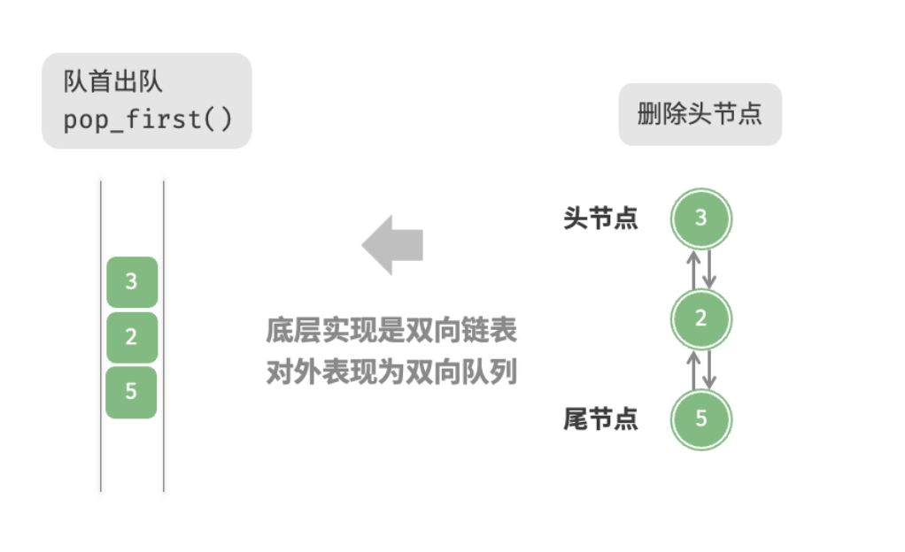

实现代码如下:

```go
// 基于双向链表实现的双向队列
type linkedListDeque struct{
  // 使用内置包list
  data *list.List
}

// 初始化双端队列
func newLinkedListDeque() *linkedListDeque{
  return &linkedListDeque{
    data: list.New(),
  }
}

// 判断是否队列是否为空
func (s *linkedListDeque) isEmpty() book{
  return s.data.Len() == 0
}

// 获取队列长度
func (s *linkedListDeque) size() int{
  return s.data.Len()
}

// 访问队首元素
func (s *linkedListDeque) peekFirst() any{
  if s.isEmpty(){
    return nil
  }
  e := s.data.Front()
  return e.Value
}

// 访问队尾元素
func (s *linkedListDeque) peekLast() any{
  if s.isEmpty(){
    return nil
  }
  e := s.data.Back()
  return e.Value
}

// 队首元素入队
func (s *linkedListDeque) pushFirst(value any){
  s.data.PushFirst(value)
}

// 队尾元素入队
func (s *linkedListDeque) pushLast(value any){
  s.data.PushBack(value)
}

// 队首元素出队
func (s *linkedListDeque) popFirst() any{
  if s.isEmpty(){
    return nil
  }
  e := s.data.Front()
  s.data.Remove(e)
  return e.Value
}

// 队尾元素出队
func (s *linkedListDeque) popLast() any{
  if s.isEmpty(){
    return nil
  }
  e := s.data.Back()
  s.data.Remove(e)
  return e.Value
}

```

### 基于数组的实现

如图 5-9 所示，与基于数组实现队列类似，我们也可以使用**环形数组**来实现双向队列。

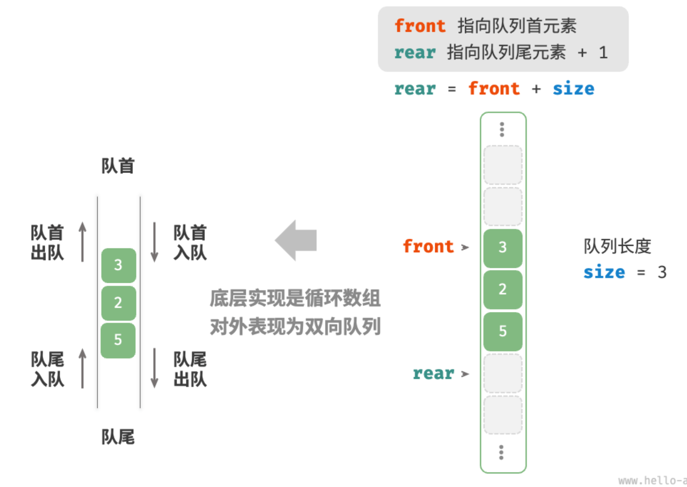

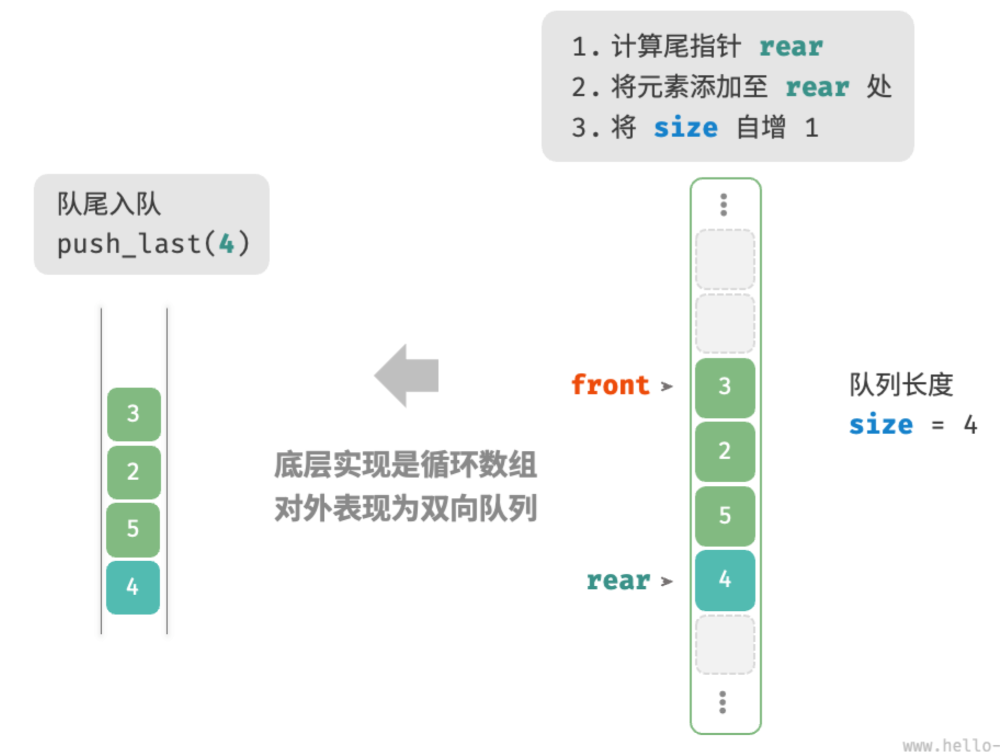

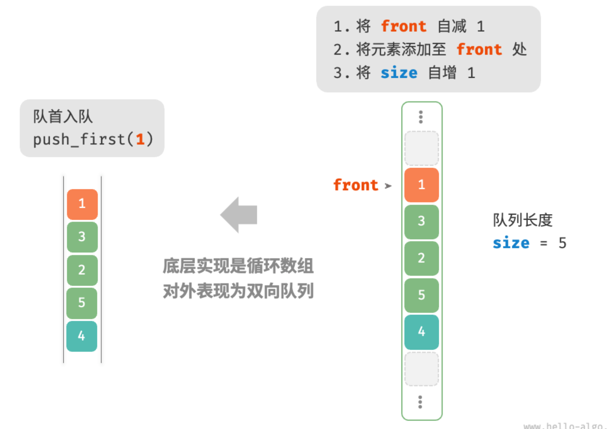

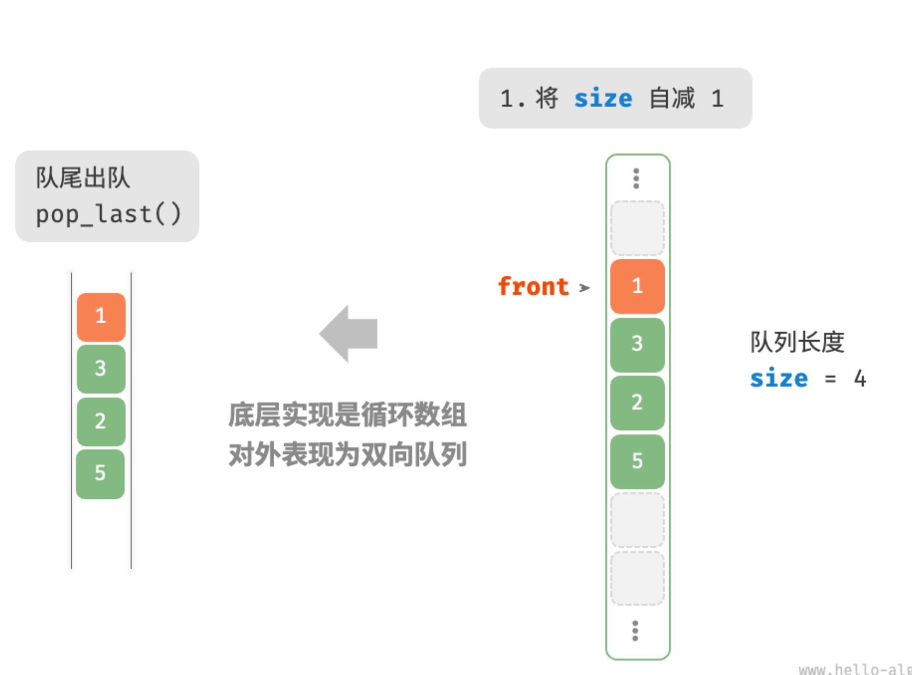

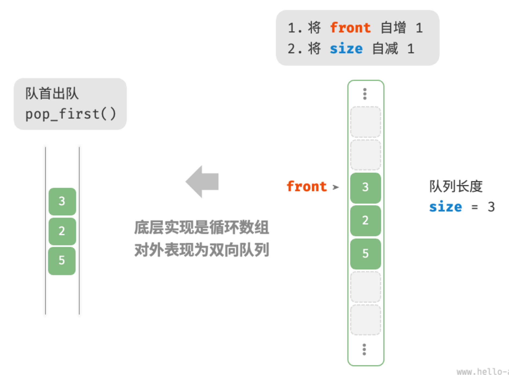

在队列的实现基础上，仅需增加“队首入队”和“队尾出队”的方法：

```go
// 基于环形数组实现的双向队列
type arrayDeque struct{
  nums []int // 用于存放双向队列元素的数组
  front int // 队首指针，指向队首元素
  queSize int // 双向队列的长度
  queCapacity int // 队列容量（即最大容纳元素数量）
}

// 初始化队列
func newArrayDeque(queCapacity int) *arrayDeque{
  return &arrayDeque{
    nums: make([]int, queCapacity),
    queCapacity: queCapacity,
    front: 0,
    queSize: 0,
  }
}

// 获取双向队列的长度
func (q * arrayDeque) size() int{
  return q.queSize
}

// 判断双向队列是否为空
func (q *arrayDeque) isEmpty() bool{
  return q.queSize == 0
}

// 计算环形数组的索引
func (q *arrayDeque) index(i int) int{
  // 通过取余操作实现数组首位相连
  // 当 i 越过数组尾部后，回到头部
  // 当 i 越过数组头部后，回到尾部
  return (i + q.queCapacity) % q.queCapacity
}

// 队首入队
func (q *arrayDeque) pushFirst(num int){
  if q.queSize == q.queCapacity{
    fmt.Println("双向队列已满")
    return
  }
  // 队首指针向左移动一位
  // 通过取余操作实现front越过头部后回到尾部
  q.front = q.index(q.front - 1)
  // 将num 添加至队首
  q.nums[q.front] = num
  q.queSize++
}

// 队尾入队
func (q *arrayDeque) pushLast(num int){
  if q.queSize == q.queCapacity{
    fmt.Println("双向队列已满")
    return
  }
  // 计算队尾指针，指向队尾索引+1
  rear := q.index(q.front + q.queSize)
  // 将 num 添加至队尾
  q.nums[rear] = num
  q.queSize++
}

// 访问队首元素
func (q *arrayDeque) peekFirst() any{
  if q.isEmpty(){
    return nil
  }
  return q.nums[q.front]
}

// 访问队尾元素
func (q *arrayDeque) peekLast() any{
  if q.isEmpty(){
    return nil
  }
  // 计算元素索引
  last := q.index(q.front + q.queSize - 1)
  return q.nums[last]
}

// 队首出队
func (q *arrayDeque) popFirst() any{
  num := q.peekFirst()
  if num == nil{
    return nil
  }
  // 队首指针向后移动一位
  q.front = q.index(q.front + 1)
  q.queSize--
  return num
}

// 队尾出队
func (q *arrayDeque) popLast() any{
  num := q.peekLast()
  if num == nil{
    return nil
  }
  q.queSize--
  return num
}


// 获取Slice用于打印
func (q *arrayDeque) toSlice() []int{
  // 仅转换有效长度范围内的元素
  res := make([]int, q.queSize)
  for i,j := 0, q.front; i<q.queSize; i++{
    res[i] = q.nums[q.index(j)]
    j++
  }
  return res
}

```

## 双向队列应用

双向队列兼具栈与队列的逻辑，因此它可以实现这两者的所有应用场景，同时提供更高的自由度。

我们知道，软件的“撤销”功能通常使用栈来实现：系统将每次更改操作 push 到栈中，然后通过 pop 实现撤销。然而，考虑到系统资源的限制，软件通常会限制撤销的步数（例如仅允许保存$50$步）。当栈的长度超过 
$50$时，软件需要在栈底（队首）执行删除操作。但栈无法实现该功能，此时就需要使用双向队列来替代栈。请注意，“撤销”的核心逻辑仍然遵循栈的先入后出原则，只是双向队列能够更加灵活地实现一些额外逻辑。