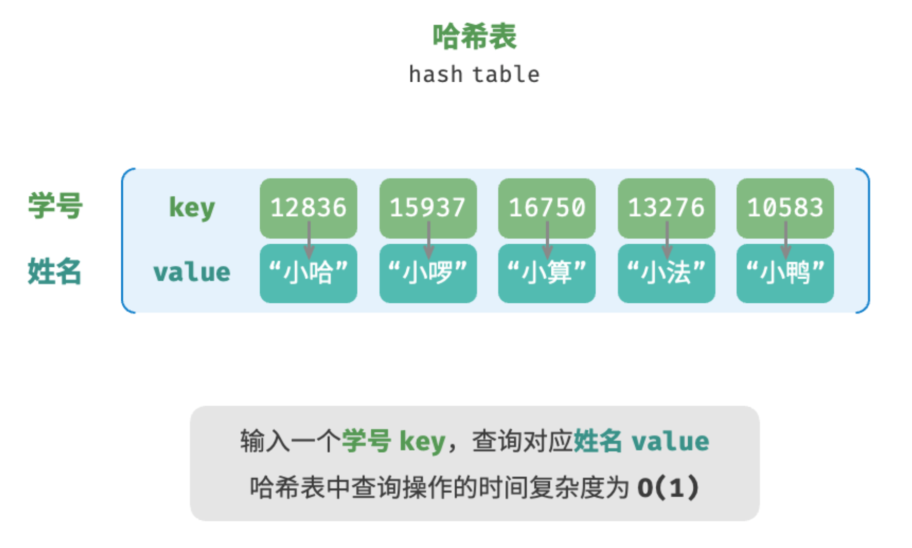
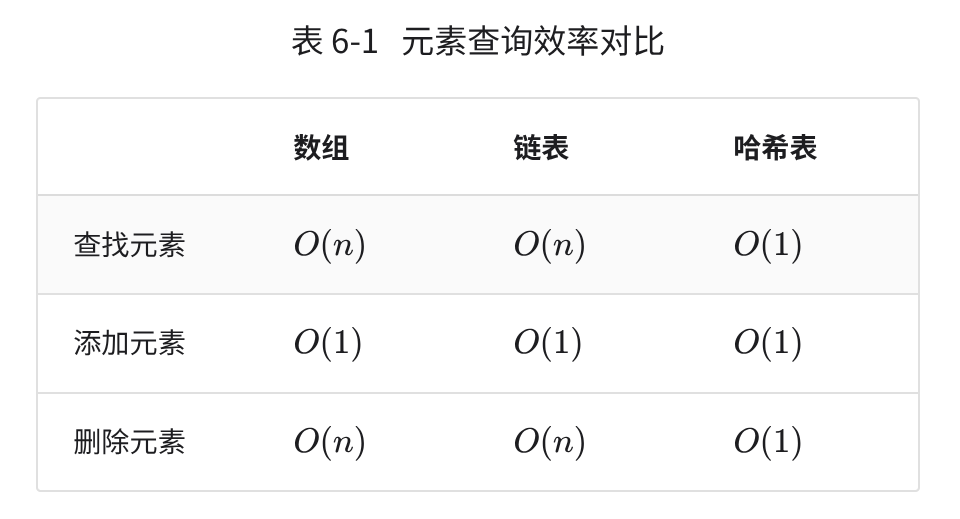
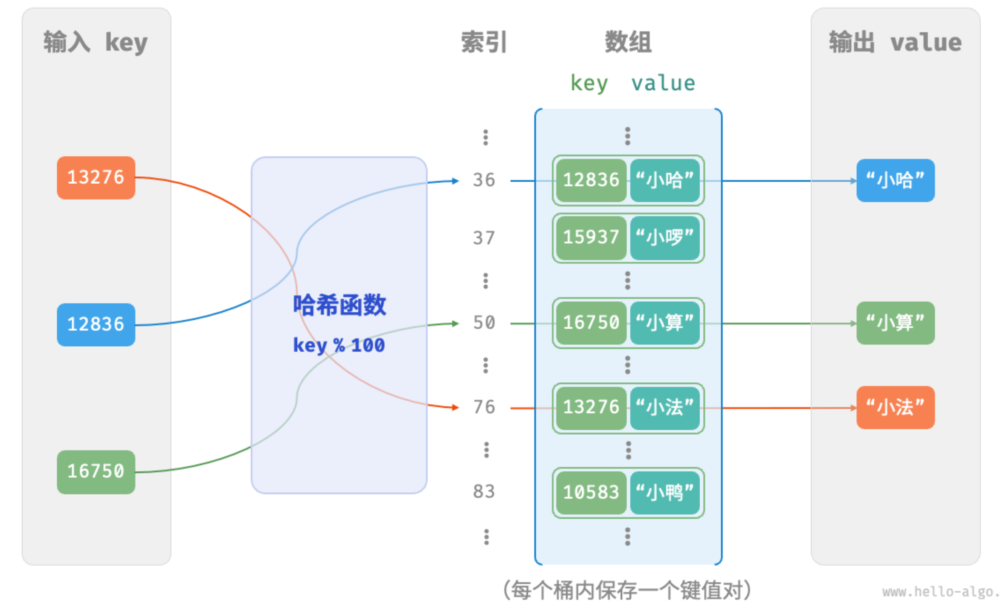
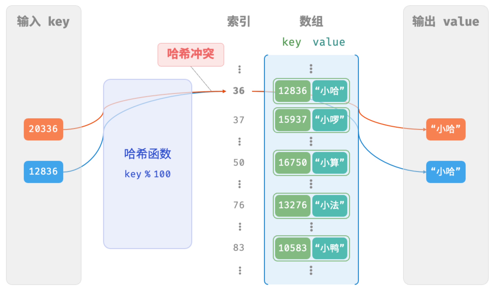
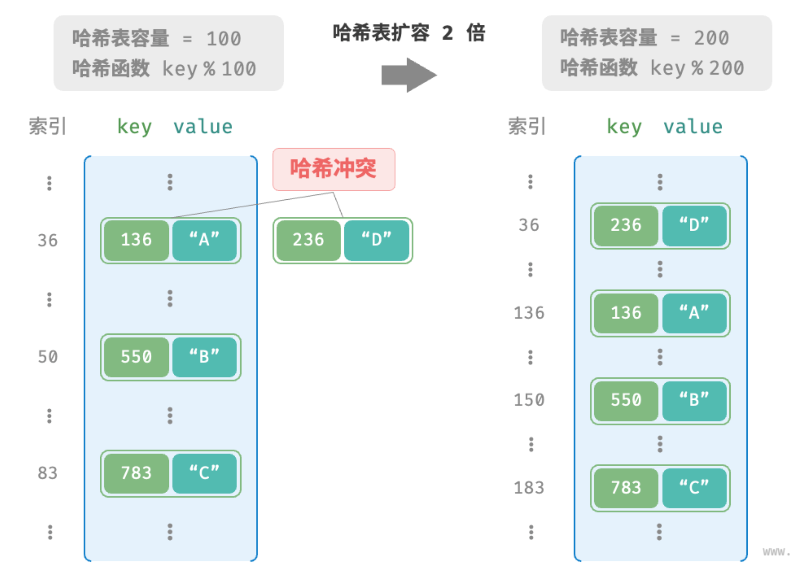

## 哈希表常用操作

哈希表（hash table），又称散列表，它通过建立键 `key` 与值 `value` 之间的映射，实现高效的元素查询。具体而言，我们向哈希表中输入一个键 key ，则可以在 
$O(1)$ 时间内获取对应的值 value 。

如图 6-1 所示，给定 $n$ 个学生，每个学生都有“姓名”和“学号”两项数据。假如我们希望实现“输入一个学号，返回对应的姓名”的查询功能，则可以采用图 6-1 所示的哈希表来实现。



除哈希表外，数组和链表也可以实现查询功能，它们的效率对比如表 6-1 所示。

- 添加元素：仅需将元素添加至数组（链表）的尾部即可，使用 $O(1)$ 时间。
- 查询元素：由于数组（链表）是乱序的，因此需要遍历其中的所有元素，使用 $O(n)$ 时间。
- 删除元素：需要先查询到元素，再从数组（链表）中删除，使用 $O(n)$ 时间。



观察发现，在哈希表中进行增删查改的时间复杂度都是 $O(1)$ ，非常高效。

哈希表的常见操作包括：初始化、查询操作、添加键值对和删除键值对等，示例代码如下：

```go
// 初始化哈希表
hmap := make(map[int]string)

// 添加操作
// 在哈希表中添加键值对
hmap[12836] = "小哈"
hmap[15937] = "小喽"
hmap[16750] = "小算"
hmap[13276] = "小法"
hmap[10583] = "小哈"

// 查询操作
// 向哈希表中输入key,得到value
name := hmap[15937]

// 删除操作
delete(hmap, 100583)
```

哈希表有三种常用的遍历方式：遍历键值对、遍历键和遍历值。示例代码如下：

```go
// 遍历键值对 key->vvalue
for key, value := range hmap{
  fmt.Println(key, "->", value)
}

// 单独遍历key
for key := range hmap{
  fmt.Println(key)
}


// 单独遍历value
for _, value := range hamp{
  fmt.Println(value)
}

```


## 哈希表简单实现

先考虑最简单的情况，仅用一个数组来实现哈希表。在哈希表中，我们将数组中的每个空位称为`桶（bucket）`，**每个桶可存储一个键值对**。因此，查询操作就是找到 key 对应的桶，并在桶中获取 `value` 。

那么，如何基于 key 定位对应的桶呢？这是通过`哈希函数（hash function）`实现的。**哈希函数的作用是将一个较大的输入空间映射到一个较小的输出空间**。在哈希表中，输入空间是所有 `key` ，输出空间是所有`桶（数组索引）`。换句话说，输入一个 `key` ，我们**可以通过哈希函数得到该 key 对应的键值对在数组中的存储位置。**


输入一个 `key` ，哈希函数的计算过程分为以下两步。

1. 通过某种哈希算法 `hash()` 计算得到哈希值。
2. 将哈希值对桶数量（数组长度）`capacity` **取模**，从而获取该 key 对应的数组索引 `index` 。

```go
index = hash(key) % capacity
```

随后，我们就可以利用 `index` 在哈希表中访问对应的桶，从而获取 `value` 。


设数组长度 `capacity = 100`、哈希算法 `hash(key) = key` ，设哈希函数为 `key % 100` 。图 6-2 以 `key` 学号和 `value` 姓名为例，展示了哈希函数的工作原理。



以下代码实现了一个简单哈希表。其中，我们将 `key` 和 `value` 封装成一个类 `Pair` ，以表示键值对。

```go
// 键值对
type pair struct{
  key int
  val string
}

// 基于数组实现的哈希表
type arrayHashMap struct{
  buckets []*pair
}

// 初始化哈希表
func newArrayHashMap() *arrayHashMap{
  // 初始化数组，包含100个桶
  buckets := make([]*pair, 100)
  return &arrayHashMap{bugkets: buckets}
}

// 哈希函数
func (a *arrayHashMap) hashFunc(key int) int{
  index := key % 100
  return index
}

// 查询操作
func (a *arrayHashMap) get(key int) string{
  index := a.hashFunc(key)
  pair := a.buckets[index]
  if pair == nil{
    return "Not Found"
  }
  return pair.val
}

// 添加操作
func (a *arrayHashMap) put(key int, val string){
  pair := &pair{key: key, val: val}
  index := a.hashFunc(key)
  a.buckets[index] = pair
}

// 删除操作
func (a *arrayHashMap) remove(key int){
  index := a.hashFunc(key)
  // 置为nil,代表删除
  a.buckets[index] = nil
}

// 获取所有键值对
func (a *arrayHashMap) pairSet() []*pair{
  var pairs []*pair
  for _, pair := range a.buckets{
    if pair != nil{
      pairs = append(pairs, pair)
    }
  }
  return pairs
}

// 获取所有键
func (a *arrayHashMap) keySet() []int{
  var keys []int
  for _, pair := range a.buckets{
    if pair != nil{
      keys = append(keys, pair.key)
    }
  }
  return keys
}

// 获取所有值
func (a *arrayHashMap) valueSet() []string{
  var values []string
  for _, pair := range a.buckets{
    if pair != nil{
      values = append(values, pair.val)
    }
  }
  return values
}

// 打印哈希表
func (a *arrayHashMap) print(){
  for _, pair := range a.buckets{
    if pair != nil{
      fmt.Println(pair.key, "->", pair.val)
    }
  }
}

```


## 哈希冲突与扩容

从本质上看，哈希函数的作用是将所有 key 构成的输入空间映射到数组所有索引构成的输出空间，而输入空间往往远大于输出空间。因此，**理论上一定存在“多个输入对应相同输出”的情况。**

对于上述示例中的哈希函数，当输入的 key 后两位相同时，哈希函数的输出结果也相同。例如，查询学号为 12836 和 20336 的两个学生时，我们得到：

```go
12836 % 100 = 36
20336 % 100 = 36
```

如图 6-3 所示，两个学号指向了同一个姓名，这显然是不对的。我们将这种多个输入对应同一输出的情况称为`哈希冲突（hash collision）`。



容易想到，哈希表容量 $n$ 越大，多个 `key` 被分配到同一个桶中的概率就越低，冲突就越少。因此，我们**可以通过扩容哈希表来减少哈希冲突**。

如图 6-4 所示，扩容前键值对 (136, A) 和 (236, D) 发生冲突，扩容后冲突消失。



类似于数组扩容，哈希表扩容需将所有键值对从原哈希表迁移至新哈希表，非常耗时；并且由于哈希表容量 `capacity` 改变，我们需要通过哈希函数来重新计算所有键值对的存储位置，这进一步增加了扩容过程的计算开销。为此，编程语言通常会预留足够大的哈希表容量，防止频繁扩容。

负载因子（load factor）是哈希表的一个重要概念，其定义为哈希表的元素数量除以桶数量，用于衡量哈希冲突的严重程度，也常作为哈希表扩容的触发条件。例如在 Java 中，当负载因子超过 
$0.75$ 时，系统会将哈希表扩容至原先的 $2$ 倍。

