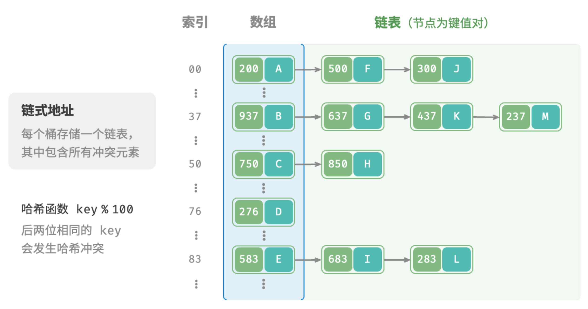
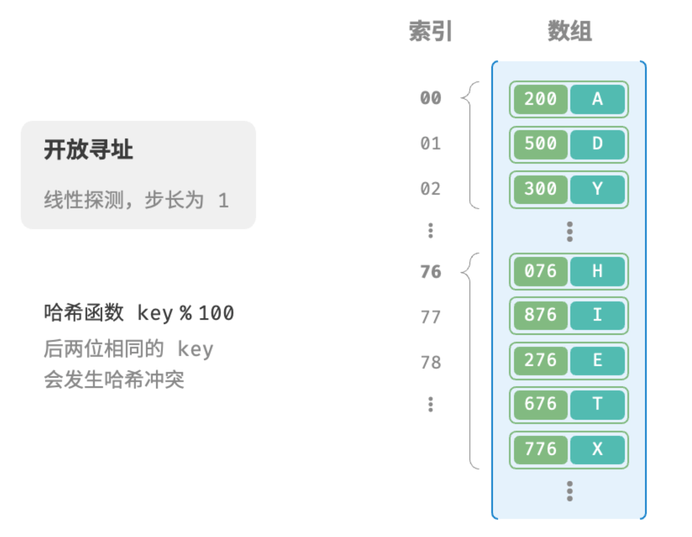
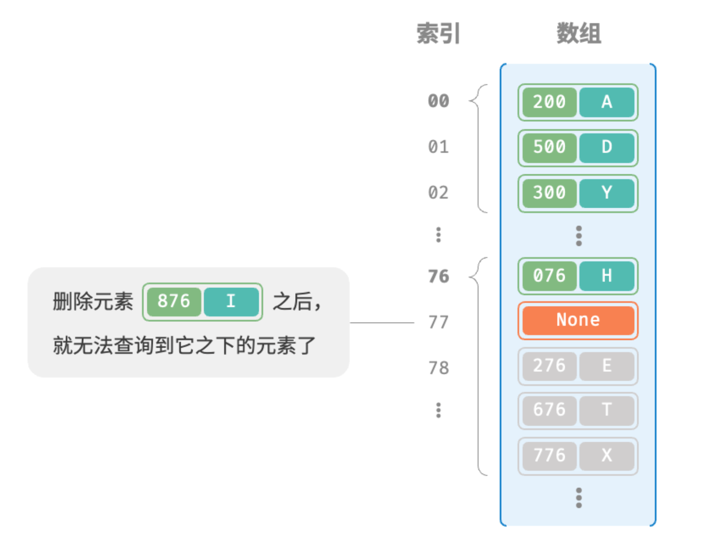

> 通常情况下哈希函数的输入空间远大于输出空间，因此理论上哈希冲突是不可避免的。
> 
> 哈希冲突会导致查询结果错误，严重影响哈希表的可用性。为了解决该问题，每当遇到哈希冲突时，我们就进行哈希表扩容，直至冲突消失为止。此方法简单粗暴且有效，但效率太低，因为哈希表扩容需要进行大量的数据搬运与哈希值计算。为了提升效率，我们可以采用以下策略。
> 
> 1.改良哈希表数据结构，使得哈希表可以在出现哈希冲突时正常工作。
> 
> 2.仅在必要时，即当哈希冲突比较严重时，才执行扩容操作。

**哈希表的结构改良方法主要包括“链式地址”和“开放寻址”。**

## 链式地址

在原始哈希表中，每个桶仅能存储一个键值对。`链式地址（separate chaining）`将单个元素转换为链表，将键值对作为链表节点，将所有发生冲突的键值对都存储在同一链表中。图 6-5 展示了一个链式地址哈希表的例子。



基于链式地址实现的哈希表的操作方法发生了以下变化。

- 查询元素：输入 key ，经过哈希函数得到桶索引，即可访问链表头节点，然后遍历链表并对比 key 以查找目标键值对。
- 添加元素：首先通过哈希函数访问链表头节点，然后将节点（键值对）添加到链表中。
- 删除元素：根据哈希函数的结果访问链表头部，接着遍历链表以查找目标节点并将其删除。

链式地址存在以下局限性。

- 占用空间增大：链表包含节点指针，它相比数组更加耗费内存空间。
- 查询效率降低：因为需要线性遍历链表来查找对应元素。

以下代码给出了链式地址哈希表的简单实现，需要注意两点。

- 使用列表（动态数组）代替链表，从而简化代码。在这种设定下，哈希表（数组）包含多个桶，每个桶都是一个列表。
- 以下实现包含哈希表扩容方法。当负载因子超过 $2/3$ 时，我们将哈希表扩容至原先的 $2$ 倍。

```go
// 链式地址法
type hashMapChaining struct{
  size int
  capacity int
  loadThres float64
  extendRadio int
  buckets [][]pair
}

// 构造方法
func newHashMapChaining() *hashMapChaining{
  buckets := make([][]pair, 4)
  for i:=0;i<4;i++{
    buckets[i] = make([]pair, 0)
  }
  return &hashMapChaining{
    size:0,

  }
}

// 哈希函数
func (m *hashMapChaining) hashFunc(key int) int{
  return key % m.capacity
}

// 负载因子
func (m *hashMapChaining) loadFactor() float64{
  return float64(m.size) / float64(m.capacity)
}

// 查询操作
func (m *hashMapChaining) get(key int) string{
  idx := m.hashFunc(key)
  bucket := m.buckets[idx]
  // 遍历桶，若找到key,则返回val
  for _, p := range bucket{
    if p.key == key{
      return p.val
    }
  }
  // 若未找到，返回空
  return ""
}

// 添加操作
func (m *hashMapChaining) put(key int, val string){
  // 当负载因子超过阈值时，执行扩容
  if m.loadFactor() > m.loadThres{
    m.extend()
  }
  idx := m.hashFunc(key)
  // 遍历桶，若遇到指定key,则更新对应val并返回
  for i := range m.buckets[idx]{
    if m.buckets[idx][i].key == key{
      m.buckets[idx][i].val = val
      return
    }
  }
  // 若无key,则将键值对添加至尾部
  p := pair{
    key: key,
    val: val,
  }
  m.buckets[idx] = append(m.buckets[idx], p)
  m.size +=1
}

// 删除操作
func (m *hashMapChaining) remove(key int){
  idx := m.hashFunc(key)
  // 遍历桶，从中删除键值对
  for i,p := range m.buckets[idx]{
    if p.key == key{
      // 切片删除
      m.buckets[idx] = append(m.buckets[idx][:i], m.buckets[idx][i+1]...)
      m.size -= 1
      break
    }
  }
}

// 扩容哈希表
func (m *hashMapChaining) extend(){
  // 暂存原哈希表
  tmpBuckets := make([][]pair, len(m.buckets)
  for i:=0;i<len(m.buckets;i++){
    tmpBuckets[i] = make([]pair, len(m.buckets[i]))
    copy(tmpBuckets[i], m.buckets[i])
  }
  // 初始化扩容后的新哈希表
  m.capacity *= m.extendRatio
  m.buckets = make([][]pair, m.capacity)
  for i:=0;i<m.capacity;i++{
    m.buckets[i] = make([]pair, 0)
  }
  m.size = 0
  // 将键值对从原哈希表搬运至新哈希表
  for _, bucket := range tmpBuckets{
    for _, p := range bucket{
      m.put(p.key, p.val)
    }
  }
}

```

值得注意的是，当链表很长时，查询效率 $O(n)$ 很差。此时可以将链表转换为“AVL 树”或“红黑树”，从而将查询操作的时间复杂度优化至 $O(logn)$ 。

## 开放寻址

开放寻址（open addressing）不引入额外的数据结构，而是通过“多次探测”来处理哈希冲突，探测方式主要包括线性探测、平方探测和多次哈希等。

### 线性探测

线性探测采用固定步长的线性搜索来进行探测，其操作方法与普通哈希表有所不同。

- 插入元素：通过哈希函数计算桶索引，若发现桶内已有元素，则从冲突位置向后线性遍历（步长通常为 $1$ ），直至找到空桶，将元素插入其中。
- 查找元素：若发现哈希冲突，则使用相同步长向后进行线性遍历，直到找到对应元素，返回 value 即可；如果遇到空桶，说明目标元素不在哈希表中，返回 `None` 。

图 6-6 展示了开放寻址（线性探测）哈希表的键值对分布。根据此哈希函数，最后两位相同的 key 都会被映射到相同的桶。而通过线性探测，它们被依次存储在该桶以及之下的桶中。



然而，**线性探测容易产生“聚集现象”**。具体来说，数组中连续被占用的位置越长，这些连续位置发生哈希冲突的可能性越大，从而进一步促使该位置的聚堆生长，形成恶性循环，最终导致增删查改操作效率劣化。

值得注意的是，我们**不能在开放寻址哈希表中直接删除元素**。这是因为删除元素会在数组内产生一个空桶 None ，而当查询元素时，线性探测到该空桶就会返回，因此在该空桶之下的元素都无法再被访问到，程序可能误判这些元素不存在，如图 6-7 所示。



为了解决该问题，我们可以采用`懒删除（lazy deletion）`机制：它不直接从哈希表中移除元素，而是利用一个常量 `TOMBSTONE` 来标记这个桶。在该机制下，`None` 和 `TOMBSTONE` 都代表空桶，都可以放置键值对。但不同的是，线性探测到 `TOMBSTONE` 时应该继续遍历，因为其之下可能还存在键值对。

然而，**懒删除可能会加速哈希表的性能退化**。这是因为每次删除操作都会产生一个删除标记，随着 `TOMBSTONE` 的增加，搜索时间也会增加，因为线性探测可能需要跳过多个 `TOMBSTONE` 才能找到目标元素。

为此，考虑在线性探测中记录遇到的首个 TOMBSTONE 的索引，**并将搜索到的目标元素与该 TOMBSTONE 交换位置**。这样做的好处是当每次查询或添加元素时，元素会被移动至距离理想位置（探测起始点）更近的桶，从而优化查询效率。

以下代码实现了一个包含懒删除的开放寻址（线性探测）哈希表。为了更加充分地使用哈希表的空间，我们将哈希表看作一个**“环形数组”**，当越过数组尾部时，回到头部继续遍历。

```go
// 开发寻址哈希表
type hashMapOpenAddressing struct{
  size int
  capacity int
  loadThres float64
  extendRatio int
  buckets []*pair // 桶数组
  TOMBSTONE *pair // 删除标记
}

// 构造方法
func newHashMapOpenAddressing() *hashMapOpenAddressing{
  return &hashMapOpenAddressing{
    size: 0,
    capacity: 4,
    loadThres: 2.0/3.0,
    extendRatio: 2,
    buckets: make([]*pair, 4),
    TOMBSTONE: &pair{-1, "-1"},
  }
}

// 哈希函数
func (h *hashMapOpenAddressing) hashFunc(key int) int{
  return key % h.capacity // 根据键计算哈希值
}

// 负载因子
func (h *hashMapOpenAddressing) loadFactor() float64{
  return float64(h.size) / float64(h.capacity) // 计算当前负载因子
}

// 搜索key对应的桶索引
func (h *hashMapOpenAddressing) findBucket(key int) int{
  index := h.hashFunc(key) // 获取初始索引
  firstTombstone := -1 // 记录遇到的第一个TOMBSTONE的位置
  for h.buckets[index] != nil {
    if h.buckets[index].key == key{
      if firstTombstone != -1{
        // 若之前遇到了删除标记，则将键值对移动至该索引出
        h.buckets[firstTombstone] = h.buckets[index]
        h.buckets[index] = h.TOMBSTONE
        return firstTombstone // 返回移动后的桶的索引
      }
      return index // 返回找到的索引
    }
    if firstTombstone == -1 && h.buckets[index] == h.TOMBSTONE{
      firstTombstone = index // 记录遇到的首个删除标记的位置
    }
    index = (index + 1) % h.capacity // 线性探测，越过尾部则返回头部
  }
  // 若key不存在，则返回添加点的索引
  if fitstTombstone != -1{
    return firstTombstone
  }
  return index
}

/* 查询操作 */
func (h *hashMapOpenAddressing) get(key int) string {
    index := h.findBucket(key) // 搜索 key 对应的桶索引
    if h.buckets[index] != nil && h.buckets[index] != h.TOMBSTONE {
        return h.buckets[index].val // 若找到键值对，则返回对应 val
    }
    return "" // 若键值对不存在，则返回 ""
}

/* 添加操作 */
func (h *hashMapOpenAddressing) put(key int, val string) {
    if h.loadFactor() > h.loadThres {
        h.extend() // 当负载因子超过阈值时，执行扩容
    }
    index := h.findBucket(key) // 搜索 key 对应的桶索引
    if h.buckets[index] == nil || h.buckets[index] == h.TOMBSTONE {
        h.buckets[index] = &pair{key, val} // 若键值对不存在，则添加该键值对
        h.size++
    } else {
        h.buckets[index].val = val // 若找到键值对，则覆盖 val
    }
}

/* 删除操作 */
func (h *hashMapOpenAddressing) remove(key int) {
    index := h.findBucket(key) // 搜索 key 对应的桶索引
    if h.buckets[index] != nil && h.buckets[index] != h.TOMBSTONE {
        h.buckets[index] = h.TOMBSTONE // 若找到键值对，则用删除标记覆盖它
        h.size--
    }
}

/* 扩容哈希表 */
func (h *hashMapOpenAddressing) extend() {
    oldBuckets := h.buckets               // 暂存原哈希表
    h.capacity *= h.extendRatio           // 更新容量
    h.buckets = make([]*pair, h.capacity) // 初始化扩容后的新哈希表
    h.size = 0                            // 重置大小
    // 将键值对从原哈希表搬运至新哈希表
    for _, pair := range oldBuckets {
        if pair != nil && pair != h.TOMBSTONE {
            h.put(pair.key, pair.val)
        }
    }
}

/* 打印哈希表 */
func (h *hashMapOpenAddressing) print() {
    for _, pair := range h.buckets {
        if pair == nil {
            fmt.Println("nil")
        } else if pair == h.TOMBSTONE {
            fmt.Println("TOMBSTONE")
        } else {
            fmt.Printf("%d -> %s\n", pair.key, pair.val)
        }
    }
}

```

### 平方探测

平方探测与线性探测类似，都是开放寻址的常见策略之一。当发生冲突时，平方探测不是简单地跳过一个固定的步数，而是跳过“探测次数的平方”的步数，即 
$1,4,9,...$ 步。

平方探测主要具有以下优势。

- 平方探测通过跳过探测次数平方的距离，试图缓解线性探测的聚集效应。
- 平方探测会跳过更大的距离来寻找空位置，有助于数据分布得更加均匀。

然而，平方探测并不是完美的。

- 仍然存在聚集现象，即某些位置比其他位置更容易被占用。
- 由于平方的增长，平方探测可能不会探测整个哈希表，这意味着即使哈希表中有空桶，平方探测也可能无法访问到它。


### 多次哈希

顾名思义，多次哈希方法使用多个哈希函数 $f_1(x)$、$f_2(x)$、$f_3(x)$、$...$ 进行探测。

- 插入元素：若哈希函数 $f_1(x)$ 出现冲突，则尝试 $f_2(x)$ ，以此类推，直到找到空位后插入元素。
- 查找元素：在相同的哈希函数顺序下进行查找，直到找到目标元素时返回；若遇到空位或已尝试所有哈希函数，说明哈希表中不存在该元素，则返回 `None` 。

与线性探测相比，多次哈希方法不易产生聚集，但多个哈希函数会带来额外的计算量。

请注意，开放寻址（线性探测、平方探测和多次哈希）哈希表都存在“不能直接删除元素”的问题。

## 编程语言的选择

各种编程语言采取了不同的哈希表实现策略，下面举几个例子。

- Python 采用`开放寻址`。字典 dict 使用伪随机数进行探测。
- Java 采用`链式地址`。自 JDK 1.8 以来，当 HashMap 内数组长度达到 64 且链表长度达到 8 时，链表会转换为红黑树以提升查找性能。
- Go 采用`链式地址`。Go 规定每个桶最多存储 8 个键值对，超出容量则连接一个溢出桶；当溢出桶过多时，会执行一次特殊的等量扩容操作，以确保性能。
