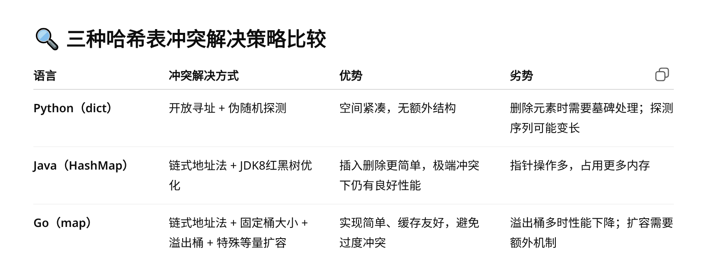
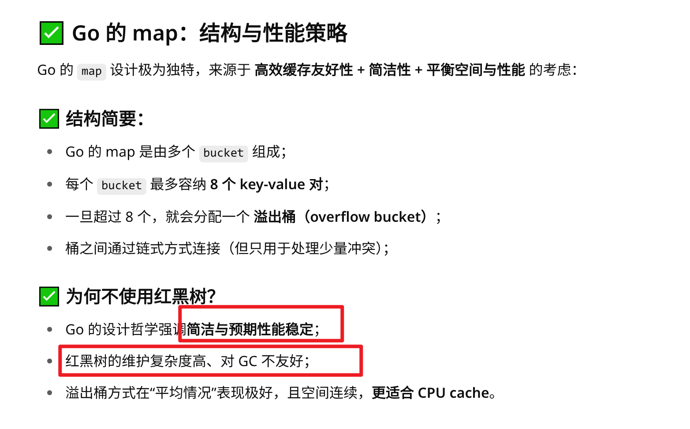

## 重点回顾

- 输入 key ，哈希表能够在 $O(1)$ 时间内查询到 value ，效率非常高。
- 常见的哈希表操作包括查询、添加键值对、删除键值对和遍历哈希表等。
- 哈希函数将 key 映射为数组索引，从而访问对应桶并获取 value 。
- 两个不同的 key 可能在经过哈希函数后得到相同的数组索引，导致查询结果出错，这种现象被称为哈希冲突。
- 哈希表容量越大，哈希冲突的概率就越低。因此可以通过扩容哈希表来缓解哈希冲突。与数组扩容类似，哈希表扩容操作的开销很大。
- 负载因子定义为哈希表中元素数量除以桶数量，反映了哈希冲突的严重程度，常用作触发哈希表扩容的条件。
- 链式地址通过将单个元素转化为链表，将所有冲突元素存储在同一个链表中。然而，链表过长会降低查询效率，可以通过进一步将链表转换为红黑树来提高效率。
- 开放寻址通过多次探测来处理哈希冲突。线性探测使用固定步长，缺点是不能删除元素，且容易产生聚集。多次哈希使用多个哈希函数进行探测，相较线性探测更不易产生聚集，但多个哈希函数增加了计算量。
- 不同编程语言采取了不同的哈希表实现。例如，Java 的 HashMap 使用链式地址，而 Python 的 Dict 采用开放寻址。
- 在哈希表中，我们希望哈希算法具有确定性、高效率和均匀分布的特点。在密码学中，哈希算法还应该具备抗碰撞性和雪崩效应。
- 哈希算法通常采用大质数作为模数，以最大化地保证哈希值均匀分布，减少哈希冲突。
- 常见的哈希算法包括 MD5、SHA-1、SHA-2 和 SHA-3 等。MD5 常用于校验文件完整性，SHA-2 常用于安全应用与协议。
- 编程语言通常会为数据类型提供内置哈希算法，用于计算哈希表中的桶索引。通常情况下，只有不可变对象是可哈希的。

## 不同语言区别

