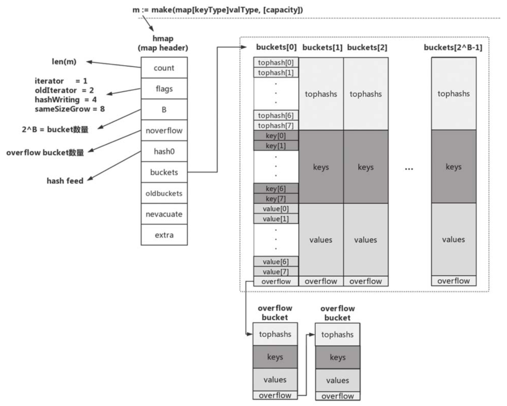
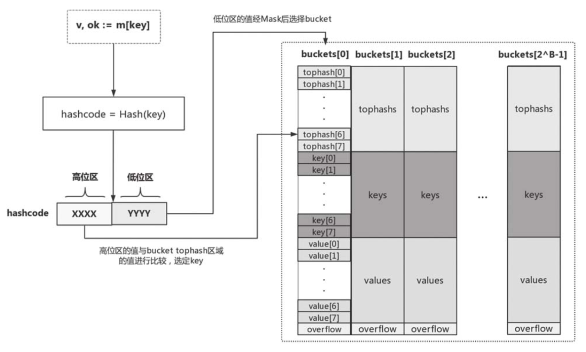
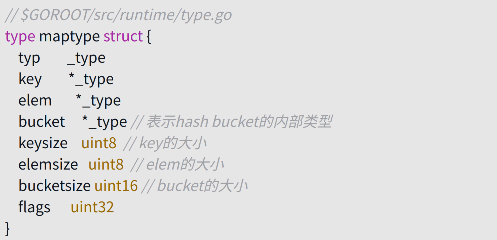
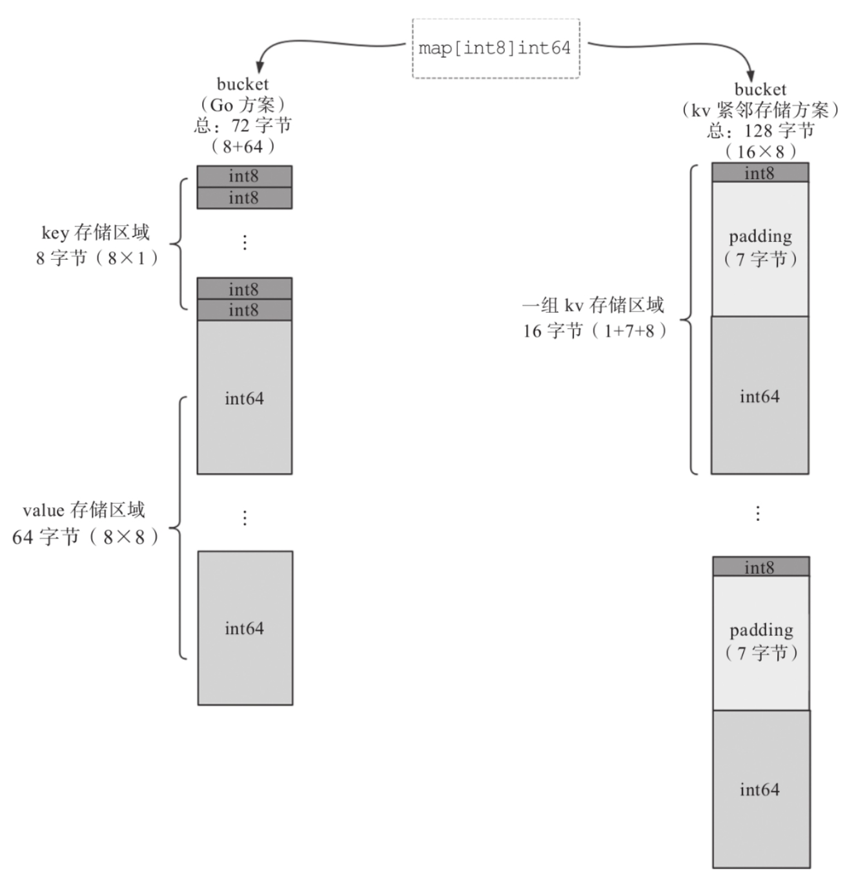
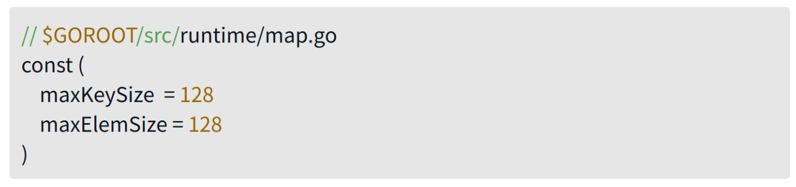
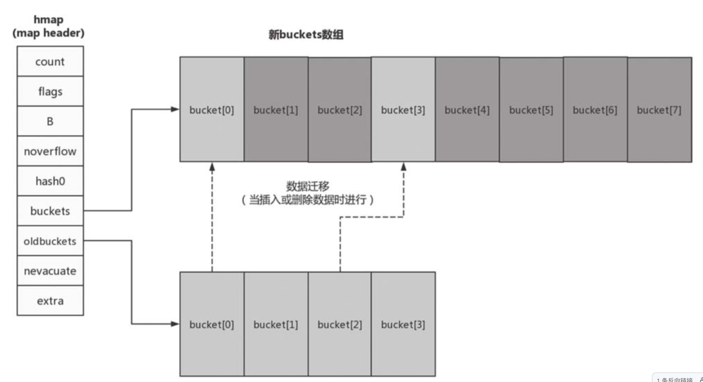

# map原理

## 初始状态

从图中我们可以看到，与语法层面 map 类型变量一一对应的是**runtime.hmap**类型的实例。**hmap 是 map 类型的 header**，可以理解为 map 类型的描述符，它存储了后续 map 类型操作所需的所有信息。

count：当前map中的元素个数；对map类型变量运用len内置函数时，len函数返回的就是count这个值。

flags：当前map所处的状态标志，目前定义了4个状态值——iterator、oldIterator、hashWriting和sameSizeGrow。

B：B的值是bucket数量的以2为底的对数，即2^B = bucket数量。

noverflow：overflow bucket的大约数量。

hash0：哈希函数的种子值。

buckets：指向bucket数组的指针。

oldbuckets：在map扩容阶段指向前一个bucket数组的指针。

nevacuate：在map扩容阶段充当扩容进度计数器。所有下标号小于nevacuate的bucket都已经完成了数据排空和迁移操作。

extra：可选字段。如果有overflow bucket存在，且key、value都因不包含指针而被内联（inline）的情况下，该字段将存储所有指向overflow bucket的指针，保证overflow bucket是始终可用的（不被垃圾回收掉）​。

真正用来存储键值对数据的是bucket（桶）​，每个bucket中存储的是Hash值低bit位数值相同的元素，默认的元素个数为BUCKETSIZE（值为8，在$GOROOT/src/cmd/compile/internal/gc/reflect.go中定义，与runtime/map.go中常量bucketCnt保持一致）​。当某个bucket（比如buckets\[0]​）的8个空槽（slot）都已填满且map尚未达到扩容条件时，运行时会建立overflow bucket，并将该overflow bucket挂在上面bucket（如buckets\[0]​）末尾的overflow指针上，这样两个bucket形成了一个链表结构，该结构的存在将持续到下一次map扩容。

### tophash区域(空间换时间，快速找到key)

当向map插入一条数据或从map按key查询数据的时候，运行时会使用哈希函数对key做哈希运算并获得一个哈希值hashcode。这个hashcode非常关键，运行时将hashcode“一分为二”地看待，**其中低位区的值用于选定bucket，高位区的值用于在某个bucket中确定key的位置**。这个过程可参考图示。

因此，每个bucket的tophash区域是用于快速定位key位置的，这样避免了逐个key进行比较这种代价较大的操作，尤其是当key是size较大的字符串类型时，这是一种以**空间换时间**的思路。

### key存储区域

tophash区域下面是**一块连续的内存区域**，存储的是该bucket承载的所有key数据。运行时在分配bucket时需要知道key的大小。那么运行时是如何知道key的大小的呢？当我们声明一个map类型变量时，比如var m map\[string]int，Go运行时就会为该变量对应的特定map类型生成一个runtime.maptype实例（如存在，则复用）​：

该实例包含了我们所需的map类型的所有元信息。前面提到过编译器会将语法层面的map操作重写成运行时对应的函数调用，这些运行时函数有一个共同的特点：第一个参数都是maptype指针类型的参数。Go运行时就是利用maptype参数中的信息确定key的类型和大小的，map所用的hash函数也存放在maptype.key.alg.hash(key, hmap.hash0)中。同时maptype的存在也让Go中所有map类型共享一套运行时map操作函数，而无须像C++那样为每种map类型创建一套map操作函数，从而减少了对最终二进制文件空间的占用。

### value存储区域

key存储区域下方是另一块连续的内存区域，该区域存储的是key对应的value。和key一样，该区域的创建也得到了maptype中信息的帮助。Go运行时采用了将key和value分开存储而不是采用一个kv接着一个kv的kv紧邻方式存储，这带来的是算法上的复杂性，但却减少了因内存对齐带来的内存浪费。以map\[int8]int64为例，我们看看存储空间利用率对比:

注：
- int8是go的一种整数类型，表示有符号的8位整数。
- 8位正好是一个字节。
- uint8是无符号8位整数，范围是0到255
- byte是uint8的别名，也是8位
- int64占用64位，因为1字节等于8位，所以int64占用8字节

可以看到当前Go运行时使用的方案内存利用效率很高。而kv紧邻存储的方案在map\[int8]int64这样的例子中内存浪费十分严重，其内存利用率=72/128=56.25%，有近一半的空间都浪费掉了。

另外还有一点要提及的是，如果key或value的数据长度大于一定数值，那么运行时不会在bucket中直接存储数据，而是会存储key或value数据的指针。目前Go运行时定义的最大key和value的长度分别如下：

## map扩容

前面提到过，map会对底层使用的内存进行自动管理。因此，在使用过程中，在插入元素个数超出一定数值后，map势必存在自动扩容的问题（扩充bucket的数量）​，并重新在bucket间均衡分配数据。

那么map在什么情况下会进行扩容呢？Go运行时的map实现中引入了一个LoadFactor（负载因子）​，当count > LoadFactor * 2^B或overflow bucket过多时，运行时会对map进行扩容。目前LoadFactor设置为6.5（loadFactorNum/loadFactorDen）​。

如果是因为overflow bucket过多导致的“扩容”​，实际上运行时会新建一个和现有规模一样的bucket数组，然后在进行assign和delete操作时进行排空和迁移；

如果是因为当前数据数量超出LoadFactor指定的水位的情况，那么运行时会建立一个两倍于现有规模的bucket数组，但真正的排空和迁移工作也是在进行assign和delete操作时逐步进行的。原bucket数组会挂在hmap的oldbuckets指针下面，直到原buckets数组中所有数据都迁移到新数组，原buckets数组才会被释放。结合图示来理解这个过程会更加深刻。

## map与并发

从上面的实现原理来看，充当map描述符角色的hmap实例自身是有状态的（hmap.flags）且对状态的读写是没有并发保护的，因此map实例不是并发写安全的，不支持并发读写。如果对map实例进行并发读写，程序运行时会发生panic。

Go 1.9版本中引入了支持并发写安全的sync.Map类型，可以用来在并发读写的场景下替换掉map。另外考虑到map可以自动扩容，map中数据元素的value位置可能在这一过程中发生变化，因此Go不允许获取map中value的地址，这个约束是在编译期间就生效的。

## 小结

从上面的自动扩容原理了解到，如果初始创建map时没有创建足够多可以应付map使用场景的bucket，那么随着插入map元素数量的增多，map会频繁扩容，而这一过程将降低map的访问性能。因此，如果可能的话，我们最好对map使用规模做出粗略的估算，并使用cap参数对map实例进行初始化。

和切片一样，map是Go语言提供的重要数据类型，也是Gopher日常编码中最常使用的类型之一。通过本条的学习我们掌握了map的基本操作和运行时实现原理，并且我们在日常使用map的场合要把握住下面几个要点：

- 不要依赖map的元素遍历顺序；
- map不是线程安全的，不支持并发写；
- 不要尝试获取map中元素（value）的地址；
- 尽量使用cap参数创建map，以提升map平均访问性能，减少频繁扩容带来的不必要损耗。