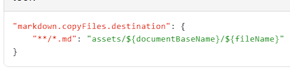

接口类型“动静兼备”的特性决定了它的变量的内部表示绝不像静态类型（如int、float64）变量那样简单。

```go
type iface struct{
  tab *itab
  data unsafe.Pointer
}


type eface struct{
  _type *_type
  data unsafe.Pointer
}
```

在运行时层面，接口类型变量有两种内部表示——`eface`和`iface`，这两种表示分别用于不同接口类型的变量。

`eface`：用于表示没有方法的空接口（empty interface）类型变量，即interface{}类型的变量。

`iface`：用于表示其余拥有方法的接口（interface）类型变量。

这两种结构的共同点是都有两个指针字段，并且第二个指针字段的功用相同，<font color="#0070c0">都指向当前赋值给该接口类型变量的动态类型变量的值</font>。

详见from《go语言的精进之路》# 第26条


<!-- 

 -->