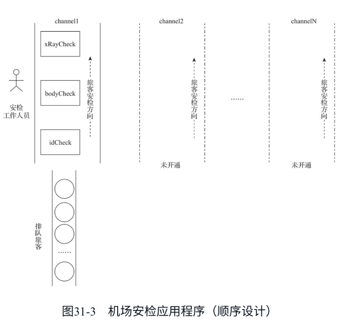
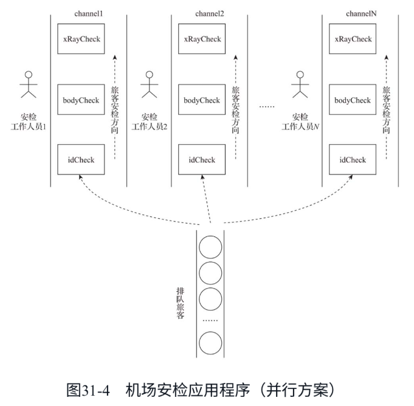
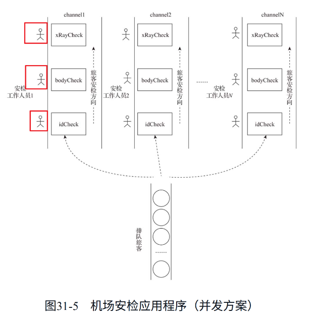

下面是一个模拟机场安检的例子，通过该例子从顺序到并行再到并发设计的演进来对比不同方案的优劣。

在这个例子中有以下对象。

排队旅客（passenger）​：代表应用的外部请求。

机场工作人员：代表计算资源。

安检程序：代表应用，必须在获取机场工作人员后才能工作。模拟安检例子中，安检程序内部流程包括登机身份检查（idCheck）​、人身检查（bodyCheck）和X光机对随身物品的检查（xRayCheck）​。

安检通道（channel）​：每个通道对应一个应用程序的实例。

1. 第一版：顺序设计

机场建设初期，建设规模小，投资不大，工作人员较少，只设置了一条安检通道（部署一个应用程序实例）​。因此，我们为该机场提供的安检应用程序采用了简单的顺序设计。

2. 第二版：并行方案

随着机场旅客量日益增大，一条安检通道显得捉襟见肘，旅客开始抱怨安检效率太低，排队等待时间过长。但这时重新设计程序有些来不及了，为了快速满足需求，只能通过开通新安检通道（部署新安检程序）的方式来快速满足旅客快速通检的要求，于是我们就有了下面的并行方案：

应用程序并未改变，只是增加了部署，新增了安检通道，并为每条新增安检通道配置了一名安检工作人员（计算资源）​。

为了模拟并行方案，我们对程序作了改动：创建三个goroutine，分别代表三个安检通道，但每个安检通道运行的程序依然是上一版程序中的airportSecurityCheck。三个通道共同处理旅客安检。

开启三个安检通道，运行着相同的安检程序（相当于部署了安检程序的多个实例）​，安检效率自然是原先的3倍（3600到10800）​。

3. 第三版：并发方案

假设机场鉴于现有建设规模，最大只能开通三条安检通道。机场旅客量依旧在增多，即便使用了并行方案，旅客的安检时长也无法再缩短。因为原安检程序采用的是顺序设计，即便机场目前有充足的人手（计算资源）可用，每个安检通道也只能用到一名工作人员。也就是说，原安检程序无法很好地适应工作人员（计算资源）的增加，是时候调整应用的结构了。

原先的安检程序（顺序设计）弊端很明显：当工作人员（计算资源）处于某一个检查环节（如人身检查）​，其他两个环节便处于“等待”状态。一条很显然的改进思路是让这些环节“同时”运行起来，就像流水线一样，这就是并发。

在这一版程序中，我们模拟开启了三条通道（newAirportSecurityCheckChannel）​，每条通道创建三个goroutine，分别负责处理idCheck、bodyCheck和xRayCheck，三个goroutine之间通过Go提供的原生channel相连。

在并发流水线启动预热并正式工作后，30名旅客的安检时长已经从3600下降到2160，并发方案使得安检通道的效率有了进一步提升。如果该流水线持续工作，效率应该会稳定在1200（3600/3）左右。如果计算资源不足，并发方案的每条安检通道的效率最差也就是“回退”到与顺序设计大致等同的水平。

总结

​“并发关乎结构，并行关乎执行。​”并发和并行是两个阶段的事情。并发在程序的设计和实现阶段，并行在程序的执行阶段。

对并发的原生支持让Go语言更契合云计算时代的硬件，适应现代计算环境。Go语言鼓励在程序设计时优先按并发设计思路组织程序结构，进行独立计算的分解。只有并发设计才能让应用自然适应计算资源的规模化，并显现出更大的威力。